# 第2章 メソドロジ

> 人に魚を与えれば一日分の食事を与えられる。
> 人に漁を教えれば一生分の食事を与えられる。

中国の格言 ([解説の参考ページ](http://roushiweb.com/category4/entry104.html))

- ツールや指標だけでなく、ノウハウが重要。
  - manページを熟読しても解決方法を導くことは難しい。
  - manページにはノウハウは記載されていない。
- 筆者はパフォーマンスのメソドロジ（方法論）を集め、文書化、共有し、自前のメソドロジを開発した。
- 本書のすべての章のうち、初版からの変更がもっとも少なかったのがこの章。

## 2.1 用語
- システムパフォーマンスについての重要な用語まとめ。
  - IOPS(Input/output Operations Per Second)
  - スループット(throughput)
    - 通信では、データ転送速度（datarate、1秒あたりのバイト数または1秒あたりのビット数）
    - データベースなどでは、処理速度（operation rate、1秒あたりのオペレーション数または1秒あたりのトランザクション数）
  - 応答時間(response time): オペレーションが完了するまでの時間
  - レイテンシ(latency)
    - オペレーションがサービスの提供を待つために使った時間
    - コンテキストによっては、オペレーションにかかった時間全体、すなわち応答時間と同じ意味になる
  - 使用率(utilizaiton)
  - 飽和度(saturation)
  - ボトルネック(bottleneck)
  - ワークロード(workload): システムに対する入力、またはシステムにかけられる負荷のこと
    - 🤔 [クラウド時代の身近な用語「ワークロード」とはいったい何なのか？](https://qiita.com/mizukyf/items/8e65b516f600cb60518a)
  - キャッシュ(cache)

## 2.2 モデル
### 2.2.1
- 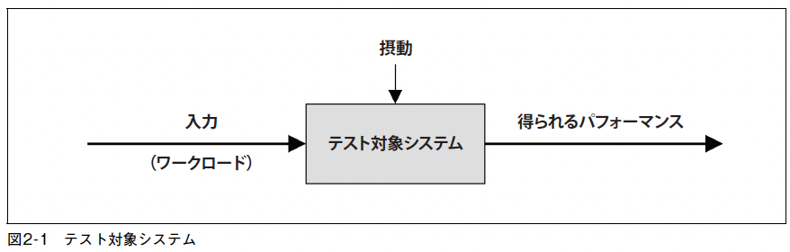
- パフォーマンスに影響し得るもの（摂動, 干渉）
- 摂動の特定は難しい場合がある
  - クラウド環境ではゲストSUTからは見ることができないものがある。
    - 物理ホストシステム上のほかのアクティビティ（ほかのゲストテナントによるもの）
  - 複数のネットワーク化されたコンポーネントがワークロードを提供している場合。
    - ロードバランサ、プロキシサーバー、ウェブサーバー、キャッシングサーバー、アプリケーションサーバー・・・
- 環境を描くだけで見落としていた摂動の発生源に気づくこともある。
  - 分析的な検討のためには、環境をキューイングシステムのネットワークとしてモデリングしてもよい。

### 2.2.2 キューイングシステム
- 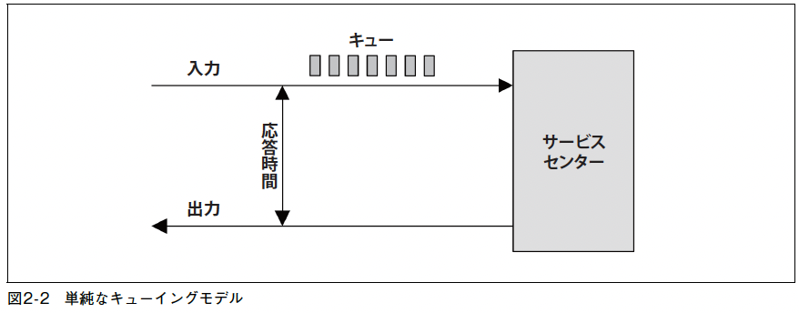
- ディスクなど、キューイングシステムとしてモデリングできるものがある。
- モデリングすることで、負荷によって応答時間がどの程度遅れるかが予測できる。

## 2.3 コンセプト
- システムパフォーマンスの重要な概念を説明する。
### 2.3.1 レイテンシ
- レイテンシは、オペレーションが実行されるまでの待ち時間である。
- 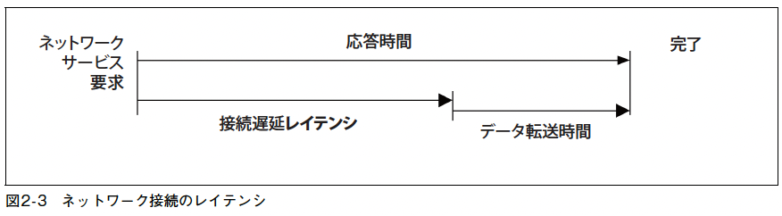
  - システムはネットワーク接続が開設されるのを待つ = レイテンシ
- Webサイトロードで発生するさまざまな(計測場所が異なる)レイテンシ
  - DNS latency
  - TCP connection latency
  - TCP data transfer latency
- これらはすべて、TCPデータ転送時間も含めて何かほかのオペレーションのレイテンシとして扱われる場合がある。
- 曖昧にならないように、何のレイテンシなのか修飾語を入れて明確にするべき。
- パフォーマンス障害をレイテンシを使って定量化する場合、同じ単位(時間)を使う。(秒, ミリ秒, マイクロ秒・・)
### 2.3.2 タイムスケール
- 時間についての感覚を得るために、タイムスケールが役立つ。
- 表2-2は、CPUのレジスタアクセスを1秒とした時にその比がどれくらいになるか（タイムスケール）を示した表
- 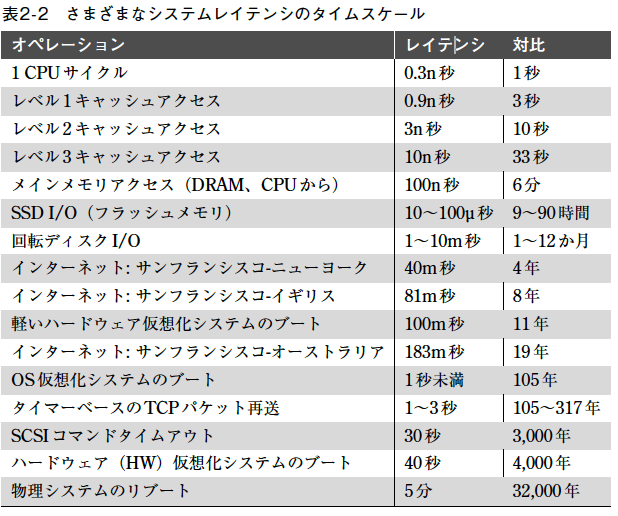

### 2.3.3 トレードオフ
- 図2-4 は、よい/速い/安いのうちの「ふたつ」を選べというトレードオフを示したものだ。
- 右の図はIT プロジェクト用に用語を置き換えた。
- 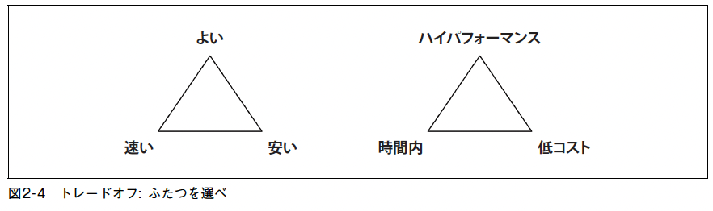
- パフォーマンス分析を怠って、速い、安いを選んでデータを詰め込んでしまうと、パフォーマンスの向上が不可能になってしまう場合もある。
- トレードオフの例
  - ファイルシステムのレコードサイズ
    - レコードサイズを小さくしてアプリケーションのI/Oサイズに近づけると、ランダムI/Oのパフォーマンスが上がる。
    - レコードサイズを大きくすると、ストリーミングのワークロードのパフォーマンスが上がる。
  - ネットワークのバッファサイズ
    - バッファサイズを小さくすると、接続ごとのオーバヘッドが削減できる。
    - バッファサイズを大きくすると、ネットワークのスループットが上がる。
- システムに変更を与えるときは、このようなトレードオフを考える。
### 2.3.4 チューニング
- パフォーマンスのチューニングは、仕事が行われる場所からもっとも近いところでしたときにもっとも効果的になる。
  - アプリケーション自体のチューニングがもっとも効果的
- 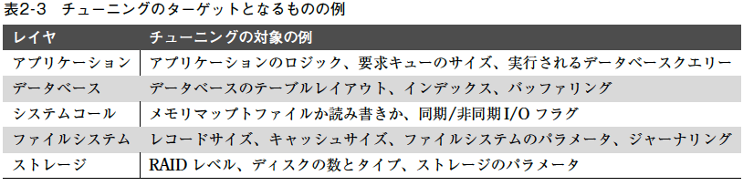
- アプリケーションレベルでのチューニング例 
  - データベースクエリ削減、省略 などを行うと、パフォーマンスは大きく上げられることがある
  - ストレージデバイスのI/Oの省略による速度改善はわずか
- 今日では、スピーディーなデプロイを目標としており、正確さが重視され、パフォーマンスの計測や最適化は行われないことが多い。
  - パフォーマンスの問題が起きてからやる場合が多い。
  - 観測の場所としてもっとも効率的なレベルとは言えない。
- 多くの環境では、アプリケーションの部分はたえず開発されており、毎日、毎週のようにデプロイされている。
  - OSのチューニングや可観測性は見落とされがち。
  - OSのパフォーマンス分析をすれば、OSレベルの問題だけではなく、アプリケーションレベルの問題も見つけられることを忘れてはならない。

### 2.3.5 適切性のレベル
### 2.3.6 いつ　分析を止めるのか
### 2.3.7 基準時の推奨値
### 2.3.8 負荷かアーキテクチャか
- 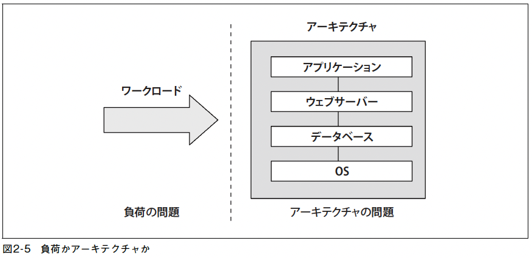
### 2.3.9 スケーラビリティ
- 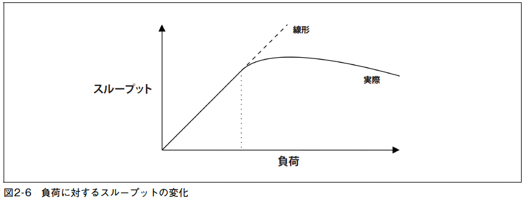
- 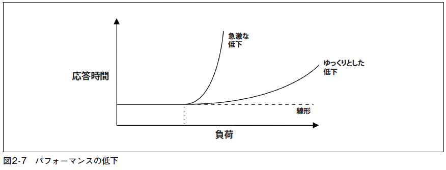
### 2.3.10 パフォーマンス指標
### 2.3.11 使用率
### 2.3.12 飽和度
- 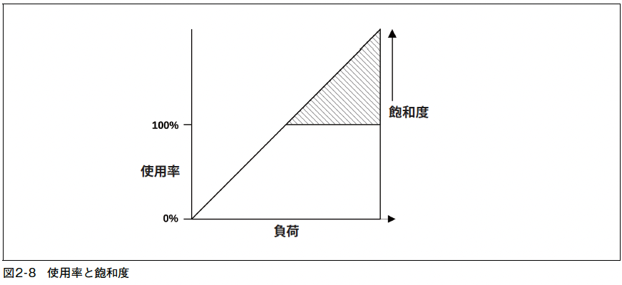
### 2.3.13 プロファイリング
### 2.3.14 キャッシング
- 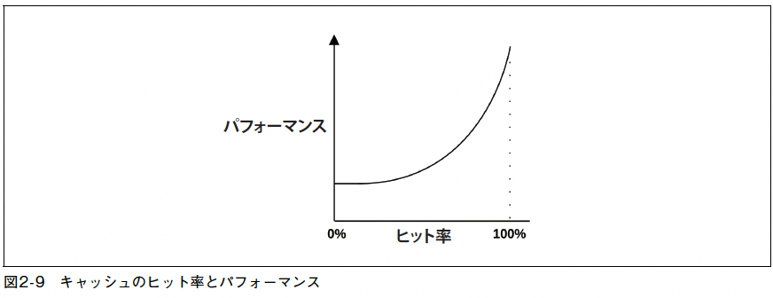
### 2.3.15 Known-Unkhowns

## 2.4 視点
### 2.4.1 リソース分析
### 2.4.2 ワークロード分析

## 2.5 メソドロジ
### 2.5.1 街頭のアンチメソッド
### 2.5.2 ランダム変更アンチメソッド
### 2.5.3 誰か他人のせいにするアンチメソッッド
### 2.5.4 アドホックチェックリストメソッド
### 2.5.5 問題の記述
### 2.5.6 科学的メソッド
### 2.5.7 診断サイクル
### 2.5.8 ツールメソッド
### 2.5.9 USEメソッド
### 2.5.10 REDメソッド
### 2.5.11 ワークロードの特性の把握
### 2.5.12 ドリルダウン分析
### 2.5.13 レイテンシ分析
### 2.5.14 メソッドR
### 2.5.15 イベントトレーシング
### 2.5.16 ベースライン統計
### 2.5.17 静的パフォーマンスチューニング
### 2.5.18 キャッシュのチューニング
### 2.5.19 マイクロベンチマーキング
### 2.5.20 パフォーマンスマントラ

## 2.6 モデリング
### 2.6.1 エンタープライズシステムかクラウドシステムか
### 2.6.2 視覚的な究明
### 2.6.3 スケーラビリティに関するアムダールの法則
### 2.6.4 ユニバーサルスケーラビリティ法則
### 2.6.5 待ち行列理論

## 2.7 キャパシティプランニング
### 2.7.1 リソースの限界
### 2.7.2 要素分析
### 2.7.3 スケーラビリティを向上させる方法

## 2.8 統計量
### 2.8.1 パフォーマンスゲインの定量化
### 2.8.2 平均
### 2.8.3 標準偏差, パーセンタイル, 中央値
### 2.8.4 変動係数
### 2.8.5 文峰分布
### 2.8.6 外れ値

## 2.9 モニタリング
### 2.9.1 時系列的なパターン
### 2.9.2 モニタリングプロダクト
### 2.9.3 ブート以降の集計

## 2.10 ビジュアライゼーション
### 2.10.1 折れ線グラフ
### 2.10.2 分布図
### 2.10.3 ヒートマップ
### 2.10.4 タイムライン図
### 2.10.5 表面プロット
### 2.10.6　ビジュアライゼーションツール

## 2.11 練習問題
1. パフォーマンスの基本用語についての以下の問いに答えなさい。
 - IOPSとは何か。
 - 使用率とは何か。
 - 飽和（度）とは何か。
 - レイテンシとは何か。
 - マイクロベンチマーキングとは何か。
2. あなたの（または架空の）環境で使うメソドロジを5 つ選びなさい。実施する順序で並べ、個々のメソドロジを選んだ理由を説明しなさい。
3. 唯一のパフォーマンス指標として平均レイテンシを使ったときの問題点を簡潔に説明しなさい。99パーセンタイルを含めれば、その問題は解決できるか。

## 2.12 参考文献

