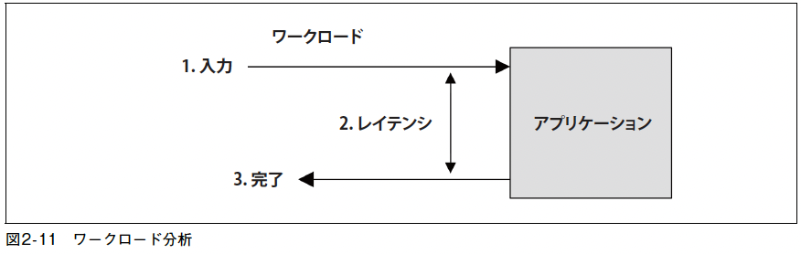
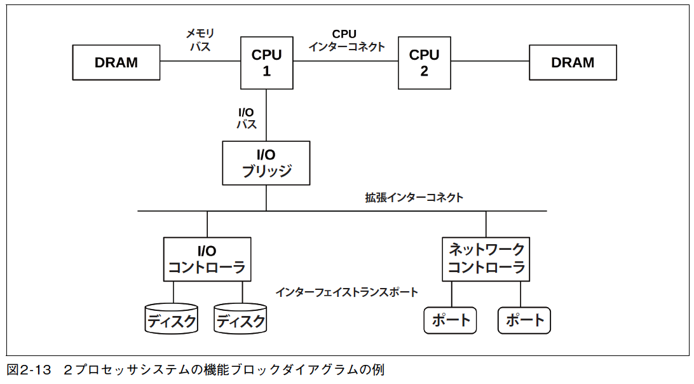

# 第2章 メソドロジ

> 人に魚を与えれば一日分の食事を与えられる。
> 人に漁を教えれば一生分の食事を与えられる。

中国の格言 ([解説の参考ページ](http://roushiweb.com/category4/entry104.html))

- ツールや指標だけでなく、ノウハウが重要。
  - manページを熟読しても解決方法を導くことは難しい。
  - manページにはノウハウは記載されていない。
- 筆者はパフォーマンスのメソドロジ（方法論）を集め、文書化、共有し、自前のメソドロジを開発した。
- 本書のすべての章のうち、初版からの変更がもっとも少なかったのがこの章。

## 2.1 用語
- システムパフォーマンスについての重要な用語まとめ。
  - IOPS(Input/output Operations Per Second)
  - スループット(throughput)
    - 通信では、データ転送速度（datarate、1秒あたりのバイト数または1秒あたりのビット数）
    - データベースなどでは、処理速度（operation rate、1秒あたりのオペレーション数または1秒あたりのトランザクション数）
  - 応答時間(response time): オペレーションが完了するまでの時間
  - レイテンシ(latency)
    - オペレーションがサービスの提供を待つために使った時間
    - コンテキストによっては、オペレーションにかかった時間全体、すなわち応答時間と同じ意味になる
  - 使用率(utilizaiton)
  - 飽和度(saturation)
  - ボトルネック(bottleneck)
  - ワークロード(workload): システムに対する入力、またはシステムにかけられる負荷のこと
    - 🤔 [クラウド時代の身近な用語「ワークロード」とはいったい何なのか？](https://qiita.com/mizukyf/items/8e65b516f600cb60518a)
  - キャッシュ(cache)

## 2.2 モデル
### 2.2.1
- 
- パフォーマンスに影響し得るもの（摂動, 干渉）
- 摂動の特定は難しい場合がある
  - クラウド環境ではゲストSUTからは見ることができないものがある。
    - 物理ホストシステム上のほかのアクティビティ（ほかのゲストテナントによるもの）
  - 複数のネットワーク化されたコンポーネントがワークロードを提供している場合。
    - ロードバランサ、プロキシサーバー、ウェブサーバー、キャッシングサーバー、アプリケーションサーバー・・・
- 環境を描くだけで見落としていた摂動の発生源に気づくこともある。
  - 分析的な検討のためには、環境をキューイングシステムのネットワークとしてモデリングしてもよい。

### 2.2.2 キューイングシステム
- 
- ディスクなど、キューイングシステムとしてモデリングできるものがある。
- モデリングすることで、負荷によって応答時間がどの程度遅れるかが予測できる。

## 2.3 コンセプト
- システムパフォーマンスの重要な概念を説明する。
### 2.3.1 レイテンシ
- レイテンシは、オペレーションが実行されるまでの待ち時間である。
- 
  - システムはネットワーク接続が開設されるのを待つ = レイテンシ
- Webサイトロードで発生するさまざまな(計測場所が異なる)レイテンシ
  - DNS latency
  - TCP connection latency
  - TCP data transfer latency
- これらはすべて、TCPデータ転送時間も含めて何かほかのオペレーションのレイテンシとして扱われる場合がある。
- 曖昧にならないように、何のレイテンシなのか修飾語を入れて明確にするべき。
- パフォーマンス障害をレイテンシを使って定量化する場合、同じ単位(時間)を使う。(秒, ミリ秒, マイクロ秒・・)
### 2.3.2 タイムスケール
- 時間についての感覚を得るために、タイムスケールが役立つ。
- 表2-2は、CPUのレジスタアクセスを1秒とした時にその比がどれくらいになるか（タイムスケール）を示した表
- 

### 2.3.3 トレードオフ
- 図2-4 は、よい/速い/安いのうちの「ふたつ」を選べというトレードオフを示したものだ。
- 右の図はIT プロジェクト用に用語を置き換えた。
- 
- パフォーマンス分析を怠って、速い、安いを選んでデータを詰め込んでしまうと、パフォーマンスの向上が不可能になってしまう場合もある。
- トレードオフの例
  - ファイルシステムのレコードサイズ
    - レコードサイズを小さくしてアプリケーションのI/Oサイズに近づけると、ランダムI/Oのパフォーマンスが上がる。
    - レコードサイズを大きくすると、ストリーミングのワークロードのパフォーマンスが上がる。
  - ネットワークのバッファサイズ
    - バッファサイズを小さくすると、接続ごとのオーバヘッドが削減できる。
    - バッファサイズを大きくすると、ネットワークのスループットが上がる。
- システムに変更を与えるときは、このようなトレードオフを考える。
### 2.3.4 チューニング
- パフォーマンスのチューニングは、仕事が行われる場所からもっとも近いところでしたときにもっとも効果的になる。
  - アプリケーション自体のチューニングがもっとも効果的
- 
- アプリケーションレベルでのチューニング例 
  - データベースクエリ削減、省略 などを行うと、パフォーマンスは大きく上げられることがある
  - ストレージデバイスのI/Oの省略による速度改善はわずか
- 今日では、スピーディーなデプロイを目標としており、正確さが重視され、パフォーマンスの計測や最適化は行われないことが多い。
  - パフォーマンスの問題が起きてからやる場合が多い。
  - 観測の場所としてもっとも効率的なレベルとは言えない。
- 多くの環境では、アプリケーションの部分はたえず開発されており、毎日、毎週のようにデプロイされている。
  - OSのチューニングや可観測性は見落とされがち。
  - OSのパフォーマンス分析をすれば、OSレベルの問題だけではなく、アプリケーションレベルの問題も見つけられることを忘れてはならない。

### 2.3.5 適切性のレベル
- パフォーマンスの要件は、パフォーマンスの専門的な能力のROI（Return on Investment、投資利益率）によって決まる。
  - 深く分析すすればするほど正しいということではない。
- システムパフォーマンスはコストだけの問題ではない。エンドユーザーのエクスペリエンスの問題でもある。
  - スタートアップであっても、パフォーマンスエンジニアリングへの投資が必要になることがある。
    - HFT（High frequency trading、超高速取引）のトレーダーではこの分野はパフォーマンスとレイテンシが死活問題になる。
    - データ転送のレイテンシを6m秒縮めるために、3 億ドルをかけてニューヨークとロンドンの取引所の間に新たな大西洋横断ケーブルの敷設が計画されている。

### 2.3.6 いつ分析を止めるのか
- いつ分析を止めるかの判断が難しい。
- 分析を止めることを検討してよい3つの状況
  - パフォーマンス障害の大部分を説明できたとき
  - 見込まれるROI が分析コストよりも低いとき
    - ただし、あとでもっと大きな障害が起きることを知らせるカナリア的な障害かもしれない場合は問題が大きくなる前にデバッグすることには意味がある。
  - ほかにもっと大きなROI が得られるものがあるとき
- 見込まれるROIに基づき、さまざまな問題の分析に優先順位をつける

### 2.3.7 基準時の推奨値
- パフォーマンスの推奨値、特にパラメータの値が有効なのは、特定の基準時（point in time）だけ
  - ある時点で最良のパラメタ値がそうで無くなる場合
    - ソフトウェアやハードウェアがアップグレードされた
    - 利用者が増えた
- パラメータを変更するときには、詳細な履歴情報を残すと役に立つ
  - 過去にどのような変更があったかを共有して見落としを防ぐ
  - バージョンコントロールシステムの導入
  - Puppet, Salt, Chef などの構成管理ツール

### 2.3.8 負荷かアーキテクチャか
- パフォーマンス問題
  - アーキテクチャ
    - ソフトウェア構成とハードウェアの問題（アーキテクチャと実装）
    - 例えば、特定のCPUだけがビジー状態になっているようなシングルスレッドなアーキテクチャや、ロックを奪い合うようなマルチスレッドアーキテクチャは問題がある
  - 負荷
    - かかっている負荷がただ重い
    - 処理自体に問題がないのにキューイングや長いレイテンシが発生する
    - クラウド環境ではオンデマンドでサーバインスタンスを追加して良いケース
- 

### 2.3.9 スケーラビリティ
- スケーラビリティ（scalability）
  - システムのパフォーマンスが負荷の増加にどの程度対応できるか
- 図2-6 システムの負荷が増えていったときの典型的なスループットプロファイル
  - 
  - ニーポイント（knee point）: 特定の位置（点線が示す位置）まで達すると、リソースの競合が始まり、スループットが下がり出す、この位置
    - 飽和点（saturation point）に達したとき（コンポーネントが100% の使用率）
    - 飽和点に近づき、キューイングがひんぱんで顕著になる場合
    - 例えば、CPUが飽和状態でスレッドがさらに追加されると、コンテキストスイッチが増え、CPUリソースが消費され、本来のタスクの処理量が減って、スループットは下がり始める。
- 図2-7 スケーラビリティが線形でなくなったときに平均応答時間かレイテンシに現れるパフォーマンスの低下
  - 
    - 急激な場合: メインメモリの空きがなくなってメモリページをディスクに移し始めた時など。
    - ゆっくりな場合: CPUの負荷
- リソースがなくなった時にスループットは線形のままで、エラーを返す場合: ウェブサーバは応答時間を一定にするために、503「Service Unavailable」を返す。
### 2.3.10 パフォーマンス指標
- システムパフォーマンス指標の一般的なタイプ
  - スループット（throughput）: 1秒あたりのオペレーション数かデータ量
    - コンテキストによって内容が変わる。
      - データベースの場合は1秒当たりのクエリやオペレーション数
      - ネットワークの場合は1秒当たりのデータ量
  - IOPS（I/O Operations Per Second）: 1秒あたりのI/Oオペレーション数
    - コンテキスト次第で定義はまちまちになる。
  - 使用率（utilization）: リソースのビジー率を%表示したもの
  - レイテンシ: オペレーションにかかる時間を平均またはパーセンタイルで表示したもの
- アクティビティを計測する補助ツールが生成する統計量やパフォーマンス分析やモニタリングのビジュアライゼーションツールなどで表示される
#### 2.3.10.1 オーバーヘッド
- 観察者効果（observer effect）: パフォーマンス指標を収集するためにどこかでCPUサイクルが使われてオーバーヘッドの原因になり、計測ターゲットのパフォーマンスにマイナス影響を与えてしまう。

#### 2.3.10.2 問題点
- あるバージョンでは正しい指標だったものが、新しいコード、コードパスを追加したときに適切に更新していないために誤ったものになることもある。
- パフォーマンス指標の問題の詳細については、「4.6 可観測性ツールに対する観察」を参照

### 2.3.11 使用率
- 使用率（utilization）は、は時間ベースか能力（または容量、capacity）ベースで定義できる。

#### 2.3.11.1 時間ベースの使用率の定義
- 待ち行列理論が公式を定義している。
- サーバーまたはリソースがビジー状態だった時間の平均的な割合
```
U = B/T
```
- U は使用率、T は観察を行った期間、BはT の期間中システムがビジー状態だった時間の合計
- 使用率が100%に近付くと、そのリソースをめぐって競合が発生している。
- コンポーネントがそのためにシステムのボトルネックになっているかどうかは、ほかの指標で確かめられる。
- 複数のオペレーションを並列実行できるコンポーネントの場合は、使用率が100% になっても要求を受け付けられる。
- 例えば、ディスクのバッファリング機能は使用率100%のビジー状態であっても後で処理するので受け付けられる。
- また、ストレージアレイは、一部のディスクが使用率100%でも、アイドル状態のディスクを抱えているのでさらに要求を受け付けられる。

#### 2.3.11.2 能力ベースの使用率の定義
- キャパシティプランニングで使う
  - 使用率が100% のディスクは、それ以上の要求を受け付けられないということを暗黙のうちに意味している。
  - 現在のディスクは、能力ベースの使用率の情報を提供していない。
    - ディスクの場合、100%の能力を使い切ったかどうかは、ディスクのオンボードコントローラが何をしているかの知識と能力の予測が必要になる。
- 本書では、使用率は時間ベースの定義を意味する。（ = 非アイドル時間（non-idle time））
- 能力ベースの定義は、メモリなどの量で表す指標の一部で使うことにする。

### 2.3.12 飽和度
- 飽和度（Saturation）: リソースが処理できる要求と比べてリソースに対する要求がどれぐらい多いか
- 飽和は、使用率（能力ベースの定義）が100%になり、それ以上の要求を処理できなくなって、キューイングが始まったときに始まる。
- 図2-8 使用率と飽和率
- 
- リソースが要求を並列処理でき流場合、使用率が100%になってもキューイングは始まらず、飽和も始まらない。
### 2.3.13 プロファイリング
- 👩‍💻 プロファイリングとは、ある人物の個人情報や過去の行動を分析し、今後の行動などを推測すること。
- プロファイリングは、ターゲットについての理解、研究できる像を作り上げる。
- 一定のインターバルでシステムの状態をサンプリング（sampling）し、集合を研究する。
  - サンプリングを使い、ターゲットのアクティビティを粗く描く。
  - 👩‍💻 パフォーマンスのチューニングの前提条件

### 2.3.14 キャッシング
- 低速なストレージティアの結果を高速なストレージティアに格納してパフォーマンスを向上させる方法。
- 複数のティアが使われることもある。
- CPUは、一般にメインメモリのために複数のハードウェアキャッシュ（レベル1、2、3）を用意している。
- 詳細は「6 章CPU」で説明
- キャッシュレイヤの一覧は、「3 章オペレーティングシステム」の「3.2.11キャッシング」を参照
- キャッシュのヒット率（hit ratio）: キャッシュ内に必要とされるデータが見つかる（ヒット）回数とキャッシュアクセス全体（ヒット+ ミス）の回数の比率。
```
ヒット率 = ヒット / 全アクセス（ヒット + ミス）
```
- 図2-9 は、キャッシュのヒット率が上がったときに期待できるパフォーマンスの向上の度合いを示している。
  - 
  - 関わっているふたつのストレージティアのスピードの差（ヒットのときとミスのときのスピードの差）のために、非線形のプロファイルになる。
- キャッシュミス率（cache miss rate）: 1 秒あたりのキャッシュミスを表す。個々のキャッシュミスによるパフォーマンス低下に比例（線形）。
- A, B二つのワークロードで、Aの方がキャッシュヒット率が良い場合でも、Aの方がキャッシュミス率が高い場合、Bの方が仕事が速い場合がある。
- 個々のワークロードの実行時間
```
実行時間 =（ヒット率 × ヒットレイテンシ）+（ミス率 × ミスレイテンシ）
```
- この計算は、平均的なヒット、ミスレイテンシを使い、作業がシリアライズされていることを前提とする

#### 2.3.14.1 アルゴリズム
- キャッシュの限られたスペースに何を格納するかは、キャッシュ管理アルゴリズムとポリシーによって決まる。
- キャッシュ保持ポリシー（cacheretention policy）: 残すものを決める
  - MRU（Most Recently Used）: もっとも最近に使ったオブジェクトを残す
  - MFU（Most Frequently Used）: 最も頻繁に使用するオブジェクトを残す
- キャッシュ削除ポリシー（cache eviction policy）: 削除するものを決める
  - LRU（Least Recently Used）: 最も最近使用されていないオブジェクトを削除する。MRUと同じ意味。短期間のページ使用履歴を保持している。
  - LFU（Least Frequently Used）: 最も頻繁に使用されていないオブジェクトを削除する。MFUと同じ意味。

  - NFU（Not Frequently Used）: コストがかからないものの徹底性に欠けるLRU
    - 👩‍💻最近使われたページを残すことを主眼としたアルゴリズム。カウンタを必要とする。使用回数だけで頻度を求めているために、どれだけ本当に頻繁かがわからない問題がある。
#### 2.3.14.2 ホット、コールド、ウォームキャッシュ
- キャッシュの状態を説明するために使われる用語
  - コールドキャッシュ（cold cache）: 空、または不要なデータが格納されたキャッシュ
  - ウォームキャッシュ（warm cache）: 役に立つデータも格納しているが、ホットというほどヒット率が高くない
  - ホットキャッシュ（hot cache）: よく要求されるデータがセット
  - ウォーム度（warmth）: キャッシュがどれぐらいホット、またはコールドか
- 最初に初期化されたときのキャッシュはコールド状態で、時間とともにウォームアップされていく。
### 2.3.15 Known-Unkhowns
- Known-Knowns: パフォーマンス指標をチェックしなければならないことを知っていて、現在の値も知っている場合。
- Known-Unknowns: 指標をチェックできることやサブシステムが存在することはわかっているが、まだ見ていないとき。
- Unknown-Unknowns: デバイスからの割り込みがCPUを大きく消費することを知らないため、デバイス割り込みをチェックしていない場合
- 「システムについて知れば知るほど、Unknown-Unknowns の存在に気付き、それらはチェックできるKnown-Unknowns になる」
- 👩‍💻 [知られていると知られていることがある](https://medium.com/@andreamantovani/known-knowns-known-unknowns-unknown-unknowns-leadership-367f346b0953)
- 👩‍💻 [Known unknowns](https://deeeet.com/writing/2016/05/24/known-unknowns/)
  
## 2.4 視点
- パフォーマンス分析には2つの視点がある。
  - 
### 2.4.1 リソース分析(（resource analysis)
- システムリソース（CPU、メモリ、ディスク、ネットワークインターフェイス・・）の分析から始める。ボトムアップ。
- 物理環境のリソースに対して責任を負うシステム管理者が主に行う。
- 作業内容
  - パフォーマンス障害の調査
  - キャパシティプランニング
- 視点
  - リソースがいつ限界に達するか、いつ限界に近付くかを明らかにするために使用率に注目する。
- リソース分析に適した指標
  - IOPS
  - スループット
  - 使用率
  - 飽和度
  - レイテンシ
- これは視点のひとつであって、唯一の視点ではない。
### 2.4.2 ワークロード分析(workload analysis)
- アプリケーションのパフォーマンスを調べる。トップダウン。
- アプリケーションソフトウェアとその構成に責任を負う人々によって使われる。
  - 
- ワークロード分析の対象
  - 要求: 与えられたワークロード
  - レイテンシ（latency、応答時間）: アプリケーションの応答時間(アプリケーションのパフォーマンスを表現するもっとも重要な指標)
  - 完了: エラー探し
- ワークロードの特性の把握（workload characterization）
  - 要求の属性をチェックして集計する作業が、ワークロードの要求の調査には含まれる。
- 調査の出発点はアプリケーションだということに注意
  - アプリケーションからライブラリ、OS（カーネル）へと下に向かって掘り下げていく。
- ワークロード分析に適した指標
  - スループット（秒あたりのトランザクション数）
  - レイテンシ

## 2.5 メソドロジ
- メソドロジは、どこから分析を始めるべきか、効果的な手順は何かを示して、この複雑な問題にアプローチしやすくしてくれる。
- 一部のアンチメソドロジ（anti-methodology）も含めてある。
### 2.5.1 街頭のアンチメソッド
- 街灯効果（streetlight effect）という観察結果のバイアスから命名されている。
> 「街灯の下のここで失くしたというのは確かなことなんですか？」　酔っぱらいは答える。「いいや、でもここは明かりの具合が一番いいからね」
  - 意味があるからではなく、ほかのツールの読み方を知らないのでtop(1) を見る、という感じ。
- 何らかの問題を見つけても決定的な問題を見つけられない(まともなメソドロジの欠如のこと)。
### 2.5.2 ランダム変更アンチメソッド
- 実験によるアンチメソッド
  - どこに問題があるかを適当に推測し、その問題が消えるまで適当に変更を加えて計測する。
- 非常に時間がかかる
- 長期的には無意味なチューニングを残す危険
  - OSなどのバグを回避するためにアプリケーションを書き換える場合
    - その後バグがフィックスされたらどうなるだろうか？
  - 負荷がピークになったときに、その正しく理解できない変更がもっと大きな問題を引き起こす
### 2.5.3 誰か他人のせいにするアンチメソッッド
- 他のシステムやコンポーネントに問題があるという仮説をもとに、問題をそのチームに丸投げする。
> 「これはたぶんネットワークだ。ネットワークチームにパケットを落としたとかその類のことをしてな
いか聞いてみてくれないか。」

- このアンチメソッドの犠牲者にならない方法
  - 告発者に対し、使ったツールや根拠になるデータをもらう
  - 誰かほかの人からその解釈に対するセカンドオピニオンをもらう
### 2.5.4 アドホックチェックリストメソッド
- 短期間でシステムをチェックしてチューニングしてくれと頼まれたときなど
- サポートプロフェッショナルが一般に使うメソドロジ
  - あらかじめ用意されたチェックリストをステップ実行する。
  - 同じタイプのシステムでの最近の経験や問題から作ったもの
- 基準値を推奨されることが多いので情報の新鮮さが保たれていることが必要
- 既知の解決方法がある問題に偏りがちで、ソースコードや環境に対するカスタムの修正には手が回らないことが多い。
- アドホックなチェックリストでも、よくある問題のチェック方法を全員に周知徹底するための方法として効果的
  - 問題の見分け方と解決方法を明確に処方箋的に書くと良い。
### 2.5.5 問題の記述
- 顧客に尋ねる項目。

1. パフォーマンスに問題があると思ったのはなぜか。
2. このシステムは、良好なパフォーマンスで動いていたことがあったか。
3. 最近の変化は何か。ソフトウェアか、ハードウェアか、負荷か。
4. その問題はレイテンシか実行時間で表現できるか。
5. その問題はほかの人やアプリケーションに影響を及ぼしているか（それとも、影響があるのはあなただけか）。
6. 環境はどうなっているのか。どのソフトウェア、ハードウェアを使っているのか。バージョン、構成はどうか。

- 最初のアプローチとして「問題の記述」を行うべき
- サーバにログインしたり指標をチェックするまでもなく問題をパフォーマンス障害を解決できることがある。
### 2.5.6 科学的メソッド
- 仮説を立て、それを検証することを通じて未知の事象について検討する。

1. 問題
2. 仮説
3. 予測
4. 検証
5. 分析

#### 2.5.6.1 例（観察的な検証を使うもの）
1. 問題: データベースクエリーが遅い
2. 仮説: 騒がしい隣人がデータベースとディスクI/Oを奪い合っている（ファイルシステムを介して）。
3. 予測: クエリーの過程でファイルシステムにおけるI/Oレイテンシが計測されるなら、原因はファイルシステムにある。
4. 検証: データベースファイルシステムレイテンシをトレースするとファイルシステム待ちでは5%未満の時間しか使っていないことがわかった。
5. 分析: このファイルシステムとディスクはクエリーの速度低下の原因ではない。

- ステップ2 に戻り、新たな仮説を立てる。
#### 2.5.6.2 例（実験的な検証を使うもの）
1. 問題: B -> C のときと比べ、A -> C にHTTP要求を送ったときの方が処理に時間がかかる
2. 仮説: ホストAとホストBは別のデータセンターにある。
3. 予測: ホストAをホストBと同じデータセンターに移すと問題は解決する。
4. 検証: ホストAを移してパフォーマンスを計測する。
5. 分析: パフォーマンス障害は解決した。仮説に整合している。

- 新しい仮説を立てて検証する場合は、前の実験の変更を元に戻してから行う。
  - 一度に複数の変更を加えると、どの変更が意味を持つのか見分けにくい。

#### 2.5.6.3 例（実験的な検証を使うもの）(ネガティブテスト)
1. 問題: ファイルシステムキャッシュのサイズを大きくしたらファイルシステムパフォーマンスが低下した
2. 仮説: 小さなキャッシュよりも大きなキャッシュを管理するときの方が計算能力が必要になる。
3. 予測: レコードサイズを段階的に小さくしていき、同じ量のデータを格納するために使うレコードの数を増やすと、パフォーマンスが次第に低下する。
4. 検証: 同じワークロードで段階的にレコードサイズを小さくして検証する。
5. 分析: 結果をグラフにまとめると、予測と符合した結果になっている。キャッシュ管理ルーチンに対してドリルダウン分析を実行する。

- これはネガティブテスト
- わざとパフォーマンスを低下させるようなことをして、ターゲットシステムについての理解を深める検証の例
### 2.5.7 診断サイクル（diagnosis cycle）

```
仮説　→　インストルメンテーション　→　データ　→　仮説
```

- このメソドロジもデータのコレクションを使って仮説をていねいに検証する。
- 診断サイクルはデータがすぐに新しい仮説を導いてくる。
- 仮説からデータまでの動きを早くするようにし、悪い理論は早い段階で排除され、よい理論を発展させていける。

### 2.5.8 ツールメソッド
- ツール重視のアプローチ
1. 利用できるパフォーマンスツールをリストアップする。
2. 個々のツールについて、得られる役に立つ指標をリストアップする。
3. 個々の指標について、考えられる解釈の方法をリストアップする。

- 処方箋的なチェックリストが完成する。
  - どのツールを実行すべきか、どの指標を読むべきか、その指標をどのように解釈すべきか
- 利用できる（つまり既知の）ツールだけに依存してしまう問題
- 自分が不完全な像しか見ていないことに気付かない危険性
- 複数のツールが同じ機能を持っているように見えるときには、それぞれの長所、短所を理解するためにさらに余分に時間を使ってしまう。
  - 結果をクロスチェックできて役に立つかもしれないが、時間の浪費になると考える(著者)
- カスタムツール（たとえば、動的トレーシング）が必要な問題は見つからず、解決されない危険性

### 2.5.9 USEメソッド
- USE（使用率、飽和度、エラー: Utilization、Saturation、Errors）メソッド
  - システム的なボトルネックを見つけるために、パフォーマンス調査の初期の段階で使うべきメソドロジ
  - システムリソースを重点的にチェックするメソドロジ
  - すべてのリソースについて、使用率、飽和度、エラーをチェックする。
    - リソース: 物理サーバーのすべての機能的なコンポーネント。指標に意味がある場合は、ソフトウェアリソースも。
    - 使用率: 決められたインターバルのなかで、リソースが要求を処理するためにビジー状態だった時間の割合。
    - 飽和度: 処理できない要求を抱えている度合い。プレッシャー（pressure）
    - エラー: エラーイベントの回数。
#### 2.5.9.1 手順
- USEメソッドのフローチャート
  - 
  - 1: エラーチェックは簡単に解釈できるので最初にやることで時間短縮になる
  - 2: 飽和度は使用率よりも簡単に解釈できる。少しでも飽和があれば問題になり得る。
- システムは複数のパフォーマンス問題を抱えていることがある。
- 最初に見つけたものは問題の一つであって決定的な問題ではないかもしれない。
#### 2.5.9.2 指標の表現
- USEメソッドの指標の表現
  - 使用率: インターバルを通じての割合（例: 「1個のCPUが90%の使用率で実行されている」）。
  - 飽和度: 待機キューの長さ（例: 「CPUは、平均して長さが4のランキューを持っている」）。
  - エラー: 報告されたエラーの数（例: 「このディスクドライブは、50回のエラーを起こしている」）。
- インターバルによって値が変わる場合
  - 使用率が短時間に極端に高くなるような場合、インターバルを長くすると直感的に分かりにくく、見落とす。
#### 2.5.9.3 リソースリスト
- USEメソッドの最初のステップは、リソースのリストを作ること
- できる限り完全なリストを作る
- サーバーハードウェアリソースの汎用リスト例
  - CPU:ソケット、コア、ハードウェアスレッド（仮想CPU）
  - メインメモリ: DRAM
  - ネットワークインターフェイス: イーサネットポート、インフィニバンド
  - ストレージデバイス: ディスク、ストレージアダプタ
  - アクセラレータ: GPU、TPU、FPGAなど（使われている場合）
  - コントローラ: ストレージ、ネットワーク
  - インターコネクト: CPU、メモリ、I/O

- USEメソッドは、高い使用率や飽和によってパフォーマンスを低下させるようなリソースでもっとも効果的なメソドロジ
  - キャッシュは使用率が高い方がパフォーマンスが上がるのでハードウェアキャッシュなどはリストに載せなくて良い。
  - リストに入れてその指標が実際にどのように機能するかを見てみる
#### 2.5.9.4 機能ブロックダイアグラム
- システムの機能ブロックダイアグラムを描いてリストアップするのも良い。
  - 
- コンポーネントの関係も示すので、データフローのなかのボトルネックを探すときに特に役に立つ。
- CPU、メモリ、I/Oのインターコネクトやバスは見落としがちだ。
#### 2.5.9.5 指標
- リソースのリストが完成したら、個々のリソースについて適切な指標タイプを考える。
  - 
  - 各指標を取り出すための命令を入れておく。
  - 現在取得できない指標のメモを取っておこう。これはKnown-Unknownsである。
- 比較的難しい組み合わせ
  - 
  - 動的トレーシングやCPUパフォーマンスカウンタ機能を使わなければならない場合がある。
- 「付録A USE メソッド: Linux」は、Linux システムのためのUSEメソッドチェックリストの例
#### 2.5.9.6 ソフトウェアリソース
- ソフトウェアリソースの一部も同じようにして検証できる。
  - ミューテックスのロック: 使用率はロックされていた時間、飽和度はロックを待ってキューイングされていたスレッド数として定義される。
  - スレッドプール
  - プロセス/スレッドの数
  - ファイルディスクリプタの数
#### 2.5.9.7 解釈方法の提案
- タイプごとの指標の一般的な解釈方法

  - 使用率
    - 使用率100%は、一般にボトルネックを起こしている兆候である（飽和度とその効果をチェックして確認する）。
    - 60%を超える使用率も問題を示している場合がある。
      - 短期間の100% 使用率が隠されている可能性がある。
      - ハードディスクなどの一部のリソース（CPUは異なる）は、使用率が上がると、キューイングによる遅れがひんぱんになり、気付くほどになる。
      - 60% の使用率の問題については、「2.6.5 待ち行列理論」を参照
  - 飽和度
    - 飽和度が少しでもあれば（0 以外）、問題が起きている可能性がある。
  - エラー
    - エラーカウンタが0 以外なら精査すべきである。
- 調査の範囲を狭めて問題のある部分に集中できるようにする。排除のプロセス。
#### 2.5.9.8 リソースコントロール
- クラウドコンピューティング、コンテナ環境で、ひとつのシステムを共有するテナントを制限、抑制するために使われる。
- 物理リソースのときと同じように、USEメソッドを使って調べることができる。
- 「11 章クラウドコンピューティング」参照
#### 2.5.9.9 マイクロサービス
- マイクロサービスアーキテクチャにも、同じようにリソース指標過多の問題がある。
- Netflixの一般的なマイクロサービスのUSE指標
  - 使用率: インスタンスクラスタ全体の平均CPU使用率
  - 飽和度: レイテンシの99パーセンタイルと平均の差を近似値として使う（99パーセンタイルは飽和の影響を受けると仮定して）。
  - エラー: 要求エラー

### 2.5.10 REDメソッド
- 一般的にはマイクロサービスアーキテクチャのクラウドサービスで使われる。
- トム・ウィルキーが作ったもの
  - [Tom Wilkie](https://twitter.com/tom_wilkie)
- ユーザーから見た健全性を監視するための3 つの指標

> すべてのサービスで、要求率（request rate）、エラー（error）、処理時間（duration）をチェックせよ。

  - 要求率: 1 秒あたりのサービス要求の数
  - エラー: 失敗した要求の数
  - 処理時間: 要求の処理が終わるまでの時間（平均のほか、パーセンタイルなどの分布の統計量も考慮する。「2.8 統計量」参照）。

- マイクロサービスアーキテクチャのダイアグラムを作り、個々のサービスに対してこれら3つの指標をモニタリングすることが求められる。
- 手っ取り早く簡単に実施できて包括的
- USEメソッドはマシンの健全性、REDメソッドはユーザーから見た健全性をチェックする
- 要求率で、パフォーマンス障害が負荷によるものかアーキテクチャによるものかを判断できる（「2.3.8 負荷かアーキテクチャか」参照）。
  - 要求率が安定しているのに処理時間が長くなってくるなら、アーキテクチャ、すなわちサービス自体に問題があるということだ。
### 2.5.11 ワークロードの特性の把握
- 負荷に起因する問題を明らかにするための単純で効果的なメソドロジ
- パフォーマンスではなくシステムに対する入力に注目する
- ワークロードの特性は、次の問いに答えていくとわかる。
  - 誰が負荷をかけているのか
    - プロセスID、ユーザーID、リモートIP アドレスは何か。
  - なぜ負荷がかかっているのか
    - コードパス、スタックトレースはどうか。
  - 負荷の特徴は何か
    - IOPS、スループット、方向（読み/書き）、タイプは何か。適切なら分散（標準偏差）も含める。
  - 負荷は時系列的にどのように変化しているか

- 答えがどうなるかはっきりとした予想があっても意外なことが起きることがあるので、全部をチェックすると役に立つ。
  - 例えば、、
    - データベースサーバに負荷がかかった場合、クライアントになっているWebサーバが原因と思っていたが、全体を調べてみるとDDoS攻撃を受けていた・・・など
- 素性が明らかになったワークロードを取り除けない場合、システムリソースコントロールを使ってワークロードを抑制する
  - 例えば、、
    - バックアップをもっとゆっくり実行して、データベースに害を与えないようにできる。
- ワークロードの計測値の平均だけでなく、分布や分散の詳細も集めておくとよい。
  - 予想されるさまざまなワークロードをシミュレートしたいときには、これが重要になる。

### 2.5.12 ドリルダウン分析
- ドリルダウン分析は、高いレベルで問題を解析するところから始まり、焦点をしぼっていき、注目すべき領域を深く掘り下げていく。
- 根本原因を見つける。
- システムパフォーマンスを調べるためのドリルダウン分析の3段階
1. モニタリング: 時系列的に高レベルの統計量を記録。
2. 特定: ボトルネックになっている可能性のあるものを特定し、調査対象を関連性のありそうな一部のリソースや領域に絞り込む。
3. 分析: 根本原因を明らかにして問題を定量化するために、特定したシステム領域をさらに解析する。
- モニタリング
  - 全社規模で実施され、すべてのサーバー、クラウドインスタンスの結果が集計される。
  - SNMP（Simple Network Monitoring Protocol）
    - モニタリングための古くからのテクノロジ
    - ネットワークに接続されていてSNMPをサポートするデバイスなら何でもモニタリングでき
  - 新しいモニタリングシステムでは、得られたデータは記録されGUIによって可視化される。
    - 短期的にコマンドラインツールを実行しただけでは見落としてしまうような長期的なパターンが明らかになることがある
- 特定
  - サーバーを直接対象とし、システムコンポーネントをチェックして行われる。
  - vmstat(8)、iostat(1)、mpstat(1)
  - 最近は同じ指標を表示するGUI ダッシュボード
- 分析
  - ドリルダウン（掘り下げ）の大半はここで行われる。
  - 必要に応じてソフトウェアスタックのレイヤを外から剥ぎ取るようなこともする
  - strace(1)、perf(1)、BCCツール、bpftrace、Ftrace
- Netflix クラウドの例
1. モニタリング: オープンソースのクラウドワイドモニタリングプラットフォームであるNetflix Atlas
2. 特定: USEメソッドの指標などで単一インスタンスを分析してダッシュボードに表示するNetflix perfdash（正式名はNetflix Vector）
3. 分析: さまざまなタイプのフレームグラフを生成するNetflix FlameCommander とSSH セッションを介して実行されるFtrace ツール、BCCツール、bpftrace などのコマンドラインツール


#### 2.5.12.1 なぜなぜ分析
- [なぜなぜ分析（Five Whys）](https://ja.wikipedia.org/wiki/%E3%81%AA%E3%81%9C%E3%81%AA%E3%81%9C%E5%88%86%E6%9E%90)
  - 「なぜか」を自問自答し、それを全部で5回（またはそれ以上）繰り返す方法
- しつこく疑問を追いかけ、根本問題に向かって掘り下げていく。
### 2.5.13 レイテンシ分析
### 2.5.14 メソッドR
### 2.5.15 イベントトレーシング
### 2.5.16 ベースライン統計
### 2.5.17 静的パフォーマンスチューニング
### 2.5.18 キャッシュのチューニング
### 2.5.19 マイクロベンチマーキング
### 2.5.20 パフォーマンスマントラ

## 2.6 モデリング
### 2.6.1 エンタープライズシステムかクラウドシステムか
### 2.6.2 視覚的な究明
### 2.6.3 スケーラビリティに関するアムダールの法則
### 2.6.4 ユニバーサルスケーラビリティ法則
### 2.6.5 待ち行列理論

## 2.7 キャパシティプランニング
### 2.7.1 リソースの限界
### 2.7.2 要素分析
### 2.7.3 スケーラビリティを向上させる方法

## 2.8 統計量
### 2.8.1 パフォーマンスゲインの定量化
### 2.8.2 平均
### 2.8.3 標準偏差, パーセンタイル, 中央値
### 2.8.4 変動係数
### 2.8.5 文峰分布
### 2.8.6 外れ値

## 2.9 モニタリング
### 2.9.1 時系列的なパターン
### 2.9.2 モニタリングプロダクト
### 2.9.3 ブート以降の集計

## 2.10 ビジュアライゼーション
### 2.10.1 折れ線グラフ
### 2.10.2 分布図
### 2.10.3 ヒートマップ
### 2.10.4 タイムライン図
### 2.10.5 表面プロット
### 2.10.6　ビジュアライゼーションツール

## 2.11 練習問題
1. パフォーマンスの基本用語についての以下の問いに答えなさい。
 - IOPSとは何か。
 - 使用率とは何か。
 - 飽和（度）とは何か。
 - レイテンシとは何か。
 - マイクロベンチマーキングとは何か。
2. あなたの（または架空の）環境で使うメソドロジを5 つ選びなさい。実施する順序で並べ、個々のメソドロジを選んだ理由を説明しなさい。
3. 唯一のパフォーマンス指標として平均レイテンシを使ったときの問題点を簡潔に説明しなさい。99パーセンタイルを含めれば、その問題は解決できるか。

## 2.12 参考文献

