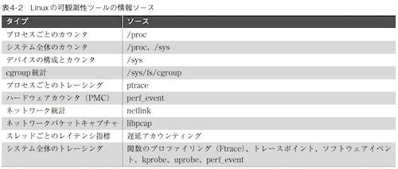

# 第4章 可観測性ツール

参）🤔オブザーバビリティとは？
https://www.splunk.com/ja_jp/data-insider/what-is-observability.html
> オブザーバビリティ(可観測性)とは、システムの出力を調査することによって内部の状態を測定する能力を指します。出力からの情報すなわちセンサーデータのみを使用して現在の状態を推定できるシステムは「オブザーバビリティがある」とみなされます。

Observabilityと英語では表記し、Observe（観察する）とAbility（能力）を組み合わせた意味の単語です。この言葉は最近の流行語ではなく、制御理論(自己調整システムについて説明し理解するための理論)に関連して数十年前に提唱された用語に由来します。

---
この章での学習目標は次の通り。
- 静的パフォーマンスチューニングツールとクライシスツールを見分けられるようにする。
  - クライシスツール：緊急用ツール、アウトドアや日常の作業で使えるツールをコンパクトに内蔵したツールナイフ。
    - 
- ツールのタイプとそのオーバーヘッドを理解する: カウンタ、プロファイリング、トレーシング
- 可観測性データのソースについて学ぶ: /proc、/sys、トレースポイント、kprobe、uprobe、USDT、
PMCなど
- 統計量のアーカイブを作るsar(1) の設定方法を学ぶ。

## 4.1 取り上げるツール

- 大半はCPU、メモリ、ディスクなどの特定のデバイスにターゲットを絞ったもの
- そのほかに、さまざまなものを解析できるperf、Ftrace、BCC、bpftrace などの多用途ツール

### 4.1.1 静的パフォーマンスツール
- アクティブなワークロードを抱えたシステムではなく、休止状態のシステムの属性を解析するタイプのもの。
- 構成ミスによって起こるパフォーマンス障害を調査する。
- 構成やコンポーネントの問題をチェックするときに図4.2の使う。

### 4.1.2 クライシスツール
- 表4.1 はクライシスツールとして推奨されているインストールパッケージ、またはソースリポジトリ

- デフォルトのLinux ディストリビューションには、procpsとutil-linux がインストールされているだけという場合があるので、そういうときにはその他すべてのパッケージをインストールしなければならない。
- コンテナ環境では、システムへのフルアクセスを持ち、すべてのツールがインストールされている特権的なデバッグコンテナを作るとよい場合がある。必要なときにこのコンテナのイメージをコンテナホスト
にインストールし、デプロイすればよい。
- ツールパッケージを追加しただけでは不十分な場合があるので必要な設定も行わなければならない。
  
## 4.2 ツールタイプ
- 可観測性ツールの分類


- いくつかの一部のツールは、複数の四半球に収まる。
  - 例えば、top(1)は、システム全体の集計情報を持っており、コマンドにオプション（-p PID）をつけるとは特定のプロセスだけを対象にするようにフィルタリングできる。
- イベントベースツール
  - プロファイラ：イベントについての一連のスナップショットを取ってアクティビティを観測し、ターゲットのおおよその姿を描く。
  - トレーサー：対象のイベントをすべてインストルメンテーションし、たとえばカスタマイズされたカウンタを生成するなどの処理を加えることもある。
  
### 4.2.1 固定カウンタ
- カーネルは、システム統計を提供するためにさまざまなカウンタを維持している。
- 通常のカウンタは、イベントが発生するとインクリメントされる符号なし整数として実装されている。
  - 受信したネットワークパケットの数、発行したディスクI/Oの数、発生した割り込みの数のカウンタ
- カーネルは、一般に2個（イベントの数とイベント処理にかかった時間の合計）の累積値カウンタを管理するという方法をとる。
- カウンタはデフォルトで有効になっており、カーネルによって継続的にメンテナンスされているので、パフォーマンス的には「タダ」で使えると考えてよい。

#### 4.2.1.1 システム全体
- カーネルカウンタを使ってシステムソフトウェアやハードウェアリソースのコンテキストでシステム全体のアクティビティを解析する。
  - vmstat(8): 仮想メモリ、物理メモリの統計量。システム全体
  - mpstat(1): CPUごとの使用率。
  - iostat(1): ディスクごとのI/Oの使用状況。ブロックデバイスインターフェイスから報告される。
  - nstat(8): TCP/IPスタックの統計量。
  - sar(1): さまざまな統計量。履歴情報の報告のために情報をアーカイブ化することもできる。
- 多くのツールは、オプションでインターバル（interval、間隔）と個数（count）を指定できるという慣習的なルールに従っている。

```
$ vmstat 1 3
procs -----------memory---------- ---swap-- -----io---- -system-- ------cpu-----
r b swpd free buff cache si so bi bo in cs us sy id wa st
4 0 1446428 662012 142100 5644676 1 4 28 152 33 1 29 8 63 0 0
4 0 1446428 665988 142116 5642272 0 0 0 284 4957 4969 51 0 48 0 0
4 0 1446428 685116 142116 5623676 0 0 0 0 4488 5507 52 0 48 0 0
```


#### 4.2.1.2 プロセスごと
- プロセス指向で、カーネルが個々のプロセスのためにメンテナンスしているカウンタを使っている。
- Linux ツールとしては次のようなものがある。
  - ps(1): プロセスのステータス、メモリやCPUの使用率などのさまざまな統計量を表示する。
  - top(1): CPUの使用率、その他の統計量順に上位のプロセスを表示する。
  - pmap(1): プロセスのメモリセグメントを利用統計付きでリストアップする。

- 一般に、/proc ファイルシステムから統計量を読み出している。

### 4.2.2 プロファイリング
- プロファイリングは、ターゲットの挙動のサンプル、スナップショットを集めてターゲットの特徴を表す。
  - 例えば、タイマーに基づいて命令ポインタやスタックトレースを __サンプリング__ し、CPUサイクルを消費しているコードパスの特徴を浮かび上がらせる。
- サンプルは、通常すべてのCPUを通じて100Hz（サイクル/秒）などの決まった頻度で1分などの短い期間に収集される。
- プロファイリングツールは、プロファイラ: profiler と呼ぶ。
- プロファイラは、ターゲットのアクティビティとサンプリングが同じ歩調にならないように、100Hz ではなく99Hz を使うことが多い。歩調が揃うと、数えた数が多過ぎたり少な過ぎたりすることがある。
- 固定カウンタとは異なり、一般に必要なときに限り有効にされる。
- 収集のためにCPUオーバーヘッド、格納のためにストレージオーバーヘッドがかかるため。

#### 4.2.2.1 システム全体
- システム全体を対象とするLinuxプロファイラには次のものがある。
  - perf(1): Linux の標準プロファイラ
  - profile(8): BCCリポジトリに含まれるBPFベースのCPUプロファイラ
  - Intel VTune Amplifier XE: Linux とWindows のプロファイリング
  
#### 4.2.2.2 プロセスごと
- プロセス指向のLinux プロファイラには次のものがある。
  - gprof(1): GNUプロファイリングツール。コンパイラが追加した（たとえばgcc -pg）プロファイリング情報を分析する。
  - cachegrind: valgrind ツールキットに含まれている。ハードウェアキャッシュの使用状況をプロファイリングし、kcachegrind を使ってビジュアライズできる。
  - Java Flight Recorder (JFR): プログラミング言語は、言語コンテキストを調査できる専用プロファイラを持っていることがよくある。Java のJFRはその例である。

- プロファイリングツールの詳細は、「6 章CPU」と「13 章perf」を参照
  
### 4.2.3 トレーシング
- トレーシングは __発生したイベントをすべてインストルメンテーション__ し、あとで分析するためにイベントごとの詳細情報を格納したり、集計を生成したりすることができる。
- トレーシングはプロファイリングよりもCPUとストレージのオーバーヘッドが高くなるため、ターゲットの実行速度を遅らせることがある。
- トレーシングも必要なときしか使われない。
- ロギング（logging）は、デフォルトで有効にされる頻度の低いトレーシングと考えることがで
きる。

#### 4.2.3.1 システム全体
- カーネルのトレーシング機能を使って、システムソフトウェアやハードウェアリソースの __コンテキスト__ でシステム全体のアクティビティを解析する。
- Linux トレーサーとしては次のようなものがある。
  - tcpdump(8): ネットワークパケットのトレーシング
  - biosnoop(8): ブロックI/Oのトレーシング
  - execsnoop(8): 新しいプロセスのトレーシング
  - perf(1): Linux の標準プロファイラだが、イベントトレーシングにも使える。
  - perf trace: システム全体のシステムコールをトレースするperf の特別なサブコマンド
  - Ftrace: Linux の組み込みトレーサー
  - BCC: BPFベースのトレーシングライブラリとツールキット
  - bpftrace: BPFベースのトレーサー（bpftrace(8)）とツールキット

#### 4.2.3.2 プロセスごと
- Linux トレーサーとしては次のようなものがある。
  - strace(1): システムコールのトレーシング
  - gdb(1): ソースレベルデバッガ
- デバッガはイベントごとのデータを解析できるが、そのためにはターゲットの実行を停止、開始しなければならない。オーバーヘッドが莫大なものになることがあるので、本番環境での使用には適していない。

### 4.2.4 モニタリング
#### 4.2.4.1 sar(1)
- sar(1)（System Activity Reporter）
- 単一OSホストのモニタリングで古くから使われている。AT&T Unix に起源を持つ。
- カウンタベースで、cronによってスケジューリングされた時刻に実行されるエージェントがシステム全体のカウンタの状態を記録していく。
```
# sar
Linux 4.15.0-66-generic (bgregg) 12/21/2019 _x86_64_ (8 CPU)
12:00:01 AM CPU %user %nice %system %iowait %steal %idle
12:05:01 AM all 3.34 0.00 0.95 0.04 0.00 95.66
12:10:01 AM all 2.93 0.00 0.87 0.04 0.00 96.16
12:15:01 AM all 3.05 0.00 1.38 0.18 0.00 95.40
12:20:01 AM all 3.02 0.00 0.88 0.03 0.00 96.06
[...]
Average: all 0.00 0.00 0.00 0.00 0.00 0.00
```
- 数十種もの統計量を記録し、CPU、メモリ、ディスク、ネットワーキング、割り込み、消費電力などについての知見を提供する。
- ネットワークに指標を送るサードパーティのモニタリングプロダクトも多数ある。
#### 4.2.4.2 SNMP
- SNMP（Simple Network Management Protocol）
- ネットワークのモニタリング
- ほとんどの環境はカスタムエージェントベースのモニタリングに切り替わっている。
  - SNMPエージェント
    - ネットワーク機器がSNMPにより外部の機器と通信し、自身の状態を報告したり、管理や操作を受け付ける
#### 4.2.4.3 エージェント
- 最近のモニタリングソフトウェアでは、カーネルとアプリケーションの指標を記録するためにエージェント（agent、エクスポーター: exporter とかプラグイン: plugin と呼ばれることもある）を実行する。
- システムカウンタだけでは入手できない詳細なアプリケーション要求の指標を提供できる。
- Linux 用のモニタリングソフトウェアとエージェントには次のものがある。
  - Performance Co-Pilot（PCP）: PMDA（Performance Metric Domain Agents）と呼ばれる数十種のエージェントをサポートし、そのなかにはBPFベースの指標も含まれる。
  - Prometheus: データベース、ハードウェア、メッセージング、ストレージ、HTTP、API、ロギングなどのための数十種のエクスポーターをサポートする。
  - collectd: 数十種のプラグインをサポートする
- モニタリングアーキテクチャの例
  

- 各サーバから指標がデータベースに送られ、クライアントUIでグラフとしてダッシュボードに表示される。
- モニタリングデータベースサーバーとしてはGraphite Carbon、モニタリングウェブサーバー/ダッシュボードとしてはGrafana などがある。
- モニタリング製品は何十種もあるが、カーネルのカウンタに基づくシステム指標を学習しておくと、モニタリング製品を理解するために役に立つ。
## 4.3 可観測性ツールの情報ソース
- 取り上げるソース



- イベント、グループ名を使ってこれらのトレー
シングソースが何を対象としているかまとめたも


### 4.3.1 /proc
- カーネル統計に対するファイルシステムインターフェイス。
- いくつかのディレクトリが含まれており、各ディレクトリには対象プロセスのプロセスIDに基づく名前が付けられている。
  - statはシステムの全体的な動作状況を表示
- カーネルによって動的に作成される。
- ストレージデバイスの裏付けはない（インメモリで実行されている）。
- ほとんどが読み出し専用で、可観測性ツールのために統計量を提供している。
- 一部のファイルは、プロセスやカーネルの動作をコントロールするために書き込み可能になっている。
  - tcp_rmem など、設定変更が可能
- 大半の/proc ファイルの読み出しにかかるオーバーヘッドは無視できる。
- ただし、ページテーブルをたどっていかなければならないメモリマップ関連のファイルは例外。
### 4.3.2 /sys
- /proc/sys配下には、OSのチューニングパラメータが集まっている。ここにあるファイルやパラメータを理解することで、OSを特殊環境などに適応させることができる。(引用: https://atmarkit.itmedia.co.jp/flinux/special/proctune/proctune02a.html)
- /sys ファイルシステムは、一般に、数万の統計量を格納する読み出し専用ファイルと、カーネルの状態を変更するための書き込み可能ファイルを持っている。
### 4.3.3 遅延アカウンティング
- 遅延アカウンティング（delay accouting）は、プロセスやスレッドグループが、どれだけカーネルに待たされたかを測定できる仕組み。
- CONFIG_TASK_DELAY_ACCTオプションを指定したLinux システムは、次の項目についてタスクごとの時間を管理する。
  - スケジューラレイテンシ（scheduler latency）: on-CPUになるのを待つ時間
  - ブロックI/O（block I/O）: ブロックI/Oが完了するのを待つ時間
  - スワッピング（swapping）: ページングを待つ時間（メモリの圧迫度）
  - メモリの回収（memory reclaim）: メモリ回収ルーチンが実行されるのを待つ時間
### 4.3.4 netlink
### 4.3.5 トレースポイント
### 4.3.6 kprobe
### 4.3.7 uprobe 
### 4.3.8 USDT
### 4.3.9 ハードウェアカウンタ(PMC)
### 4.3.10 可観測性ツールのその他の情報ソース

## 4.4 sar
### 4.4.1 sar(1)でできること
### 4.4.2 sar(1)モニタリング
### 4.4.3 sar(1)のライブ出力
### 4.4.4 sar(1)のドキュメント

## 4.5 トレーシングツール

## 4.6 可観測性ツールに対する観察

## 4.7 練習問題

1. 静的パフォーマンスツールの例をいくつか挙げなさい。
2. プロファイリングとは何か
3. プロファイラが100Hzではなく99Hzを使うのはなぜか。
4. トレーシングとは何か。
5. 静的インストルメンテーションとは何か。
6. 動的インストルメンテーションが重要な理由を説明しなさい。
7. トレースポイントとkprobe の違いは何か。
8. 以下の作業で予想されるCPUのオーバーヘッド（低いか普通か高いか）を説明しなさい。
   1. ディスクのIOPSカウンタ（iostat(1) で見られるもの）
   2. トレーシングポイントかkprobe を使ったディスクI/Oごとのトレーシング
   3. トレーシングポイントかkprobe を使ったコンテキストスイッチごとのトレーシング
   4. トレーシングポイントかkprobe を使ったプロセスの起動（execve(2)）ごとのトレーシング
   5. uprobe を使ったlibc malloc( ) 呼び出しごとのトレーシング
9. パフォーマンス分析でPMCに価値がある理由を説明しなさい。
10. 可観測性ツールが与えられたとき、どうすればそれが使っているインストルメンテーションソースを明らかにできるかを説明しなさい。


## ４.８ 参考文献
