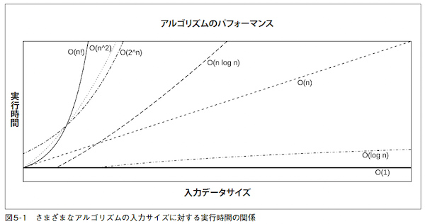
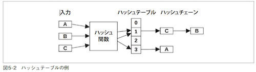

# 第5章 アプリケーション
- システムパフォーマンスの研究者にとってのアプリケーションパフォーマンス分析とは？
  - システムリソースを最も最大限に活用するためのアプリケーション構成
  - アプリケーションがシステムをどのように使っているかの特徴づけ
  - 一般的な病理分析

## 5.1 アプリケーションの基礎知識
- アプリケーションを広い視野から見て理解する。
  - 機能
  - アプリケーションが処理する要求
  - パフォーマンス要件（SLOなど）
  - CPUモード（ユーザレベルか、カーネルレベルか）
  - 構成・設定（キャッシュサイズ、スレッド数など）
  - ホスト（アプリケーションをホスティングしているものは何か？）
  - アプリケーションの指標が提供されているか
  - どのようなログを作っているか
  - バージョン管理
  - バグデータベースはあるか
  - ソースコード管理
  - コミュニティ、書籍、エキスパート
- 機能ダイアグラム(functional diagram)
  - アプリケーションの内部構造を描く図

### 5.1.1 パフォーマンスの目標
- パフォーマンス分析の明確な目標を設定し、方向性を決める。
- 目標の項目
  - レイテンシ
  - スループット
  - リソースの使用率
  - コスト: システム利用料金あたりのパフォーマンスを上げる
- ビジネスやQoS（サービス品質）要件の指標を使って定量化するとなおよい。
  - 『95% の要求は100m秒以下のレイテンシで処理されるようにする。』など...

#### 5.1.1.1 Apdex（application performance index）
- 顧客エクスペリエンスを定量化できる。

```
Apdex =（満足 + 0.5 × 許容範囲 + 0 × 不満）/イベント数
```
- 0（満足な顧客なし）〜 1（顧客全員が満足）の値をとる

### 5.1.2 よく実行されるコードの最適化
- アプリケーションのパフォーマンスを効率よく向上させるためには、よく実行されるコードパスを見つけて改善するのが効率が良い。
- よく実行されるコードパスを見つける方法として、アプリケーションの分析とプロファイリングが有効。
  - スタックトレース
  - フレームグラフ
  - 可観測性ツール
    - よく実行される部分のコンテキスト情報

### 5.1.3 可観測性
- 最も大きくパフォーマンスを引き上げられるのは、不要な仕事を取り除いた時。
- 性能だけ比べるのではなく、可観測性ツールを多く取り揃えているツールを選ぶ方が不透明なツールを選ぶより、長期で見ると良い可能性がある。

### 5.1.4 ビッグオー記法
- アルゴリズムの複雑度を分析し、入力データセットが増えたときにパフォーマンスがどう変わるかをモデリングする。
- オー（O）は関数のオーダー（order）、処理量の増加によって処理時間がどのように増加するか

表5-1 ビッグオー記法の例
| 記法       | 例                                                                                                                                                           |
| ---------- | ------------------------------------------------------------------------------------------------------------------------------------------------------------ |
| O(1)       | 2 値テスト                                                                                                                                                   |
| O(log n)   | ソート済み配列の二分探索                                                                                                                                     |
| O(n)       | 連結リストの線形サーチ                                                                                                                                       |
| O(n log n) | クイックソート（平均的な条件で）                                                                                                                             |
| O(n2)      | バブルソート（平均的な条件で）                                                                                                                               |
| O(2n)      | 数値の因数分解、指数的な成長                                                                                                                                 |
| O(n!)      | [力任せに解く巡回セールスマン問題](https://ja.wikipedia.org/wiki/%E5%B7%A1%E5%9B%9E%E3%82%BB%E3%83%BC%E3%83%AB%E3%82%B9%E3%83%9E%E3%83%B3%E5%95%8F%E9%A1%8C) |

- 

## 5.2 アプリケーションのパフォーマンス向上のためのテクニック
### 5.2.1 I/Oサイズの選択
- I/Oサイズの大小に関わらずかかるコスト
  - バッファの初期化
  - システムコールの実行
  - モード/コンテキストスイッチ
  - カーネルメタデータのアロケート
  - プロセスの特権と制限のチェック
  - アドレスからデバイスへのマッピング
  - I/Oを実行するためのカーネル
  - ドライバコードの実行
  - メタデータとバッファの開放
- I/Oサイズを大きくすれば固定コストが減って効率的。
- しかし、転送すべきデータが小さい場合は無駄になり、かえって遅くなってしまう（I/Oレイテンシが上がる）。
- アプリケーションが要求するサイズに最も近い小さい値をI/OサイズにするとI/Oレイテンシは下がる。

### 5.2.2 キャッシング
- よく実行されるオペレーションの結果をローカルキャッシュに格納して後で使えるようにすることでパフォーマンスを上げる手法。
- アプリケーションがどのようなキャッシュ機能を持っているか、キャッシュサイズはどれくらいに設定したら良いか、調べて設定する。

### 5.2.3 バッファリング
- 書き込みデータを一定量になるまで一時保存し、バッファ内でデータを結合してI/Oサイズを大きくすることで、書き込み効率を上げる。
- バッファへの最初に書き込みはディスクに書き込まれるまで待つ必要があり、書き込みタイプによっては書き込みレイテンシが高くなる場合がある。
- リングバッファ（ring buffer, 循環バッファ: circular buffer）は、コンポーネント間での継続的なデータ転送のために使えるアルゴリズム。
  - 👩‍💻[リングバッファー](https://www.wdic.org/w/TECH/%E3%83%AA%E3%83%B3%E3%82%B0%E3%83%90%E3%83%83%E3%83%95%E3%82%A1%E3%83%BC)
### 5.2.4 ポーリング
- ループ内でイベントのステータスをチェックしてイベントの発生を確認する手法。
- チェックの間にポーズ（一時停止）が入る。
- パフォーマンス上の問題
  - 反復的なチェックにより、CPUのオーバヘッドが高くなる
  - イベントの発生から次のチェックまでの間のレイテンシが高い
- イベントの発生をリスン(?)するようにふるまいを変えられることができれば改善できる(？)
  - 🤔WebアプリケーションではWebHookを使う？
#### 5.2.4.1 poll()システムコール
- ファイルディスクリプタのステータスをチェックするためのシステムコール。
- イベントベースなのでポーリングのようなパフォーマンスコストはかからない。
  - イベントが発生した時に配列をスキャンする。
  - O(n)なので配列サイズによってはパフォーマンスの大きな問題になる危険がある。
  - ChatGPTにpoll()を使ってファイル受信を監視するプログラムを書いてもらった。
```c
#include <stdio.h>
#include <stdlib.h>
#include <unistd.h>
#include <fcntl.h>
#include <poll.h>

#define MAX_EVENTS 1
#define POLL_TIMEOUT 5000

int main(int argc, char *argv[]) {
    int fd, ret;
    struct pollfd fds[MAX_EVENTS];
    char *path;

    if (argc < 2) {
        fprintf(stderr, "Usage: %s <file_path>\n", argv[0]);
        return 1;
    }

    path = argv[1];

    fd = open(path, O_RDONLY);
    if (fd < 0) {
        perror("open");
        return 1;
    }

    fds[0].fd = fd;
    fds[0].events = POLLIN;

    while (1) {
        ret = poll(fds, MAX_EVENTS, POLL_TIMEOUT);
        if (ret < 0) {
            perror("poll");
            return 1;
        }

        if (ret == 0) {
            printf("Poll timeout\n");
        } else {
            if (fds[0].revents & POLLIN) {
                printf("File %s has been modified\n", path);
            }
        }
    }

    close(fd);
    return 0;
}

```
- Linuxでは epoll(2)を使えばスキャンを避けられる。
### 5.2.5 並行実行と並列処理
- 並行実行（concurrency）
  - 複数の実行可能プログラムをロードして、実行を開始できるという機能である。
  - それらのプログラムの実行時間は重なり合っているが、かならずしも同時にon-CPUで実行されるわけではない。
- 並列処理（parallelism）
  - 並列処理でマルチプロセッサシステムを活用する。
  - マルチプロセス、またはマルチスレッドを扱うアプリケーションである必要がある。
  - I/Oを並行実行するための手段にもなる。
  - コンテキストスイッチのオーバーヘッドがかかる。
    - 並列処理では、スケジューラをを使ってカーネルが実行するプロセス、スレッドを決めるということ。
- ユーザモードアプリケーション側独自のスケジューリングメカニズム
  - ファイバー（fiber）: 軽量スレッド（lightweight thread）とも呼ばれる、ユーザモードバージョンのスレッド。個々のファイバーがスケジューリング可能なプログラムを表現する。OSスレッドで同じことをするよりオーバーヘッドが軽くなる。
    - 👩‍💻サポートしているプログラミング言語 C++20, Ruby, Rust 
  - コルーチン（co-routine）: ユーザモードアプリケーションがスケジューリングできるサブルーチン。ファイバーよりも軽量。
    - 👩‍💻サポートしているプログラミング言語: C++20, Python3.5, Rust, C#, Kotlin, Swift, Golang
  - イベントベースの並行実行: キューに基づいて実行できるイベントハンドラを持つ。
- I/Oはカーネルが処理しなければならないので、ユーザモードアプリケーションでのスケジューリングでは、一般にOSスレッドのスレッドスイッチは不可避である。
- 一部のランライムは、軽量並行実行のためにコルーチン、並列処理のために複数のOSスレッドを使っている。
  - Golang ランタイムは、OSスレッドのプールを準備した上でgoroutine（コルーチン）を使っている。Golangのスケジューラは、パフォーマンスの向上のために、goroutine がブロックを起こす呼び出しをすると、ブロックを起こしたスレッドのほかのgoroutine を自動的にほかのスレッドに移して実行する。
- マルチスレッドプログラミングで広く使われているモデル
  - サービススレッドプール: ネットワーク要求にサービスを提供するスレッドのプールを用意する。
  - CPUスレッドプール: CPUごとに1個のスレッドが作られる。
  - 段階的イベント駆動型アーキテクチャ: アプリケーションの要求がステージに分解され、そのステージが1個以上のスレッドのプールによって処理される。
- マルチスレッドプログラムは、プロセスと同じアドレス空間を共有するため、複数のスレッドが同時に読み書きするとデータが破壊される危険がある。そうならないように同期プリミティブが使われている。
#### 5.2.5.1 同期プリミティブ
- メモリアクセスを規整してデータの完全性を保障する。
- 広く使われている同期プリミティブ
  - ミューテックスロック（MUTually EXclusive lock）: ロックを持つスレッドだけがCPUを使える。他のスレッドはブロックされ、off-CPUで待つ。
  - スピンロック（spin lock）: スピンロックを持っているスレッドは処理を実行できる。他のスレッドはon-CPUだが、タイトループに入ってロックが開放されていないかどうかをチェックする。レイテンシは低いがCPUリソースを無駄に使う。
  - RW ロック（RW lock）: 複数のリーダを認めてライターを認めない。または、一つのライターを認めてリーダを一切認めないかのどちらか。
  - セマフォ: 指定した数までのスレッドの並列処理を認めるか、ひとつのスレッドの実行だけを認めるか（この場合、実質的にミューテックスロックになる）を選べる。
- ミューテックスロックは、ライブラリ、またはカーネルでスピンロックとミューテックスロックのハイブリッドとして実装されていることがある。
- Linux のRCU（read-copy-update）メカニズムは、カーネルコードで多用されているまた別のタイプの同期メカニズムである。
  - 書き込みは保護されたデータのコピーを作ってそのコピーを更新する。読み出し処理はロックを取らない。
- ロックに関連するパフォーマンス障害の調査は時間がかかり、アプリケーションのソースコードの知識を必要とすることが多い。通常これは開発者の仕事である。
#### 5.2.5.2 ハッシュテーブル
- ロックのハッシュテーブルを使えば、大量のデータ構造体のために最適な数のロックを使い回せる。
  - すべてのデータ構造のために1 個のグローバルミューテックスロックを使うと競合が起きやすい。
  - すべてのデータ構造にそれぞれのミューテックスロックを与えると、オーバーヘッドがかかりすぎる。
- 図5-2 のサンプルハッシュテーブルは4個のエントリ（バケット: buckets と呼ばれる）を持ち、エントリ
はそれぞれ自分用のロックを持っている。
- 
  - ハッシュチェーンを使ってハッシュの衝突を回避する。
- ハッシュテーブルのバケット数は、最大限の並列処理を実現できるようにするために、CPUの個数以上でなければならない。
### 5.2.6 ノンブロッキングI/O
- 現在のスレッドをブロックせずにI/Oを非同期に発行する。
- メカニズム
  - open(2): O_ASYNCフラグを指定する。ファイルディスクリプタに対するI/Oが可能になったらシグナルを受け取る。
  - io_submit(2): Linux AIO（asynchronous I/O）。
  - sendfile(2): あるファイルディスクリプタのデータを別のファイルディスクリプタにコピーする。カーネルにI/Oを委ねる。
  - io_uring_enter(2): ユーザー空間とカーネル空間で共有されているリングバッファを使って非同期I/Oをサブミットできるようにしている。
- その他の方法についてはOSドキュメントを参照
### 5.2.7 プロセッサのバインド
- NUMA環境では、プロセスやスレッドをひとつのCPUで実行し続け、I/O 実行後も以前と同じCPUで実行するとメリットがある。
  - 👩‍💻 [NUMA(Non-Uniform Memory Access)](https://e-words.jp/w/NUMA.html)
    - 複数のマイクロプロセッサ（MPU/CPU）を搭載した対称型マルチプロセッサ（SMP）構成のコンピュータ
  - アプリケーションスレッドを同じCPUに任せ続けるように設計されている（CPUアフィニティ: CPU affinity）。
  - 一部のアプリケーションは、自分自身をCPUにバインドしてこの挙動を強制している。
    - ChatGPTにGo言語でCPUアフィニティを設定するプログラムを書いてもらった。
```go
package main

import (
    "fmt"
    "runtime"
)

func main() {
    // 利用可能なCPU数を取得
    numCPU := runtime.NumCPU()

    // CPUアフィニティを指定するためのマスクを作成
    var cpumask uint64 = 1 << 1 // CPU 1を選択
    if numCPU > 2 {
        cpumask = (1 << 2) - 1 // CPU 0と1を選択
    }

    // CPUアフィニティを設定
    runtime.GOMAXPROCS(int(cpumask))

    // 実行中のCPU番号を取得
    cpu := runtime.GOMAXPROCS(0)
    fmt.Printf("Running on CPU %d\n", cpu)

    // ここで実行したい処理を記述
    // ...

}

```
- 他のCPUバインドと競合する場合はパフォーマンスが下がることもある。
  - 同じシステムで他のテナントやアプリケーションが実行されている時にはCPUバインドのリスクに注意が必要。
- アプリケーションが終了するまでにホストが変わる場合、CPUバインドが更新されなければパフォーマンスが下がる。
### 5.2.8 パフォーマンスマントラ
「2 章メソドロジ」の「2.5.20 パフォーマンスマントラ」参照
1. するな。
2. してもいいが二度するな。
3. 減らせ。
4. 先に延ばせ。
5. 見られていないときにせよ。
6. 同時並行でせよ。
7. 安上がりにせよ。
   
## 5.3 プログラミング言語
- 「パフォーマンスの最適化」は、その言語を実行するソフトウェアの機能であって、言語自体の機能ではない。
- 以下の各節では、プログラミング言語のタイプごとに基本的なパフォーマンス特性を説明する。
### 5.3.1 コンパイル言語
- コンパイルは、実行に先立ってプログラムからマシン語命令を生成してバイナリ（binary）と呼ばれる実
行可能ファイルに格納する処理。
- C、C++、アセンブリ言語など
- コンパイルされたコードは、CPUが実行する前にさらに変換をする必要がないので、一般にパフォーマンスが高い。
- コンパイル後のマシン語コードがオリジナルのプログラムに正確に対応付けられる。
- プロファイリングやトレース時にこれを使ってコードパスを遡ることもできる。
- コンパイラは、最適化（optimization）によってパフォーマンスを改善できる。
#### 5.3.1.1 最適化器
- gcc(1) コンパイラには、0、1、2、3、s、g、fast の7種類の最適化レベルがある。
  - 0はもっとも最適化しないレベルであるのに対し、3 はもっとも最適化をかけるレベルである。
  - s はサイズの最適化
  - g はデバッグ用
  - fast はすべての最適化を使うとともに標準への準拠を無視した追加の最適化までかける
- 最適化はパフォーマンス向上のために行うが-fomit-frame-pointerオプションのように一部のマシンでデバッグが不可能になることもある。
- 振る舞いに影響を与えることもある。
### 5.3.2 インタープリタ言語
- インタープリタ言語は、実行時にプログラムを実際の動作に変換しながらプログラムを実行する。
- オーバーヘッドがかかる。パフォーマンスは期待されていない。
- プログラミングやデバッグの容易さを重視する場合にインタープリタ言語が選択される。
- インタープリタ言語のパフォーマンス分析は、可観測性ツールが提供されていなければ困難になり得る。
  - 👩‍💻 PHPの場合はXdebugでデバッグやプロファイリングを行うことができる
- インタープリタによっては、インタープリタ関数への引数という形でプログラムコンテキストがわかる場合があり、それは動的インストルメンテーションで見られる。
- シェルスクリプトなど
### 5.3.3 仮想マシン
- 仮想マシン（virtual machine、言語仮想マシン: language virtual machine、プロセス仮想マシン: processvirtual machine とも）は、コンピュータをシミュレートするソフトウェアである。
- Java やErlang などのプログラミング言語は、一般に仮想マシン（VM）を使って実行される。
- アプリケーションプログラムは仮想マシン語命令セット（バイトコード: bytecode）にコンパイルされ、仮想マシンによって実行される。
- 👩‍💻 [JITコンパイラ](https://medium-company.com/jit%E3%82%B3%E3%83%B3%E3%83%91%E3%82%A4%E3%83%A9/)
- 仮想マシンの可観測性は難しい。
  - プログラムがon-CPUで実行されるまでに、コンパイル、解釈のステージを複数くぐり抜ける。
  - パフォーマンス分析は、仮想マシンとともに提供されるツールセット（多くのものはUSDTプローブを提供する）とサードパーティツールを中心としたものになる。
### 5.3.4 ガベージコレクション
- メモリ管理の自動化に対応した言語では、メモリの開放は、非同期に実行されるガベージコレクションプロセスに任せることができる。
- ガベージコレクションのデメリット
  - メモリ消費量の増加: オブジェクトが自動的に開放可能だと判断されない場合には、メモリの消費が増える場合がある。
  - CPUのコスト: GC（ガベージコレクション）は、単属的にメモリ内のオブジェクトのサーチ、スキャンを行うため、CPUリソースを消費する。GCがCPU全体を消費してしまうところまでエスカレートすることもある。
  - レイテンシ外れ値: GCの割り込みのためにアプリケーションの応答レイテンシが非常に高くなることがある。
## 5.4 メソドロジ
### 5.4.1 CPUプロファイリング
#### 5.4.1.1 CPUフレームグラフ
#### 5.4.1.2 off-CPUのフットプリント
### 5.4.2 off-CPU分析
#### 5.4.2.1 off-CPU時間のフレームグラフ
#### 5.4.2.2 待ち時間
### 5.4.3 システムコール分析
### 5.4.4 USEメソッド
### 5.4.5 スレッド状態の分析
#### 5.4.5.1 9種類の状態
#### 5.4.5.2 Linux
##### 5.4.5.2.1 関連指標
##### 5.4.5.2.2 off-CPU分析
##### 5.4.5.2.3 直接計測
### 5.4.6 ロック分析
### 5.4.7 静的パフォーマンスチューニング
### 5.4.8 分散トレーシング

## 5.5 可観測性ツール
### 5.5.1 perf
### 5.5.2 profile
### 5.5.3 offcputime
### 5.5.4 strace
### 5.5.5 execsnoop
### 5.5.6 syscount
### 5.5.7 bpftrace


## 5.6 注意点
### 5.6.1 不明なシンボル
### 5.6.2 不明なスタック

## ５.7 練習問題

### 1. 用語について以下の問いに答えなさい。
- キャッシュとは何か。
- リングバッファとは何か。
- スピンロックとは何か。
- アダプティブミューテックスロックとは何か。
- 並行実行と並列処理の違いは何か。
- CPUアフィニティとは何か。

### 2. コンセプトについての以下の問いに答えなさい。
- 大きなI/O サイズを使うことの一般的な長所、短所は何か。
- ロックのハッシュテーブルは何のために使われているか。
- コンパイル言語、インタープリタ言語、仮想マシンを使う言語の実行時の一般的なパフォーマンス特性を説明しなさい。
- ガベージコレクションの役割とパフォーマンスに与える影響について説明しなさい。

### 3. アプリケーションを選び、以下の基本的な問いについて答えなさい。
- そのアプリケーションの役割は何か。
- そのアプリケーションは別々のオペレーションとして何をしているか。
- そのアプリケーションはユーザーモードとカーネルモードのどちらで実行されるか。
- そのアプリケーションはどのように構成されているか。パフォーマンスに関してどのようなオプションがあるか。
- そのアプリケーションはどのようなパフォーマンス指標を提供しているか。
- そのアプリケーションはどのようなログを作っているか。ログにパフォーマンス情報は含まれているか。
- そのアプリケーションの最新バージョンはパフォーマンス問題を解決しているか。
- そのアプリケーションに既知のパフォーマンスバグはあるか。
- そのアプリケーションにコミュニティ（IRC、ミートアップなど）はあるか。パフォーマンスのコミュニティはどうか。
- そのアプリケーションについての本はあるか。パフォーマンスについての本はどうか。
- そのアプリケーションのパフォーマンスについて有名なエキスパートはいるか。いるなら誰か。

### 4. 負荷のかかっているアプリケーションを選び、以下の作業をしなさい（多くのものは動的トレーシングを必要とする）。
- 計測を行う前に、そのアプリケーションがCPUバウンドかI/Oバウンドかを予想しなさい。また、その理由を説明しなさい。
- CPUバウンドかI/Oバウンドかを可観測性ツールで明らかにしなさい。
- そのアプリケーションのCPUフレームグラフを作りなさい。この課題では、シンボルとスタックトレースの修復が必要になる場合がある。もっともホットなCPUコードパスは何か。
- そのアプリケーションのoff-CPU フレームグラフを作りなさい。要求の処理中にブロックする時間がもっとも長いイベントは何か（アイドルスタックは無視する）。
- 実行するI/Oのサイズ（たとえば、ファイルシステムの読み書き、ネットワークの送受信）の特性を説明しなさい。
- そのアプリケーションはキャッシュを持っているか。あるなら、サイズとヒット率を明らかにしなさい。
- そのアプリケーションが実行するオペレーションのレイテンシ（応答時間）を計測しなさい。平均、最小値、最大値、全体の分布を示しなさい。
- オペレーションのドリルダウン分析を行い、レイテンシの主要部がどこで発生しているかを解析しなさい。
- そのアプリケーションのワークロードの特性を明らかにしなさい（特に、誰がと何を）。
- 静的パフォーマンスチューニングチェックリストをすべてチェックしなさい。
- そのアプリケーションは並行実行されるか。同期プリミティブの使われ方を調べなさい。

### 5. （オプション、高度）複数のスレッド状態分析欄を持ち、それぞれで使った時間を表示するtsastat(8)というLinux 用のツールを開発しなさい。このツールは、pidstat(1)と同じように動作し、変化の過程を出力できるものとする。

## 5.8 参考文献

