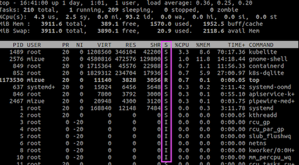

# 第5章 アプリケーション
- システムパフォーマンスの研究者にとってのアプリケーションパフォーマンス分析とは？
  - システムリソースを最も最大限に活用するためのアプリケーション構成
  - アプリケーションがシステムをどのように使っているかの特徴づけ
  - 一般的な病理分析

## 5.1 アプリケーションの基礎知識
- アプリケーションを広い視野から見て理解する。
  - 機能
  - アプリケーションが処理する要求
  - パフォーマンス要件（SLOなど）
  - CPUモード（ユーザレベルか、カーネルレベルか）
  - 構成・設定（キャッシュサイズ、スレッド数など）
  - ホスト（アプリケーションをホスティングしているものは何か？）
  - アプリケーションの指標が提供されているか
  - どのようなログを作っているか
  - バージョン管理
  - バグデータベースはあるか
  - ソースコード管理
  - コミュニティ、書籍、エキスパート
- 機能ダイアグラム(functional diagram)
  - アプリケーションの内部構造を描く図

### 5.1.1 パフォーマンスの目標
- パフォーマンス分析の明確な目標を設定し、方向性を決める。
- 目標の項目
  - レイテンシ
  - スループット
  - リソースの使用率
  - コスト: システム利用料金あたりのパフォーマンスを上げる
- ビジネスやQoS（サービス品質）要件の指標を使って定量化するとなおよい。
  - 『95% の要求は100m秒以下のレイテンシで処理されるようにする。』など...

#### 5.1.1.1 Apdex（application performance index）
- 顧客エクスペリエンスを定量化できる。

```
Apdex =（満足 + 0.5 × 許容範囲 + 0 × 不満）/イベント数
```
- 0（満足な顧客なし）〜 1（顧客全員が満足）の値をとる

### 5.1.2 よく実行されるコードの最適化
- アプリケーションのパフォーマンスを効率よく向上させるためには、よく実行されるコードパスを見つけて改善するのが効率が良い。
- よく実行されるコードパスを見つける方法として、アプリケーションの分析とプロファイリングが有効。
  - スタックトレース
  - フレームグラフ
  - 可観測性ツール
    - よく実行される部分のコンテキスト情報

### 5.1.3 可観測性
- 最も大きくパフォーマンスを引き上げられるのは、不要な仕事を取り除いた時。
- 性能だけ比べるのではなく、可観測性ツールを多く取り揃えているツールを選ぶ方が不透明なツールを選ぶより、長期で見ると良い可能性がある。

### 5.1.4 ビッグオー記法
- アルゴリズムの複雑度を分析し、入力データセットが増えたときにパフォーマンスがどう変わるかをモデリングする。
- オー（O）は関数のオーダー（order）、処理量の増加によって処理時間がどのように増加するか

表5-1 ビッグオー記法の例
| 記法       | 例                                                                                                                                                           |
| ---------- | ------------------------------------------------------------------------------------------------------------------------------------------------------------ |
| O(1)       | 2 値テスト                                                                                                                                                   |
| O(log n)   | ソート済み配列の二分探索                                                                                                                                     |
| O(n)       | 連結リストの線形サーチ                                                                                                                                       |
| O(n log n) | クイックソート（平均的な条件で）                                                                                                                             |
| O(n2)      | バブルソート（平均的な条件で）                                                                                                                               |
| O(2n)      | 数値の因数分解、指数的な成長                                                                                                                                 |
| O(n!)      | [力任せに解く巡回セールスマン問題](https://ja.wikipedia.org/wiki/%E5%B7%A1%E5%9B%9E%E3%82%BB%E3%83%BC%E3%83%AB%E3%82%B9%E3%83%9E%E3%83%B3%E5%95%8F%E9%A1%8C) |

- 

## 5.2 アプリケーションのパフォーマンス向上のためのテクニック
### 5.2.1 I/Oサイズの選択
- I/Oサイズの大小に関わらずかかるコスト
  - バッファの初期化
  - システムコールの実行
  - モード/コンテキストスイッチ
  - カーネルメタデータのアロケート
  - プロセスの特権と制限のチェック
  - アドレスからデバイスへのマッピング
  - I/Oを実行するためのカーネル
  - ドライバコードの実行
  - メタデータとバッファの開放
- I/Oサイズを大きくすれば固定コストが減って効率的。
- しかし、転送すべきデータが小さい場合は無駄になり、かえって遅くなってしまう（I/Oレイテンシが上がる）。
- アプリケーションが要求するサイズに最も近い小さい値をI/OサイズにするとI/Oレイテンシは下がる。

### 5.2.2 キャッシング
- よく実行されるオペレーションの結果をローカルキャッシュに格納して後で使えるようにすることでパフォーマンスを上げる手法。
- アプリケーションがどのようなキャッシュ機能を持っているか、キャッシュサイズはどれくらいに設定したら良いか、調べて設定する。

### 5.2.3 バッファリング
- 書き込みデータを一定量になるまで一時保存し、バッファ内でデータを結合してI/Oサイズを大きくすることで、書き込み効率を上げる。
- バッファへの最初に書き込みはディスクに書き込まれるまで待つ必要があり、書き込みタイプによっては書き込みレイテンシが高くなる場合がある。
- リングバッファ（ring buffer, 循環バッファ: circular buffer）は、コンポーネント間での継続的なデータ転送のために使えるアルゴリズム。
  - 👩‍💻[リングバッファー](https://www.wdic.org/w/TECH/%E3%83%AA%E3%83%B3%E3%82%B0%E3%83%90%E3%83%83%E3%83%95%E3%82%A1%E3%83%BC)
### 5.2.4 ポーリング
- ループ内でイベントのステータスをチェックしてイベントの発生を確認する手法。
- チェックの間にポーズ（一時停止）が入る。
- パフォーマンス上の問題
  - 反復的なチェックにより、CPUのオーバヘッドが高くなる
  - イベントの発生から次のチェックまでの間のレイテンシが高い
- イベントの発生をリスン(?)するようにふるまいを変えられることができれば改善できる(？)
  - 🤔WebアプリケーションではWebHookを使う？
#### 5.2.4.1 poll()システムコール
- ファイルディスクリプタのステータスをチェックするためのシステムコール。
- イベントベースなのでポーリングのようなパフォーマンスコストはかからない。
  - イベントが発生した時に配列をスキャンする。
  - O(n)なので配列サイズによってはパフォーマンスの大きな問題になる危険がある。
  - ChatGPTにpoll()を使ってファイル受信を監視するプログラムを書いてもらった。
```c
#include <stdio.h>
#include <stdlib.h>
#include <unistd.h>
#include <fcntl.h>
#include <poll.h>

#define MAX_EVENTS 1
#define POLL_TIMEOUT 5000

int main(int argc, char *argv[]) {
    int fd, ret;
    struct pollfd fds[MAX_EVENTS];
    char *path;

    if (argc < 2) {
        fprintf(stderr, "Usage: %s <file_path>\n", argv[0]);
        return 1;
    }

    path = argv[1];

    fd = open(path, O_RDONLY);
    if (fd < 0) {
        perror("open");
        return 1;
    }

    fds[0].fd = fd;
    fds[0].events = POLLIN;

    while (1) {
        ret = poll(fds, MAX_EVENTS, POLL_TIMEOUT);
        if (ret < 0) {
            perror("poll");
            return 1;
        }

        if (ret == 0) {
            printf("Poll timeout\n");
        } else {
            if (fds[0].revents & POLLIN) {
                printf("File %s has been modified\n", path);
            }
        }
    }

    close(fd);
    return 0;
}

```
- Linuxでは epoll(2)を使えばスキャンを避けられる。
### 5.2.5 並行実行と並列処理
- 並行実行（concurrency）
  - 複数の実行可能プログラムをロードして、実行を開始できるという機能である。
  - それらのプログラムの実行時間は重なり合っているが、かならずしも同時にon-CPUで実行されるわけではない。
- 並列処理（parallelism）
  - 並列処理でマルチプロセッサシステムを活用する。
  - マルチプロセス、またはマルチスレッドを扱うアプリケーションである必要がある。
  - I/Oを並行実行するための手段にもなる。
  - コンテキストスイッチのオーバーヘッドがかかる。
    - 並列処理では、スケジューラをを使ってカーネルが実行するプロセス、スレッドを決めるということ。
- ユーザモードアプリケーション側独自のスケジューリングメカニズム
  - ファイバー（fiber）: 軽量スレッド（lightweight thread）とも呼ばれる、ユーザモードバージョンのスレッド。個々のファイバーがスケジューリング可能なプログラムを表現する。OSスレッドで同じことをするよりオーバーヘッドが軽くなる。
    - 👩‍💻サポートしているプログラミング言語 C++20, Ruby, Rust 
  - コルーチン（co-routine）: ユーザモードアプリケーションがスケジューリングできるサブルーチン。ファイバーよりも軽量。
    - 👩‍💻サポートしているプログラミング言語: C++20, Python3.5, Rust, C#, Kotlin, Swift, Golang
  - イベントベースの並行実行: キューに基づいて実行できるイベントハンドラを持つ。
- I/Oはカーネルが処理しなければならないので、ユーザモードアプリケーションでのスケジューリングでは、一般にOSスレッドのスレッドスイッチは不可避である。
- 一部のランライムは、軽量並行実行のためにコルーチン、並列処理のために複数のOSスレッドを使っている。
  - Golang ランタイムは、OSスレッドのプールを準備した上でgoroutine（コルーチン）を使っている。Golangのスケジューラは、パフォーマンスの向上のために、goroutine がブロックを起こす呼び出しをすると、ブロックを起こしたスレッドのほかのgoroutine を自動的にほかのスレッドに移して実行する。
- マルチスレッドプログラミングで広く使われているモデル
  - サービススレッドプール: ネットワーク要求にサービスを提供するスレッドのプールを用意する。
  - CPUスレッドプール: CPUごとに1個のスレッドが作られる。
  - 段階的イベント駆動型アーキテクチャ: アプリケーションの要求がステージに分解され、そのステージが1個以上のスレッドのプールによって処理される。
- マルチスレッドプログラムは、プロセスと同じアドレス空間を共有するため、複数のスレッドが同時に読み書きするとデータが破壊される危険がある。そうならないように同期プリミティブが使われている。
#### 5.2.5.1 同期プリミティブ
- メモリアクセスを規整してデータの完全性を保障する。
- 広く使われている同期プリミティブ
  - ミューテックスロック（MUTually EXclusive lock）: ロックを持つスレッドだけがCPUを使える。他のスレッドはブロックされ、off-CPUで待つ。
  - スピンロック（spin lock）: スピンロックを持っているスレッドは処理を実行できる。他のスレッドはon-CPUだが、タイトループに入ってロックが開放されていないかどうかをチェックする。レイテンシは低いがCPUリソースを無駄に使う。
  - RW ロック（RW lock）: 複数のリーダを認めてライターを認めない。または、一つのライターを認めてリーダを一切認めないかのどちらか。
  - セマフォ: 指定した数までのスレッドの並列処理を認めるか、ひとつのスレッドの実行だけを認めるか（この場合、実質的にミューテックスロックになる）を選べる。
- ミューテックスロックは、ライブラリ、またはカーネルでスピンロックとミューテックスロックのハイブリッドとして実装されていることがある。
- Linux のRCU（read-copy-update）メカニズムは、カーネルコードで多用されているまた別のタイプの同期メカニズムである。
  - 書き込みは保護されたデータのコピーを作ってそのコピーを更新する。読み出し処理はロックを取らない。
- ロックに関連するパフォーマンス障害の調査は時間がかかり、アプリケーションのソースコードの知識を必要とすることが多い。通常これは開発者の仕事である。
#### 5.2.5.2 ハッシュテーブル
- ロックのハッシュテーブルを使えば、大量のデータ構造体のために最適な数のロックを使い回せる。
  - すべてのデータ構造のために1 個のグローバルミューテックスロックを使うと競合が起きやすい。
  - すべてのデータ構造にそれぞれのミューテックスロックを与えると、オーバーヘッドがかかりすぎる。
- 図5-2 のサンプルハッシュテーブルは4個のエントリ（バケット: buckets と呼ばれる）を持ち、エントリ
はそれぞれ自分用のロックを持っている。
- 
  - ハッシュチェーンを使ってハッシュの衝突を回避する。
- ハッシュテーブルのバケット数は、最大限の並列処理を実現できるようにするために、CPUの個数以上でなければならない。
### 5.2.6 ノンブロッキングI/O
- 現在のスレッドをブロックせずにI/Oを非同期に発行する。
- メカニズム
  - open(2): O_ASYNCフラグを指定する。ファイルディスクリプタに対するI/Oが可能になったらシグナルを受け取る。
  - io_submit(2): Linux AIO（asynchronous I/O）。非同期 I/O ブロックを処理待ちキューに登録する。
  - sendfile(2): あるファイルディスクリプタのデータを別のファイルディスクリプタにコピーする。カーネルにI/Oを委ねる。
  - io_uring_enter(2): ユーザー空間とカーネル空間で共有されているリングバッファを使って非同期I/Oをサブミットできるようにしている。
- その他の方法についてはOSドキュメントを参照
### 5.2.7 プロセッサのバインド
- NUMA環境では、プロセスやスレッドをひとつのCPUで実行し続け、I/O 実行後も以前と同じCPUで実行するとメリットがある。
  - 👩‍💻 [NUMA(Non-Uniform Memory Access)](https://e-words.jp/w/NUMA.html)
    - 複数のマイクロプロセッサ（MPU/CPU）を搭載した対称型マルチプロセッサ（SMP）構成のコンピュータ
  - アプリケーションスレッドを同じCPUに任せ続けるように設計されている（CPUアフィニティ: CPU affinity）。
  - 一部のアプリケーションは、自分自身をCPUにバインドしてこの挙動を強制している。
    - ChatGPTにGo言語でCPUアフィニティを設定するプログラムを書いてもらった。
```go
package main

import (
    "fmt"
    "runtime"
)

func main() {
    // 利用可能なCPU数を取得
    numCPU := runtime.NumCPU()

    // CPUアフィニティを指定するためのマスクを作成
    var cpumask uint64 = 1 << 1 // CPU 1を選択
    if numCPU > 2 {
        cpumask = (1 << 2) - 1 // CPU 0と1を選択
    }

    // CPUアフィニティを設定
    runtime.GOMAXPROCS(int(cpumask))

    // 実行中のCPU番号を取得
    cpu := runtime.GOMAXPROCS(0)
    fmt.Printf("Running on CPU %d\n", cpu)

    // ここで実行したい処理を記述
    // ...

}

```
- 他のCPUバインドと競合する場合はパフォーマンスが下がることもある。
  - 同じシステムで他のテナントやアプリケーションが実行されている時にはCPUバインドのリスクに注意が必要。
- アプリケーションが終了するまでにホストが変わる場合、CPUバインドが更新されなければパフォーマンスが下がる。
### 5.2.8 パフォーマンスマントラ
「2 章メソドロジ」の「2.5.20 パフォーマンスマントラ」参照
1. するな。
2. してもいいが二度するな。
3. 減らせ。
4. 先に延ばせ。
5. 見られていないときにせよ。
6. 同時並行でせよ。
7. 安上がりにせよ。
   
## 5.3 プログラミング言語
- 「パフォーマンスの最適化」は、その言語を実行するソフトウェアの機能であって、言語自体の機能ではない。
- 以下の各節では、プログラミング言語のタイプごとに基本的なパフォーマンス特性を説明する。
### 5.3.1 コンパイル言語
- コンパイルは、実行に先立ってプログラムからマシン語命令を生成してバイナリ（binary）と呼ばれる実
行可能ファイルに格納する処理。
- C、C++、アセンブリ言語など
- コンパイルされたコードは、CPUが実行する前にさらに変換をする必要がないので、一般にパフォーマンスが高い。
- コンパイル後のマシン語コードがオリジナルのプログラムに正確に対応付けられる。
- プロファイリングやトレース時にこれを使ってコードパスを遡ることもできる。
- コンパイラは、最適化（optimization）によってパフォーマンスを改善できる。
#### 5.3.1.1 最適化器
- gcc(1) コンパイラには、0、1、2、3、s、g、fast の7種類の最適化レベルがある。
  - 0はもっとも最適化しないレベルであるのに対し、3 はもっとも最適化をかけるレベルである。
  - s はサイズの最適化
  - g はデバッグ用
  - fast はすべての最適化を使うとともに標準への準拠を無視した追加の最適化までかける
- 最適化はパフォーマンス向上のために行うが-fomit-frame-pointerオプションのように一部のマシンでデバッグが不可能になることもある。
- 振る舞いに影響を与えることもある。
### 5.3.2 インタープリタ言語
- インタープリタ言語は、実行時にプログラムを実際の動作に変換しながらプログラムを実行する。
- オーバーヘッドがかかる。パフォーマンスは期待されていない。
- プログラミングやデバッグの容易さを重視する場合にインタープリタ言語が選択される。
- インタープリタ言語のパフォーマンス分析は、可観測性ツールが提供されていなければ困難になり得る。
  - 👩‍💻 PHPの場合はXdebugでデバッグやプロファイリングを行うことができる
- インタープリタによっては、インタープリタ関数への引数という形でプログラムコンテキストがわかる場合があり、それは動的インストルメンテーションで見られる。
- シェルスクリプトなど
### 5.3.3 仮想マシン
- 仮想マシン（virtual machine、言語仮想マシン: language virtual machine、プロセス仮想マシン: processvirtual machine とも）は、コンピュータをシミュレートするソフトウェアである。
- Java やErlang などのプログラミング言語は、一般に仮想マシン（VM）を使って実行される。
- アプリケーションプログラムは仮想マシン語命令セット（バイトコード: bytecode）にコンパイルされ、仮想マシンによって実行される。
- 👩‍💻 [JITコンパイラ](https://medium-company.com/jit%E3%82%B3%E3%83%B3%E3%83%91%E3%82%A4%E3%83%A9/)
- 仮想マシンの可観測性は難しい。
  - プログラムがon-CPUで実行されるまでに、コンパイル、解釈のステージを複数くぐり抜ける。
  - パフォーマンス分析は、仮想マシンとともに提供されるツールセット（多くのものはUSDTプローブを提供する）とサードパーティツールを中心としたものになる。
### 5.3.4 ガベージコレクション
- メモリ管理の自動化に対応した言語では、メモリの開放は、非同期に実行されるガベージコレクションプロセスに任せることができる。
- ガベージコレクションのデメリット
  - メモリ消費量の増加: オブジェクトが自動的に開放可能だと判断されない場合には、メモリの消費が増える場合がある。
  - CPUのコスト: GC（ガベージコレクション）は、単属的にメモリ内のオブジェクトのサーチ、スキャンを行うため、CPUリソースを消費する。GCがCPU全体を消費してしまうところまでエスカレートすることもある。
  - レイテンシ外れ値: GCの割り込みのためにアプリケーションの応答レイテンシが非常に高くなることがある。
## 5.4 メソドロジ
- この節では、アプリケーションの分析とチューニングのメソドロジを説明する。分析のために使うツールは、ここで紹介するものか、ほかの章で参照したものである。
- アプリケーションでは、特にCPUプロファイリング、ワークロードの特性の把握、ドリルダウン分析が重要になる。
### 5.4.1 CPUプロファイリング
- CPUプロファイリングはアプリケーションのパフォーマンス分析では必要不可欠な作業。
- LinuxのCPUプロファイラは、カーネルモードで動作し、カーネルスタックとユーザースタックの両方を捕捉してミックスモードプロファイルを作ることができる。CPUの使用状況については、これで（ほぼ）完全に可視化できる。
- アプリケーションが提供するユーザモードのプロファイラは、カーネルがCPUをどのように使っているかを示まい。また、CPU時間の概念に歪みがある。ユーザモードのプロファイラは最後の手段として使う方が良い。
- サンプリングベースのプロファイラでサンプリングしたスタックトレースのビジュアライゼーションのためによく使われるのが「フレームグラフ」で、著者が発案したもの。
#### 5.4.1.1 CPUフレームグラフ
- 
- 上から下に見ていくと、現在実行されている関数から呼び出し元をたどっていくことができる。
- フレームの幅は、プロファイル内に含まれている期間に比例する。
- 目をつけるべきところは大きな「高原」と「塔」であり、そこはCPU時間の多くが費やされているところである。
- フレームグラフの詳細については、「6 章CPU」の「6.7.3 フレームグラフ」を参照
- 👩‍💻 [CPUフレームグラフ](https://deeeet.com/writing/2016/05/29/go-flame-graph/)
  - Golangでフレームグラフ https://github.com/uber-archive/go-torch
    - やってみた https://github.com/mzeand/code-examples/tree/main/golang/pprof-http
#### 5.4.1.2 off-CPUのフットプリント
- CPUプロファイルは、off-CPU問題の証拠も探せる。
  - たとえば、ファイルシステムアクセスとブロックI/O の初期化のためにCPUが使われた時間を見れば、ディスクI/Oのことがある程度わかる。
- 図5-3では、ex4ファイルシステムのI/Oが含まれている場所を強調している（アノテーション）。
- CPUフレームグラフはCPUをどの程度使っているかを示すもので、ブロックされoff-CPU で使った時間はわからない。
### 5.4.2 off-CPU分析
- off-CPU分析は、現在CPUを獲得して実行されているわけではないスレッドの分析である。
  - ディスクI/O、ネットワークI/O、ロックの競合、明示的なスリープ、スケジューラによるプリエンプションなど、スレッドがブロックされるあらゆる理由が含まれる。
- off-CPUプロファイリングの方法
  - サンプリング: タイマーベースでサンプルを集める
  - スケジューラのトレーシング: カーネルのCPUスケジューラをインストルメンテーションし、スレッドがoff-CPU になっている時間を計算
  - アプリケーションインストルメンテーション: 一部のアプリケーションでoff-CPUのインストルメンテーションが提供されているが、off-CPUイベント（スケジューラによるプリエンプションやページフォールトなど）はわからない。
- これらの方法には大きなオーバーヘッドがかかる。
- 現在広く使われているテクニックはスケジューラのトレーシングで、著者作ったoffcputime(8)（「5.5.3 offcputime」参照）がベースとなっていて、オーバーヘッドが削減されている。
  - それでも本番環境でのoff-CPUプロファイリングには慎重な態度で臨んだ方がよい。まずテスト環境でオーバヘッドを評価すべきだ。
#### 5.4.2.1 off-CPU時間のフレームグラフ
- 図5-4 は、システム全体の30秒に渡るoff-CPUプロファイルで、コマンド（クエリー）を処理するMySQLサーバースレッドをズームイン表示している。
- 
- on-CPU、off-CPU のふたつのフレームグラフを使えば、コードパスのon-CPU時間とoff-CPU時間を完全に捉えられる。
#### 5.4.2.2 待ち時間
- off-CPU時間の大半は待ち時間で、スレッドが作業完了を待っている時間のことである。
- 図5-5 は、先ほどと同じoff-CPU 時間のフレームグラフだが、特定のスレッドにズームインしていない全体像を示したものである。
- 
- 重要なoff-CPU 時間を見つけるためのテクニック
  - 要求処理関数をズーム表示するか要求処理関数だけを表示するようにフィルタリングする。
    - このアプローチは効果的だが、特定のアプリケーションで探すべき関数が何かを知っている必要がある。
- 収集中にカーネルフィルタを使い、見てもあまり意味のないスレッドの状態を取り除く。
  - Linux では、TASK_UNINTERRUPTIBLE（シグナル受信不可,待ち状態）にマッチするものを探すと、注目すきoff-CPUイベントの多くが残るが、一部は捨てられてしまう。
### 5.4.3 システムコール分析
- リソースによるパフォーマンス障害の解明では、システムコールのインストルメンテーションが役に立つ。
- システムコール分析の対象
  - 新プロセスのトレーシング: execve(2) システムコールをトレースすると、新プロセスの実行をロギングし、実行時間が短いプロセスの問題を分析できる。
  - I/O のプロファイリング: read(2)/write(2)/send(2)/recv(2) とその変種をトレース
  - カーネル時間分析: syscount(8) 「5.5.6 syscount」を参照
    - https://github.com/brendangregg/perf-tools/blob/master/syscount
- システムコールからスタックトレースをたどっていくと、それを呼び出したアプリケーションのコードパスもわかる。
  - スタックトレースは、フレームグラフという形でビジュアライズできる。
### 5.4.4 USEメソッド
- 👩‍💻USEメソッドとは
  - 著者Brendan Gregg氏により提唱されたシステムのパフォーマンス分析の方法論
    - https://www.brendangregg.com/usemethod.html
  - 「2 章メソドロジ」の「2.5.9 USEメソッド」で詳しく紹介されている
  > USE（使用率、飽和度、エラー: Utilization、Saturation、Errors）メソッドは、システム的なボトルネックを見つけるために、パフォーマンス調査の初期の段階で使うべきメソドロジである。
  > システムリソースを重点的にチェックするメソドロジ。
- インフラストラクチャのリソースだけでなく、アプリケーションのリソースにも応用できる。
- 例 1）ワーカスレッドプールがジョブキューを処理する場合
  - 使用率：一定期間中に要求を処理してビジー状態になっているスレッド数の平均のスレッド総数に対する割合
  - 飽和数：期間中における要求キューの長さ（Queue Length: 待ち行列の長さ）の平均
  - エラー：何らかの理由で拒否された要求と失敗した要求の数
- 例 2）ファイルディスクリプタ
  - 使用率：使われているファイルディスクリプタの数の上限に対する割合。
  - 飽和度：（OSのふるまいにより変わる）スレッドがファイルディスクリプタ待ちでブロックされるなら、ブロックされているスレッドの数が飽和度になる。
  - エラー：EFILEの“Too many open files” のようなアロケーションエラー。
    - 👩‍💻EMFILE：プログラムが同時に開けるファイルディスクリプタ（file descriptor）の数の上限に達した場合に発生するエラーコードです。
- アプリケーションが提供している指標または、動的トレーシングなどのツールを使って計測手段を追加するなどして計測する。
- これを繰り返し、意味のない指標を外していく（＝アプリケーションのボトルネックを探して解決する🤔）
### 5.4.5 スレッド状態の分析
- 目標は、アプリケーションのスレッドがどこで時間を費やしているかを高いレベルで知ることである。
#### 5.4.5.1 9種類の状態
1. ユーザー: ユーザーモードでon-CPU。
   1. どのコードパスがCPUを消費しているか
2. カーネル: カーネルモードでon-CPU。
   1. どのコードパスがCPUを消費しているか
3. 実行可能（runnable）: on-CPUの順番待ちでoff-CPU だがいつでも実行可能。
   1. [プリエプション](https://e-words.jp/w/%E3%83%97%E3%83%AA%E3%82%A8%E3%83%B3%E3%83%97%E3%82%B7%E3%83%A7%E3%83%B3.html)または [タイムスライス](https://e-words.jp/w/%E3%82%BF%E3%82%A4%E3%83%A0%E3%82%B9%E3%83%A9%E3%82%A4%E3%82%B9.html) で実行状態に切り替わる。
   2. この状態が長いということは、アプリケーションがもっとCPUリソースを必要としているということ。
   3. CPUの使用制限（たとえばリソースコントロール）があるかどうかを調べる。
4. [スワッピング](https://medium-company.com/%E3%82%B9%E3%83%AF%E3%83%83%E3%83%94%E3%83%B3%E3%82%B0%E6%96%B9%E5%BC%8F/): 実行可能だが無名ページインのためにブロックされている。
   1. システム全体でのメモリの使用率とメモリ制限の有無を調べる。
5. ディスクI/O: ブロックデバイスI/O（読み書き、データ/テキストのページイン）を待ってブロックされている。
   1. 分析方法については、「5.4.3 システムコール分析」、「8 章ファイルシステム」、「9 章ディスク」を参照。
   2. ワークロードの特性の把握（ファイル名、I/Oサイズ、I/Oタイプ）
6. ネットワークI/O: ネットワークデバイスI/O（ソケットの読み書き）を待ってブロックされている。
   1. ネットワークI/O（送受信）の途中でブロックされている時間は含まれるが、新しい接続をリスニングする時間は含まれない（これはアイドル時間になる）。
   2. ワークロードの特性の把握（ホスト名、プロトコル、スループット）
7. スリープ: 自発的にスリープしている。
   1. 理由（コードパス）とスリープの時間を調べる。
8. ロック: 同期ロックの獲得を待ってブロックされている（ほかのスレッドの処理待ち）。
   1. 通常はアプリケーションとロックの階層構造を熟知しているソフトウェア開発者が行う。
   2. この種の分析で役に立つBCCツール、offwaketime(8) を著者が開発した（BCCに含まれている）。
      1. https://github.com/iovisor/bcc
9. アイドル: 仕事を待っている。
- 

- 次は、Linux でスレッドの9 種類の状態を計測する方法を説明する。
#### 5.4.5.2 Linux
- 
- Linuxのカーネルスレッド状態は、カーネルのtask_struct 構造体のstate メンバーに基づいている。
  - https://git.kernel.org/pub/scm/linux/kernel/git/stable/linux.git/tree/include/linux/sched.h?h=v6.3.3#n737
  - 実行可能    TASK_RUNNING
  - ディスクI/O TASK_UNINTERRUPTIBLE
  - スリープ    TASK_INTERRUPTIBLE
  - 
  - state メンバーからはさらなる分析のための手がかりは得られるが9種類の状態への分類には十分ではない。
    - /proc や[getrusage(2)](https://manpages.ubuntu.com/manpages/bionic/ja/man2/getrusage.2.html) を使えば、実行可能はユーザーとカーネルに分割できる
  - Solarisカーネルではマイクロステートアカウンティング機能を持つ
  - マイクロステートアカウンティングは、スレッドの時間を以下の8種類の状態に分類して記録する。
    - USR（ユーザー）
    - SYS（システム）
    - TRP（トラップ）
    - TFL（テキストフォールト）
    - DFL（データフォールト）
    - LCK（ロック）
    - SLP（スリープ）
    - LAT（ランキュー、スケジューラレイテンシ）
　- Linux で9 種類の状態を割り出すための関連指標、off-CPU 分析、直接計測の3 つの方法を説明しよう。
##### 5.4.5.2.1 関連指標
- ユーザー: [pidstat(1)](https://atmarkit.itmedia.co.jp/ait/articles/1707/21/news019.html) の%usr（この状態は直接計測される）
- カーネル: pidstat(1) の%system（この状態は直接計測される）
- 実行可能: vmstat(8) のr（システム全体）
- スワッピング: vmstat(8) のsi とso（システム全体）
- ディスクI/O: pidstat(1) -dのiodelay（スワッピング状態を含む）
- ネットワークI/O: sar(1) -n DEVのrxKB/sとtxKB/s（システム全体）
- スリーピング: 簡単には手がかりが得られない
- ロック: perf(1) top（スピンロックの時間が直接わかる場合がある）
- アイドル: 簡単には手がかりが得られない
##### 5.4.5.2.2 off-CPU分析
- 9 種類の状態の多くがoff-CPU なので（ユーザーとカーネル以外の全部）、off-CPU 分析をすればスレッドの状態がわかる。「5.4.2 off-CPU 分析」参照。
##### 5.4.5.2.3 直接計測
- 次のようにすれば、スレッドの状態ごとの時間を正確に計測できる。
  - ユーザー: /proc/PID/stat, getrusage(2), pidstat(1)
  - カーネル: /proc/PID/stat, getrusage(2), pidstat(1)
  - 実行可能: カーネルのschedstat 機能がナノ秒単位で計測している。/proc/PID/schedstat で見られる。
  - スワッピング: 遅延アカウンティング（delay accounting）によってナノ秒単位で計測できる
  - ディスクI/O: pidstat(1) -d, iotop(8), BCCのbiotop(8)
  - ネットワークI/O: tcptop(8), BCCとbpftrace
  - スリープ: トレーサーとsyscalls:sys_enter_nanosleep トレースポイントなどのイベント
  - ロック: BCC のklockstat(8)
  - アイドル: トレーシングツールでアプリケーション内の仕事待ちを処理しているコードパスをインストルメンテーションできる。
- アプリケーションが完全に眠っている（ブロックされてoff-CPU 状態になってい）ように見えるとき
  - pstack(1) やgdb(1) などのデバッガを使ってスレッドのスタックトレースを調べる場合、デバッガはターゲットアプリケーションを停止できるので、パフォーマンス障害の原因になり得ることに注意する
### 5.4.6 ロック分析
- ロッグを分析する方法
  - 競合のチェック
  - 長過ぎるロック保持のチェック
- ロックの名前（ある場合）とロックを使おうとするに至ったコードパスをはっきりさせる。
- ロック分析には専用ツールがあるが、CPUプロファイリングだけで問題を解決できる場合もある。
### 5.4.7 静的パフォーマンスチューニング
- 静的パフォーマンスチューニングは、構成された環境の問題点を明らかにする。
  - バージョン、リリースノートの内容
  - パフォーマンスに影響する既知のバグ
  - 構成
  - チューニングされた設定の根拠
  - キャッシュの有無、サイズ
  - 並行実行されているか、スレッドプールのサイズ
  - デバッグモードになっていないか
  - ライブラリのバージョン
  - メモリアロケータ
  - ヒープサイズ
  - コンパイラ、コンパイルオプション
  - ネーティブコードに高度な命令（たとえば、Intel SSEなどのSIMD/ベクトル命令）が含まれているか（そうすべきか）。
  - アプリケーションがエラーや設定ミスで、縮退モード（[フォールバック](https://e-words.jp/w/%E3%83%95%E3%82%A9%E3%83%BC%E3%83%AB%E3%83%90%E3%83%83%E3%82%AF.html)）で実行されていないか。
  - システムから設定された制限はないか（クラウドコンピューティングでは設定されているのが普通）。
### 5.4.8 分散トレーシング
- 分散環境で稼働するアプリケーションの全体を検討する場合、分散トレーシングを使う。
- 以下のような情報が集められる
  - アプリケーション要求に対する一意なID（外部要求ID）
  - 依存関係の階層構造における要求の位置についての情報
  - 開始、終了時刻
  - エラーステータス
- ヘッドベースサンプリング（head-based sampling）
  - 要求の最初（ヘッド）の時点でサンプリング（トレース）するかどうかを判断する
  - 間欠的なエラーや外れ値の分析は難しい
- テールベースサンプリング（tail-basedsampling）
  - 最初にすべてのイベントを捕捉しておき、レイテンシやエラーに基づいてどれを残すかを判断する
## 5.5 可観測性ツール
### 5.5.1 perf
- perf(1)はLinuxの標準プロファイラで、多用途の多機能ツールである。
#### 5.5.1.1 CPUプロファイリング
- 30 秒に渡って、49Hz（-F 49、毎秒のサンプル数）ですべてのCPU（-a）のスタックトレース（-g）をサンプリングする

```shell
mizue@apple:~$ sudo perf record -F 49 -a -g -- sleep 30
[ perf record: Woken up 3 times to write data ]
[ perf record: Captured and wrote 1.700 MB perf.data (2940 samples) ]
mizue@apple:~$ sudo perf script
swapper     0 [000] 19637.564496:   20408163 cpu-clock:pppH: 
        ffffaeb833e679c4 [unknown] ([unknown])
        ffffaeb832eaaed4 [unknown] ([unknown])
        ffffaeb832eab00c [unknown] ([unknown])
        ffffaeb832eab250 [unknown] ([unknown])
        ffffaeb833e5b3ec [unknown] ([unknown])
[...]
```
#### 5.5.1.2 CPUフレームグラフ
```shell
mizue@apple:~/handson/FlameGraph$ sudo perf record -F 49 -a -g -- sleep 10; perf script --header > out.stacks
[ perf record: Woken up 1 times to write data ]
[ perf record: Captured and wrote 1.171 MB perf.data (980 samples) ]
failed to open perf.data: Permission denied
mizue@apple:~/handson/FlameGraph$ sudo ./stackcollapse-perf.pl < ../out.stacks | ./flamegraph.pl --hash > out.svg
mizue@apple:~/handson/FlameGraph$ open out.svg
```

#### 5.5.1.3 システムコールのトレーシング
```shell
mizue@apple:~/handson/FlameGraph$ sudo perf trace -p $(pgrep mysqld) -o trace_mysqltxt
mizue@apple:~/handson/FlameGraph$ head trace_mysqld.txt 
         ? (         ): ib_log_files_g/1082  ... [continued]: futex())                                            = -1 ETIMEDOUT (Connection timed out)
     0.012 ( 0.008 ms): ib_log_files_g/1082 futex(uaddr: 0xffff8dd77c90, op: WAKE|PRIVATE_FLAG, val: 1)           = 0
     0.036 (10.061 ms): ib_log_files_g/1082 futex(uaddr: 0xffff8dd77ce8, op: WAIT_BITSET|PRIVATE_FLAG, utime: 0xffff76cbb608, val3: MATCH_ANY) = -1 ETIMEDOUT (Connection timed out)
    10.110 ( 0.010 ms): ib_log_files_g/1082 futex(uaddr: 0xffff8dd77c90, op: WAKE|PRIVATE_FLAG, val: 1)           = 0
         ? (         ): ib_log_fl_noti/1078  ... [continued]: futex())                                            = -1 ETIMEDOUT (Connection timed out)
    10.137 (         ): ib_log_files_g/1082 futex(uaddr: 0xffff8dd77ce8, op: WAIT_BITSET|PRIVATE_FLAG, utime: 0xffff76cbb608, val3: MATCH_ANY) ...
    16.589 ( 0.013 ms): ib_log_fl_noti/1078 futex(uaddr: 0xffff8dd778d0, op: WAKE|PRIVATE_FLAG, val: 1)           = 0
         ? (         ): ib_log_flush/1079  ... [continued]: futex())                                            = -1 ETIMEDOUT (Connection timed out)
    16.616 (         ): ib_log_fl_noti/1078 futex(uaddr: 0xffff8dd77928, op: WAIT_BITSET|PRIVATE_FLAG, utime: 0xffff78cfb578, val3: MATCH_ANY) ...
    16.619 ( 0.011 ms): ib_log_flush/1079 futex(uaddr: 0xffff8dd77a10, op: WAKE|PRIVATE_FLAG, val: 1)           = 0

```

- perfの長所
  - オーバーヘッドを削減するためにCPU単位のバッファを使っているのでstrace(1) の現在の実装よりもかなり安全。
  - strace(1) がプロセスの集合（普通は単一プロセス）に制限されているのに対し、perf(1) はシステム全体をトレースできる。
  - システムコール以外のイベントもトレースできる。
- perfの短所
  - perf(1) はstrace(1) と比べてシステムコールの引数変換が充実していない。
##### 5.5.1.3.1 カーネル時間の分析
- perf(1) の-sオプションは、システムコールの集計情報を示す。
  - 出力はシステムコールの回数と各スレッドの所要時間を示している。
  
```shell
mizue@apple:~$ sudo perf trace -s -p $(pgrep mysqld)
^C
 Summary of events:

 ib_io_ibuf (1067), 26 events, 0.6%

   syscall            calls  errors  total       min       avg       max       stddev
                                     (msec)    (msec)    (msec)    (msec)        (%)
   --------------- --------  ------ -------- --------- --------- ---------     ------
   io_getevents          13      0  6007.545     0.000   462.119   502.059      8.33%


 ib_io_rd-1 (1068), 26 events, 0.6%

   syscall            calls  errors  total       min       avg       max       stddev
                                     (msec)    (msec)    (msec)    (msec)        (%)
   --------------- --------  ------ -------- --------- --------- ---------     ------
   io_getevents          13      0  6007.168     0.000   462.090   501.935      8.33%


 ib_io_rd-2 (1069), 26 events, 0.6%

   syscall            calls  errors  total       min       avg       max       stddev
                                     (msec)    (msec)    (msec)    (msec)        (%)
   --------------- --------  ------ -------- --------- --------- ---------     ------
   io_getevents          13      0  6005.087     0.000   461.930   501.595      8.33%

[...]
```
##### 5.5.1.3.2 I/Oのプロファイリング
- フィルタ（-e）を使って 特定の syscallをトレース
```shell
mizue@apple:~$ sudo perf trace -e epoll_pwait -p $(pgrep mysqld)
         ? (         ): xpl_accept-1/1094  ... [continued]: epoll_pwait())                                      = 0
     0.020 ( 1.071 ms): xpl_accept-1/1094 epoll_pwait(epfd: 17, events: 0xaaaadf32e980, maxevents: 32, timeout: 1, sigsetsize: 8) = 0
     1.107 ( 1.078 ms): xpl_accept-1/1094 epoll_pwait(epfd: 17, events: 0xaaaadf32e980, maxevents: 32, timeout: 1, sigsetsize: 8) = 0
     2.202 ( 1.077 ms): xpl_accept-1/1094 epoll_pwait(epfd: 17, events: 0xaaaadf32e980, maxevents: 32, timeout: 1, sigsetsize: 8) = 0
     3.296 ( 1.079 ms): xpl_accept-1/1094 epoll_pwait(epfd: 17, events: 0xaaaadf32e980, maxevents: 32, timeout: 1, sigsetsize: 8) = 0
[...]
```
👩‍💻epoll_pwaitは、I/O多重化と非同期イベント処理に使用される一般的なシステムコールの一つです。

### 5.5.2 profile
- profile(8)は、BCC（15 章参照）の時間に基づくCPUプロファイラである。
- 10 秒間に渡って49HzですべてのCPUでサンプルを収集するprofile(8) の実行例
```shell
# profile -F 49 10
Sampling at 49 Hertz of all threads by user + kernel stack for 10 secs.
[...]
SELECT_LEX::prepare(THD*)
Sql_cmd_select::prepare_inner(THD*)
Sql_cmd_dml::prepare(THD*)
Sql_cmd_dml::execute(THD*)
"mysql_execute_command(THD*,  bool)
Prepared_statement::execute(String*,  bool) Prepared_statement::execute_loop(String*,  bool)
mysqld_stmt_execute(THD*,  Prepared_statement*,  bool,  unsigned  long,  PS_PARAM*) dispatch_command(THD*,  COM_DATA  const*,  enum_server_command)
do_command(THD*) [unknown] [unknown]
start_thread
-                                   mysqld  (10106)
13
[...]"
```
- この出力に含まれているスタックトレースは1個だけで、SELECT_LEX::prepare( )と同じ祖先がon-CPU
で13 回サンプリングされたことを示している。

### 5.5.3 offcputime
- offcputime(8)は、ブロックされoff-CPU状態になっているスレッドが使っている時間を集計し、その理由を説明するためにスタックトレースを表示するBCC、bpftrace ツール（15 章参照）である。

```shell
# offcputime 5
Tracing off-CPU time (us) of all threads by user + kernel stack for 5 secs.
[...]
finish_task_switch
schedule
jbd2_log_wait_commit
[...]
[unknown]
[unknown]
start_thread
- mysqld (10441)
352107
[...] 
```
- この出力は、一意なスタックトレースとそれがoff-CPU で使った時間をμ 秒単位で示している。
- -mオプションで下限を変更できる（デフォルト 1μ秒）
- -Mオプションで上限を変更できる
  - 仕事待ちのスレッドやループで長くブロックされているスレッドのような見る意味のないスタックを省句ことができる。

#### 5.5.3.1 off-CPU時間のフレームグラフ
```shell
# git clone https://github.com/brendangregg/FlameGraph; cd FlameGraph
# offcputime -f 5 | ./flamegraph.pl --bgcolors=blue \
--title="Off-CPU Time Flame Graph"> out.svg
```
### 5.5.4 strace
- strace(1) コマンドは、Linux のシステムコールトレーサーである。

```shell
mizue@apple:~$ sudo strace -ttt -T -p 941
strace: Process 941 attached
1686083219.121247 futex(0x148fac8, FUTEX_WAIT_PRIVATE, 0, NULL) = 0 <0.247008>
1686083219.369315 epoll_pwait(3, [], 128, 0, NULL, 1) = 0 <0.000003>
1686083219.369398 futex(0x148fac8, FUTEX_WAIT_PRIVATE, 0, NULL) = 0 <0.119344>
1686083219.488788 write(5, "\0", 1)     = 1 <0.000010>
1686083219.488940 futex(0x148fac8, FUTEX_WAIT_PRIVATE, 0, NULL) = 0 <0.276455>
1686083219.765496 epoll_pwait(3, [], 128, 0, NULL, 1) = 0 <0.000016>
[...]
```

  - -ttt: 単位秒、分解能μ秒で先頭欄にUnix 時間を表示する。
  - -T: 最後のフィールドとして、システムコールの所要時間<time>を表示する。単位は秒で精度はμ秒。
  - -p PID: トレースするプロセスのプロセスID。

- -c オプションを使えば、システムコールの集計情報が得られる
```shell
mizue@apple:~$ sudo strace -c dd if=/dev/zero of=/dev/null bs=1k count=5000k
^C195658+0 records in
195658+0 records out
200353792 bytes (200 MB, 191 MiB) copied, 16.0812 s, 12.5 MB/s
strace: Process 211665 detached
% time     seconds  usecs/call     calls    errors syscall
------ ----------- ----------- --------- --------- ----------------
 50.72    0.838209           4    195659           read
 49.25    0.813786           4    195657           write
  0.02    0.000336         336         1           execve
  0.00    0.000027           3         7           mmap
  0.00    0.000026           8         3           newfstatat
[...]
------ ----------- ----------- --------- --------- ----------------
100.00    1.652465           4    391359         1 total

```
#### 5.5.4.1 straceのオーバーヘッド
- strace(1)の現在のバージョンではブレークポイントベースのトレーシングを使っている。
  - すべてのシステムコールの開始とリターンにブレークポイントをセットする。
  - システムコールをよく呼び出すアプリケーションでは、パフォーマンスが桁違いに悪くなったと感じられる。

```shell
mizue@apple:~$ sudo dd if=/dev/zero of=/dev/null bs=1k count=5000k
5120000+0 records in
5120000+0 records out
5242880000 bytes (5.2 GB, 4.9 GiB) copied, 2.26224 s, 2.3 GB/s
```
```shell
mizue@apple:~$ sudo strace -c dd if=/dev/zero of=/dev/null bs=1k count=5000k
^C68106+0 records in
68105+0 records out
69739520 bytes (70 MB, 67 MiB) copied, 5.62601 s, 12.4 MB/s

```
- perf(1)、Ftrace、BCC、bpftrace など、その他のトレーサーは、バッファを使ったトレーシングによってトレーシングのオーバーヘッドを大幅に削減して
いる。
### 5.5.5 execsnoop
- execsnoop(8)は、システム全体で新プロセスの実行をトレースするBCC、bpftrace ツールである。
- CPUリソースを大食いする短命なプロセスによる問題を見つけられるほか、アプリケーションの起動スク
リプトを含むソフトウェアの起動のデバッグに使える。

- apt版は `execsnoop-bpfcc`
```shell
mizue@apple:~$ sudo execsnoop-bpfcc
PCOMM            PID    PPID   RET ARGS
getent           224456 935      0 /usr/bin/getent group microk8s
chmod            224457 935      0 /snap/microk8s/5324/bin/chmod -R ug+rwX /var/snap/microk8s/5324/var/kubernetes/backend
chgrp            224458 935      0 /snap/microk8s/5324/bin/chgrp microk8s -R /var/snap/microk8s/5324/var/kubernetes/backend
chgrp            224459 935      0 /snap/microk8s/5324/bin/chgrp microk8s /var/snap/microk8s/common/run/containerd.sock
grep             224460 935      0 /snap/microk8s/5324/bin/grep -E  /var/snap/microk8s/5324/args/kube-apiserver
ip               224461 935      0 /snap/microk8s/5324/sbin/ip route
[...]
```
### 5.5.6 syscount
- syscount(8)は、システム全体でシステムコールの回数を数えるBCC、bpftrace ツールである。
### 5.5.7 bpftrace
#### 5.5.7.1 シグナルのトレーシング
#### 5.5.7.2 I/Oのプロファイリング
#### 5.5.7.3 ロックのトレーシング
#### 5.5.7.4 アプリケーションの内部

## 5.6 注意点
- アプリケーションのパフォーマンス分析でよくぶつかる問題のうち、不明なシンボルと不明なスタックトレースについて取り上げる。
  - 関数名がわからない、スタックトレースが取れない・・など
### 5.6.1 不明なシンボル
- アプリケーションの命令アドレスから関数名（シンボル）を導き出せない場合、命令アドレスを16 進数で表示したり[unknown] と表示したりすることがある。
  - 解決方法は、アプリケーションのコンパイラ、ランタイム、最適化やプロファイラ自体によって異なる。

#### 5.6.1.1 ELF形式のバイナリ（C、C++など）
- 👩‍💻 [ELF形式](https://ja.wikipedia.org/wiki/Executable_and_Linkable_Format) ：（Executable and Linkable Format）実行ファイルおよびオブジェクトファイルのためのファイルフォーマット。コンテナフォーマットの一種。
- 実行ファイルのファイルサイズを縮小するためにstrip(1) でシンボルが消去されていることがある。
  - 解決方法1: シンボルを取り除かないようにビルドプロセスを修正すれば解決できる（＝再コンパイル）
  - 解決方法2: debuginfo やBTF（BPF Type Format）のようなシンボル情報の供給源を使う
    - debuginfo: デバッグ情報が入っているリポジトリ
      - 参考) https://www.kimullaa.com/posts/202002020611/#gdb-%E3%81%A7%E3%81%AE%E4%BD%BF%E3%81%84%E6%96%B9
    - BTF（BPF Type Format）: 
      - 参考) https://atmarkit.itmedia.co.jp/ait/articles/2008/04/news004.html
#### 5.6.1.2 JITランタイム（Java、Node.jsなど）
- JIT（just-in-time）コンパイラランタイムでは、一般にシンボルが失われる。
  - 一般にランタイムが生成する補助的なシンボルテーブルを使って解決する。
  - このシンボルテーブルは/tmp/perf-<PID>.map ファイルに格納され、perf(1)、BCCの両方から読み出される。
    - [perf-map-agent](https://github.com/jvm-profiling-tools/perf-map-agent)
    - [jmaps](https://github.com/brendangregg/FlameGraph/blob/master/jmaps)

```shell
# perf record -F 49 -a -g -- sleep 10; jmaps
# perf script --header > out.stacks
# [...]
```

```shell
# bpftrace --unsafe -e 'profile:hz:49 { @[ustack] = count(); }
interval:s:10 { exit(); } END { system("jmaps"); }'
```
### 5.6.2 不明なスタック
- 残念ながら不完全なスタックトレースは非常に多い。
- 要因
  - 可観測性ツールが __フレームポインタ__ ベースのアプローチを使ってスタックトレースを読むが、
  - コンパイラによるパフォーマンスの最適化のために、ターゲットバイナリが __フレームポインタ__ 用のレジスタ（x86_64 ではRBP）を予約しておらず、そのレジスタを汎用レジスタとして使い回しているため
    - その結果
      - [unknown] が表示される。
      - 間違った関数名が含まれる。
- 👩‍💻フレームポインタ：関数のリターンアドレスを格納しておく（参考 [コールスタック](https://ja.wikipedia.org/wiki/%E3%82%B3%E3%83%BC%E3%83%AB%E3%82%B9%E3%82%BF%E3%83%83%E3%82%AF)）
- 解決方法1: フレームポインタを保持するように再コンパイルする（若干のパフォーマンス低下あり）
  - C/C++、その他gcc(1) やLLVM でコンパイルされるソフトウェアの場合:-fno-omit-framepointerを指定してソフトウェアをコンパイルし直す。
  - Java: -XX:+PreserveFramePointerを指定してjava(1) を実行する。
- 解決方法2: フレームポインタベースではないスタックウォークテクニックに切り替える
  - perf(1) はDWARF，ORC、LBR（last branch record）を使ったスタックウォークをサポートしている。
    - 「13 章perf」の「13.9 perfrecord」参照
## ５.7 練習問題

### 1. 用語について以下の問いに答えなさい。
- キャッシュとは何か。
- リングバッファとは何か。
- スピンロックとは何か。
- アダプティブミューテックスロックとは何か。
- 並行実行と並列処理の違いは何か。
- CPUアフィニティとは何か。

### 2. コンセプトについての以下の問いに答えなさい。
- 大きなI/O サイズを使うことの一般的な長所、短所は何か。
- ロックのハッシュテーブルは何のために使われているか。
- コンパイル言語、インタープリタ言語、仮想マシンを使う言語の実行時の一般的なパフォーマンス特性を説明しなさい。
- ガベージコレクションの役割とパフォーマンスに与える影響について説明しなさい。

### 3. アプリケーションを選び、以下の基本的な問いについて答えなさい。
- そのアプリケーションの役割は何か。
- そのアプリケーションは別々のオペレーションとして何をしているか。
- そのアプリケーションはユーザーモードとカーネルモードのどちらで実行されるか。
- そのアプリケーションはどのように構成されているか。パフォーマンスに関してどのようなオプションがあるか。
- そのアプリケーションはどのようなパフォーマンス指標を提供しているか。
- そのアプリケーションはどのようなログを作っているか。ログにパフォーマンス情報は含まれているか。
- そのアプリケーションの最新バージョンはパフォーマンス問題を解決しているか。
- そのアプリケーションに既知のパフォーマンスバグはあるか。
- そのアプリケーションにコミュニティ（IRC、ミートアップなど）はあるか。パフォーマンスのコミュニティはどうか。
- そのアプリケーションについての本はあるか。パフォーマンスについての本はどうか。
- そのアプリケーションのパフォーマンスについて有名なエキスパートはいるか。いるなら誰か。

### 4. 負荷のかかっているアプリケーションを選び、以下の作業をしなさい（多くのものは動的トレーシングを必要とする）。
- 計測を行う前に、そのアプリケーションがCPUバウンドかI/Oバウンドかを予想しなさい。また、その理由を説明しなさい。
- CPUバウンドかI/Oバウンドかを可観測性ツールで明らかにしなさい。
- そのアプリケーションのCPUフレームグラフを作りなさい。この課題では、シンボルとスタックトレースの修復が必要になる場合がある。もっともホットなCPUコードパスは何か。
- そのアプリケーションのoff-CPU フレームグラフを作りなさい。要求の処理中にブロックする時間がもっとも長いイベントは何か（アイドルスタックは無視する）。
- 実行するI/Oのサイズ（たとえば、ファイルシステムの読み書き、ネットワークの送受信）の特性を説明しなさい。
- そのアプリケーションはキャッシュを持っているか。あるなら、サイズとヒット率を明らかにしなさい。
- そのアプリケーションが実行するオペレーションのレイテンシ（応答時間）を計測しなさい。平均、最小値、最大値、全体の分布を示しなさい。
- オペレーションのドリルダウン分析を行い、レイテンシの主要部がどこで発生しているかを解析しなさい。
- そのアプリケーションのワークロードの特性を明らかにしなさい（特に、誰がと何を）。
- 静的パフォーマンスチューニングチェックリストをすべてチェックしなさい。
- そのアプリケーションは並行実行されるか。同期プリミティブの使われ方を調べなさい。

### 5. （オプション、高度）複数のスレッド状態分析欄を持ち、それぞれで使った時間を表示するtsastat(8)というLinux 用のツールを開発しなさい。このツールは、pidstat(1)と同じように動作し、変化の過程を出力できるものとする。

## 5.8 参考文献

