# 第8章 ファイルシステム

- アプリケーションにとっては、ディスク、ストレージデバイスのパフォーマンスよりもファイルシステムのパフォーマンスの方が重要な意味がある。
  - アプリケーションがやり取りし、処理終了を待つのはファイルシステムだから。
  - ファイルシステムは、アプリケーションがディスク（またはリモートストレージデバイス）レベルのレイテンシに支配されないように、キャッシング、バッファリング、非同期I/Oを駆使することができる。
- しかし、システムパフォーマンスの分析、モニタリングツールは、伝統的にファイルシステムパフォーマンスは盲点になっていた。
## 8.1 用語

- ファイルシステム（file system）: データをファイルとディレクトリに組織したもので、データアクセスのためのファイルベースインターフェイスとアクセス制御のためのファイルパーミッションを備えている。
- ファイルシステムキャッシュ（file system cache）:　ファイルシステム内のコンテンツをキャッシングするために使われるメインメモリ（通常DRAM）内の領域。
- オペレーション（operation、操作）: read(2)、write(2)、open(2)、close(2)、stat(2)、mkdir(2) など
- I/O（input/output、入出力）: 本書では、直接読み書きする（I/O を実行する）オペレーションだけをI/O と呼ぶ。（open(2) とclose(2) は、I/O には含まれない）
- 論理I/O（logical I/O）: アプリケーションがファイルシステムに対して発行するI/O要求のこと。
- 物理I/O（physical I/O）: ファイルシステムがディスクに直接発行する（またはRaw I/O による）I/O要求のこと。
- ブロックサイズ（レコードサイズ（record size））: ディスク上のファイルシステムデータグループのサイズ。
- スループット（throughput）: アプリケーションとファイルシステムの間でのデータ転送速度。
- i ノード（inode）: インデックスノード（index node）という意味。メタデータを格納するデータ構造。
- VFS（Virtual File System）: 異なるファイルシステムタイプを抽象化してサポートするためのカーネルインターフェイス。
- （仮想）ボリューム（volume）: ストレージのインスタンスのこと
- ボリュームマネージャ（volume manager）: 物理ストレージデバイスを柔軟に管理するためのソフトウェア


## 8.2 モデル

### 8.2.1 ファイルシステムインターフェイス

- 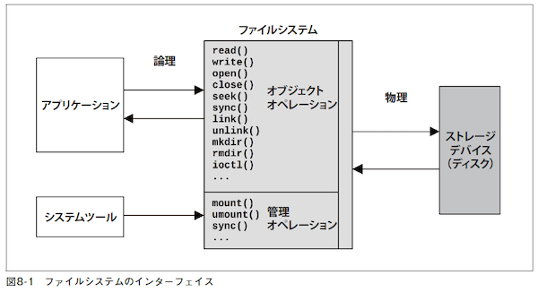
- 図8-1 に示してあるのは、ジェネリックなオブジェクトオペレーション。
- ファイルシステムをブラックボックスとして扱い、オブジェクトオペレーションのレイテンシに焦点を絞るというアプローチがある。

### 8.2.2 ファイルシステムキャッシュ

- 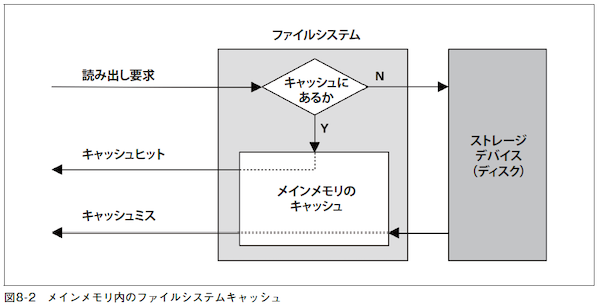
- 図8-2 は、メインメモリ内のジェネリックなファイルシステムキャッシュが読み出しオペレーションを処理しているところを示している。
- キャッシュヒットした場合はキャッシュから、キャッシュミスした場合はディスクからデータを返す。
- キャッシュミスしたディスクデータはキャッシュに格納される（キャッシュのウォームアップ）。
- ファイルシステムキャッシュは、あとで書き込む（フラッシュする: flush）ために書き込みデータをバッファリングすることもある。

### 8.2.3 2次キャッシュ

- 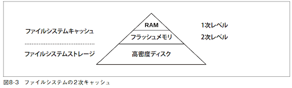
  - 元々、著者が2007年に[ZFS](https://e-words.jp/w/ZFS.html#:~:text=ZFS%E3%81%A8%E3%81%AF%E3%80%81%E4%B8%BB%E3%81%AB,%E3%81%AB%E7%A7%BB%E6%A4%8D%E3%81%95%E3%82%8C%E3%81%A6%E3%81%84%E3%82%8B%E3%80%82)のために開発したもの
- 2次キャッシュ（second-level cache、L2 cache）は、どのようなメモリタイプでもよい。
- 👩‍💻[Solaris ZFS集中講座（3）](https://atmarkit.itmedia.co.jp/ait/articles/0905/28/news108.html)
  > L2ARC（Level 2 Adaptive Replacement Cache）は、ARCのRead用拡張2次キャッシュであり、SSDを適用することでRead速度の向上を促します。

## 8.3 コンセプト
### 8.3.1 ファイルシステムレイテンシ
- ファイルシステムのパフォーマンスでもっとも重要な指標。
- 論理ファイルシステム要求を発行してから完了するまでの時間として計測される。
  - ファイルシステム、ディスクI/O サブシステムで過ごした時間とディスクデバイス（物理I/O）の待ち時間が含まれる。
- アプリケーションのパフォーマンスに直接、比例的に影響を与える。
- しかし、アプリケーションがノンブロッキングI/Oを使っているときや、I/Oが非同期スレッドから発行されているときには、影響を直接受けない。
- OSが提供しているディスクデバイスレベルの統計量だけを観測していると誤解を招く場合がある。
  - レイテンシの高いディスクI/Oのバーストがあっても、実際はアプリケーションと非同期に実行されているなど。

### 8.3.2 キャッシング
- ファイルシステムは、パフォーマンスを上げるために、一般にメインメモリ（RAM）をキャッシュとして使うので論理I/Oレイテンシは大幅に下がる。
- キャッシュが増えて空きメモリが減った場合、アプリケーションがメモリを必要とすると、カーネルはすぐにファイルシステムキャッシュのメモリを開放してアプリケーションに渡す。
- ファイルシステムとブロックデバイスサブシステムは、一般に表8-1 に示すような複数のタイプのキャッシュを使い分ける。
- 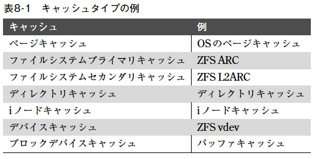
  - 個々のキャッシュタイプについては、「8.4 アーキテクチャ」で説明する。

### 8.3.3 ランダムI/OとシーケンシャルI/O
- シーケンシャル（sequential: 逐次）: 次のI/O のオフセットは、前のI/Oの末尾。
- ランダム（random: 直接）: オフセットは不規則に変化する。
- 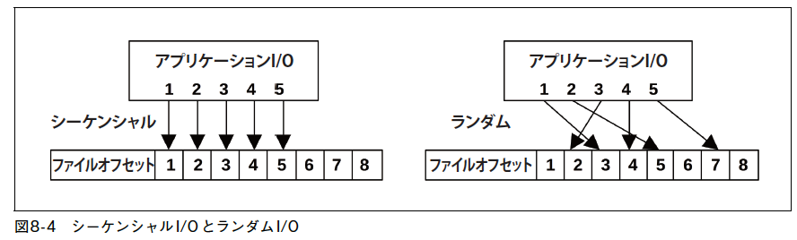
  - 図8-4 はこれらのアクセスパターンを図示したもの。
- フラグメンテーション（fragmentation、断片化）
  - ファイルはディスクのさまざまな位置に散在
  - ランダムな物理I/Oを発生させる
  - 回転ディスクの場合はプリフェッチや先読みを使ってパフォーマンスを上げることができる

### 8.3.4 プリフェッチ
- 
  - 仕組み：前回のファイルオフセットポインタと現在の位置を比較し、シーケンシャルなら、ファイルシステムは追加の読み出し（プリフェッチ）を発行する。
  - 図の場合、アプリケーションがオフセット1を読み出したあとでオフセット2を読み出すと、次の3つのオフセットのプリフェッチが実行される。
- 有効なパターン
  - 大量のファイルデータをシーケンシャルに読み出す場合の以下の問題点に有効
    - 一度に全て読み出すとキャッシュに収まらない
    - 一度しか読み出さないのでキャッシュに保持される可能性が低い
- プリフェッチ検出がうまく動作しない場合
  - アプリケーションで必要とされていない不要なI/O発生
  - キャッシュが汚れ、ディスク、I/Oトランスポートリソースが無駄に使われる
- ファイルシステムは必要に応じてプリフェッチをチューニングできるようになっている。

### 8.3.5 先読み
- readahead(2)(先読み（read-ahead）)
  - Linuxのシステムコール
    - 順次アクセスされたファイルをプリフェッチし、HDDよりもRAMから読み込まれるようする。
  - このシステムコールを使い、アプリケーションは明示的にファイルシステムキャッシュをウォームアップできる。

### 8.3.6 ライトバックキャッシング
- メインメモリへの転送が終わったら書き込みを完了扱いにし、あとで非同期に（asynchronously）ディスクに書き戻す。
  - フラッシュ（flushing）：書き戻す処理のこと
  - ダーティデータ：まだ書き込まれていないデータ
- 信頼性
  - 電源障害により、ダーティデータが失われる可能性やディスクに不完全に書き込まれる場合がある。
  - ファイルシステムメタデータが壊れた場合は、ロードできないなどの障害を引き起こし、ビジネスに影響が出る場合がある。

### 8.3.7 同期書き込み
- ファイルシステムメタデータの必要な変更を含む永続ストレージへの完全な書き込み完了で、書き込み処理完了となる。
  - ディスクデバイスのI/Oレイテンシの影響を直接被る。
- 非同期書き込みによるデータ破壊のリスクが許容できない一部のアプリケーションで使われている。
  - データベースのログライターなど

#### 8.3.7.1 個別の同期書き込み
- ファイルをオープンするときにフラグを指定する
  - [Ubuntu open(2) 同期 I/O](https://manpages.ubuntu.com/manpages/impish/ja/man2/open.2.html)
    - O_SYNC: ファイル完全性完了
    - O_DSYNC: データ完全性完了
    - O_RSYNC: Read I/O時に書き込みが完了することを保証

#### 8.3.7.2 以前の書き込みの同期コミット
- fsync(2): コード内のチェックポイントまでの非同期書き込みを同期的にコミットすることができる。
  - 書き込みをグループにまとめることができ、パフォーマンスを上げることができる。
  - [Ubuntu fsync(2)](https://manpages.ubuntu.com/manpages/impish/ja/man2/fsync.2.html)

### 8.3.8 Raw I/OとDirect I/O
- Raw I/O
  - ファイルシステムを素通りしてディスクオフセットに直接発行される。
  - ファイルシステムより上手くキャッシュ管理できるアプリケーションで使われる。
    - データベースシステムなど
    - ソフトウェアが複雑になる、管理が難しくなる、などの欠点がある。
- Direct I/O
  - ファイルシステムを使いつつ、ファイルシステムキャッシュをバイパスできるようにする。
  - キャッシング、バッファリング、プリフェッチを無効にする。
  - LinuxでO_DIRECTフラグを指定してopen(2)を呼び出すことで可能になる。
    - [Ubuntu open(2)](https://manpages.ubuntu.com/manpages/impish/ja/man2/open.2.html)
  - アライメントされたバッファ領域に対してブロックサイズの倍数でアクセスする必要がある。
    - 👩‍💻 ChatGPTにサンプルプログラムを書いてもらった。
```c
#define _GNU_SOURCE

#include <stdio.h>
#include <stdlib.h>
#include <fcntl.h>
#include <unistd.h>

int main() {
    const char* filename = "direct_io_example.txt";
    const int block_size = 4096;  // ブロックサイズ (バイト単位)
    const int num_blocks = 5;     // 書き込むブロック数

    // ファイルをO_DIRECTフラグで開く
    int fd = open(filename, O_CREAT | O_WRONLY | O_DIRECT, 0644);
    if (fd == -1) {
        perror("Failed to open file");
        return 1;
    }

    // ブロックサイズにアラインメントするためのアドレスを用意する
    void* write_buffer;
    if (posix_memalign(&write_buffer, block_size, block_size) != 0) {
        perror("Memory allocation error");
        close(fd);
        return 1;
    }

    // 書き込むデータを用意する
    for (int i = 0; i < block_size; ++i) {
        ((char*)write_buffer)[i] = 'A' + (i % 26);  // アルファベットを書き込む
    }

    // データを書き込む
    for (int i = 0; i < num_blocks; ++i) {
        ssize_t bytes_written = write(fd, write_buffer, block_size);
        if (bytes_written != block_size) {
            perror("Write error");
            close(fd);
            free(write_buffer);
            return 1;
        }
    }

    // ファイルを閉じる
    close(fd);
    free(write_buffer);

    // 書き込んだデータを読み込む
    fd = open(filename, O_RDONLY | O_DIRECT);
    if (fd == -1) {
        perror("Failed to open file for reading");
        return 1;
    }

    // バッファをアラインメントするためのアドレスを用意する
    void* read_buffer;
    if (posix_memalign(&read_buffer, block_size, block_size) != 0) {
        perror("Memory allocation error");
        close(fd);
        return 1;
    }

    // データを読み込む
    for (int i = 0; i < num_blocks; ++i) {
        ssize_t bytes_read = read(fd, read_buffer, block_size);
        if (bytes_read != block_size) {
            perror("Read error");
            close(fd);
            free(read_buffer);
            return 1;
        }

        // 読み込んだデータを処理（ここでは標準出力に出力）
        printf("Block %d: %.*s\n", i, block_size, (char*)read_buffer);
    }

    // ファイルを閉じる
    close(fd);
    free(read_buffer);

    return 0;
}

```
### 8.3.9 ノンブロッキングI/O
- スレッド作成のパフォーマンス、リソース面でのオーバーヘッドを避けるために、ノンブロッキングI/O が望ましい場合がある。
  - 参照）「5.2.6 ノンブロッキングI/O」
- open(2) システムコールでO_NONBLOCKまたはO_NDELAYフラグを指定すると実行できる。

### 8.3.10 メモリマップトファイル
- ファイルをプロセスのアドレス空間にマッピング
- 読み書きするときのシステムコール実行やコンテキストスイッチのオーバーヘッドを避けられる。
- マッピングは[madvise(2)](https://docs.oracle.com/cd/E19957-01/820-1930/auto7/index.html) でチューニングできる。
  - > カーネルに対してアドバイスを与える。カーネルはこの情報を使用して、指定された範囲に関連付けられた資源の操作と管理の手順を最適化する。
- ファイルシステムのパフォーマンス問題がディスクデバイスのI/Oレイテンシが高いことだとすると、mmap(2) でシステムコールの小さなオーバーヘッドを取り除いたところで、ほとんど無意味だ。
- マルチプロセッサシステムでマッピングを使うと、個々のCPU MMUの同期を取るためにオーバーヘッドがかかることが欠点。

👩‍💻 ChatGPTにメモリマップトファイルのサンプルプログラムを書いてもらった。
```c
#include <stdio.h>
#include <stdlib.h>
#include <string.h>
#include <sys/mman.h>
#include <sys/stat.h>
#include <fcntl.h>
#include <unistd.h>

int main() {
    const char* file_path = "sample_mmap_file.bin";
    size_t file_size = 1024;

    // ファイルをオープンしてファイルサイズを設定
    int fd = open(file_path, O_RDWR | O_CREAT, (mode_t)0600);
    if (fd == -1) {
        perror("open");
        return 1;
    }
    if (lseek(fd, file_size - 1, SEEK_SET) == -1) {
        close(fd);
        perror("lseek");
        return 1;
    }
    if (write(fd, "", 1) == -1) {
        close(fd);
        perror("write");
        return 1;
    }

    // メモリマップトファイルを作成
    void* mmapped_data = mmap(NULL, file_size, PROT_READ | PROT_WRITE, MAP_SHARED, fd, 0);
    if (mmapped_data == MAP_FAILED) {
        close(fd);
        perror("mmap");
        return 1;
    }

    // データを書き込む
    const char* data_to_write = "Hello, Memory Mapped Files!";
    size_t data_size = strlen(data_to_write);
    memcpy(mmapped_data, data_to_write, data_size);

    // メモリマップトファイルをアンマップ
    if (munmap(mmapped_data, file_size) == -1) {
        perror("munmap");
        return 1;
    }

    // ファイルをクローズ
    close(fd);

    // ファイルを削除
    if (remove(file_path) == -1) {
        perror("remove");
        return 1;
    }

    return 0;
}

```
### 8.3.11 メタデータ
- メタデータ（metadata）: ファイルやディレクトリについての情報
#### 8.3.11.1 論理メタデータ
- コンシューマ（アプリケーション）がファイルシステムに読み書きする情報
- 読み書き方法
  - 明示的な読み書き
    - ファイル統計の読み出し（stat(2)）
    - ファイルの作成、削除（creat(2)、unlink(2)）
    - ディレクトリの作成、削除（mkdir(2)、rmdir(2)）
    - ファイルのプロパティの設定（chown(2)、chmod(2)）
  - 暗黙の読み書き
    - ファイルシステムによるファイルの最終アクセス時刻タイムスタンプの更新
    - ディレクトリの最終更新時刻タイムスタンプの更新
    - 使用済みブロックのビットマップの更新、未使用スペース統計の表示
- 実際にファイルを読むより論理メタデータを参照することが多い
  - 例えば、ウェブサーバーのように、stat(2) を呼び出してキャッシング以降にファイルが変更されていないことを確認するなど。
#### 8.3.11.2 物理メタデータ
- すべてのファイルシステム情報を記録するために必要なディスク上のレイアウトについての情報
- メタデータのタイプは、ファイルシステムによって変わる。
  - 例
    - スーパーブロック
    - iノード
    - データポインタブロック（プライマリ、セカンダリ）
    - フリーリスト  など

### 8.3.12 論理I/Oと物理I/O
- アプリケーションがファイルシステムに要求するI/O（論理I/O）は、ディスクI/O（物理I/O）とは一致しないことがある。
  - ファイルシステムは、キャッシング、バッファリング、ファイルのアドレス空間へのマッピング・・などさまざまな事をおこなっている。
#### 8.3.12.1 無関係なもの
- アプリケーションとは無関係なディスクI/O
  - ほかのアプリケーション
  - ほかのテナント
  - カーネルのほかのタスク: たとえば、カーネルがソフトウェアRAID ボリュームを再構築しているときや非同期でファイルシステムのチェックサムを確認しているとき。
  - 管理タスク: バックアップなど。
#### 8.3.12.2 間接的なもの
- アプリケーションがディスクI/Oの要因となっているが、アプリケーションがそれに直接対応するI/Oを要求していないも。
  - ファイルシステムのプリフェッチ
  - ファイルシステムのバッファリング
#### 8.3.12.3 暗黙のもの
- 明示的な読み書き以外のアプリケーションのイベントによって直接トリガリングされるもの。
  - メモリマップトファイルのロード/ストア: メモリマップトファイル（mmap(2)）のロード、ストア命令がデータの読み書きのためのディスクI/Oをトリガリングすることがある。
  - 書き込みはバッファリングされ、ファイルシステムオペレーション（read(2)、write(2)）を分析してもI/Oの原因が見つからない場合がある。
#### 8.3.12.4 小さくなるもの
- アプリケーションのI/O要求よりもディスクI/Oの方が小さくなったり、なくなったりすることがある。
  - ファイルシステムのキャッシング
  - ファイルシステムへの書き込みの相殺: ディスクにフラッシュされる前に、同じバイトオフセットが複数回書き換えられている。
  - 圧縮
  - 結合: ディスクに書き込みを行う前にシーケンシャルI/O をマージする。
  - インメモリファイルシステム: ディスクに決して書き込まれないコンテンツ（たとえば、tmpfs†1）。
#### 8.3.12.5 大きくなるもの
- アプリケーションのI/O要求よりもディスクI/Oの方が大きくなる。
  - ファイルシステムのメタデータ
  - ファイルシステムのレコードサイズ: I/O サイズの切り上げ（バイト数が増える）、I/O の分解（回数が増える）。
  - ファイルシステムのジャーナリング
  - RAID による膨張: 追加のパリティデータの書き込み、ミラーリングされたボリュームへのデータの書き込み。
#### 8.3.12.6 例
- アプリケーションが1 バイトの書き込みをしたときに何が起き得るか?

1. アプリケーションが既存ファイルへの1 バイトの書き込みを要求する。
2. ファイルシステムが128KB のファイルシステムレコードの一部として書き込み位置を突き止める。この部分はキャッシュされていない（しかし、この部分を参照するメタデータはキャッシングされている）。
1. ファイルシステムがディスクからのレコードのロードを要求する。
2. ディスクデバイスレイヤが128KBの読み出しをデバイスに適した小さな読み出しに分割する。
3. ディスクが複数の小さな読み出しを実行し、合計で128KBを読み出す。
4. ファイルシステムがレコード内の1 バイトを新しいバイトに置き換える。
5. しばらくしてから、ファイルシステムかカーネルが128KB のダーティレコードのディスクへの書き戻しを要求する。
1. ディスクが128KBのレコードを書き込む（必要に応じて分割する）。
2. ファイルシステムが、たとえば参照（コピーオンライトのため）や最終ファイル更新時刻の更新のために新しいメタデータを書き込む。
1.  ディスクがさらに書き込みを行う。

- アプリケーションとしては、1バイトの書き込みを1回行っただけだが、ディスクは複数回の読み出し（合計で128KB）とそれ以上の回数の書き込み（128KB以上）を行うことになる。

### 8.3.13 オペレーションは平等ではない
- ファイルシステムのオペレーションは、タイプによってパフォーマンスがまちまち。
- パフォーマンス特性を明らかにするためには、さまざまなファイルシステムオペレーションをマイクロベンチマーキングするのが普通。
- 表8-2 は、テストをしなければアイドル状態のIntel Xeon 2.4GHzマルチコアプロセッサ上のZFSファイルシステムで計測したもの。
- 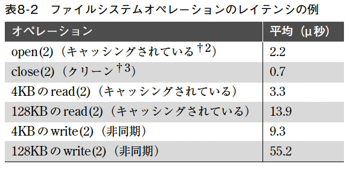
  - これらのテストにはストレージデバイスが関わっておらず、ファイルシステムソフトウェアとCPUのスピードのテストになっている。

### 8.3.14 特殊ファイルシステム
- 一時ファイル（/tmp）
- カーネルデバイスパス（/dev）
- システム統計（/proc）
- システム構成（/sys）

- Linux のストレージデバイスを使わない特殊ファイルシステムのリストは、grep '^nodev' /proc/filesystems を実行すれば得られる。
```shell
mizue@apple:~$ grep '^nodev' /proc/filesystems 
nodev	sysfs
nodev	tmpfs
nodev	bdev
nodev	proc
nodev	cgroup
nodev	cgroup2
nodev	cpuset
nodev	devtmpfs
nodev	configfs
nodev	debugfs
 :
```

### 8.3.15 最終アクセス時刻
- 最終アクセス時刻のタイムスタンプの更新を止める方法を「8.8チューニング」で示す。
  - メタデータ更新のためにディスクI/O リソースを消費する書き込みワークロードが発生するのでグループにまとめ、先延ばしにして最適化する方法。

### 8.3.16 容量
- ファイルシステムがいっぱいになってくると、パフォーマンスが低下する理由
  - 新しいデータを書き込むとき、ディスク上のフリーブロックを見つけ出すための計算や必要とされるディスクI/O のために余分に時間がかかる
  - ディスク上のフリー領域が小さくなり、離れた位置に散在するようになるため。

## 8.4 アーキテクチャ
- この節では、ファイルシステム全般、そして個別のファイルシステムのアーキテクチャについて説明する。

### 8.4.1 ファイルシステムI/Oスタック
- この図は、アプリケーションとシステムライブラリからシステムコールまで、さらにその先のカーネル内のパスを示している。
- 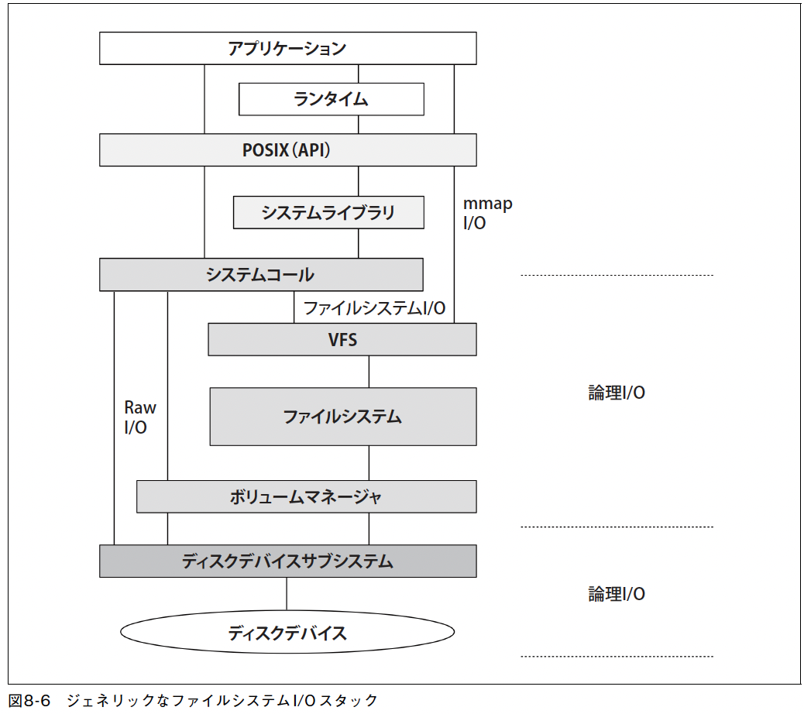
### 8.4.2 VFS
- VFS（Virtual File System interface）は、異なるファイルシステムタイプに対する共通インターフェイスを提供する。
- VFSはSunOSで生まれ、ファイルシステムの標準的な抽象化メカニズム
- 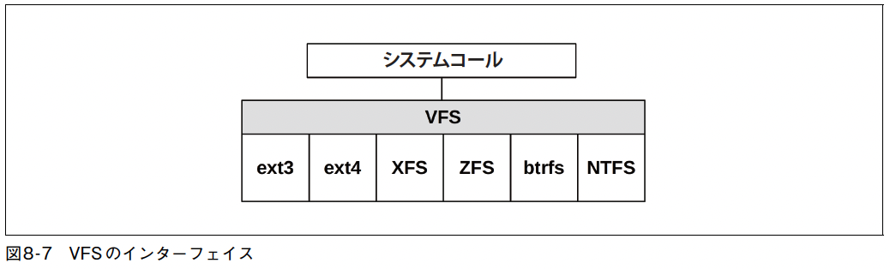
- VFSインターフェイスは、任意のファイルシステムのパフォーマンスを計測するための共通の位置としても機能する。
### 8.4.3 ファイルシステムキャッシュ
- 今日のLinuxは、複数の異なるキャッシュタイプを持っている。
- 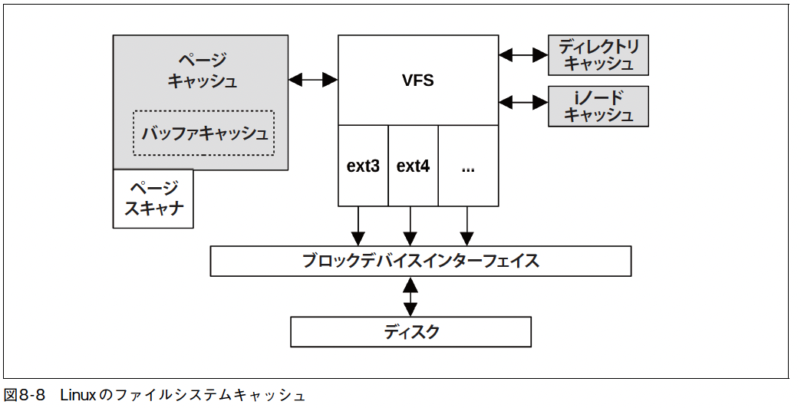
#### 8.4.3.1 バッファキャッシュ
- UBC（Unified Buffer Cache、統合バッファキャッシュ）
  - ページキャッシュ内にバッファキャッシュを格納するという方法
    - （図8-8 で境界線が点線になっているのはそのためである）
  - バッファキャッシュとページキャッシュの使い分けやオーバーヘッドなどのチューニング問題を解決する
- バッファキャッシュのサイズは動的に変化し、/proc で調べられる。
#### 8.4.3.2 ページキャッシュ
- ページキャッシュは、メモリにマッピングされたファイルシステムページを含む仮想メモリページをキャッシング。
- メモリにマッピングされたファイルシステムページを含む仮想メモリページをキャッシングし、ファイル/ディレクトリI/Oのパフォーマンスを向上させた。
- バッファキャッシュよりもページキャッシュの方が効率的。
- ページキャッシュは、使えるメモリがあればどんどん使っていくが、アプリケーションでメモリが必要になると自分のスペースを開放していく。
- ダーティな（書き換えられている）メモリページは、カーネルスレッドによってディスクにフラッシュされる。
- ページはがディスクにフラッシュされるタイミング
  - 決まった時間が経過した（30 秒）
  - sync(2)、fsync(2)、msync(2) システムコール
  - ダーティページ数が多くなり過ぎた（dirty_ratio、dirty_bytes パラメータ）
  - ページキャッシュ内に空きページがなくなった
- ページアウトデーモン（kswapd、ページスキャナ: page scanner とも呼ばれる）(カーネルスレッド)
  - システムメモリが足りなくなるとダーティページを見つけて書き込みをスケジューリングし、そのページを開放して再利用できるようにする。
#### 8.4.3.3 dentryキャッシュ
- dentry キャッシュ（Dcache）は、ディレクトリエントリ（struct dentry）からVFS iノードへのマッピングを記憶する。
  - Dcache で直接対応するiノードがわかるので、パス名のルックアップ（たとえばopen(2) による）のパフォーマンスが上がる
  - RCU-walk（Read-Copy-Update-walk）アルゴリズム：dentry の参照カウントを更新せずにパス名を検索する
- Dcacheは、存在しないエントリのルックアップを記憶するネガティブキャッシング（negative caching）も行う。
- Dcacheは、動的に成長し、システムがメモリを必要とするときにLRU（least recently used）アルゴリズムで縮小される
- サイズは、/proc を介して見ることができる。
#### 8.4.3.4 iノードキャッシュ
- VFS iノード（struct inode）を格納する
- iノードは、ファイルシステムオブジェクトの属性を記述するもの
- VFS iノードは、高速でスケーラブルなルックアップのためにハッシュテーブルに格納される
  - ただし、ほとんどのルックアップはDcacheを介して行われる
- iノードキャッシュも動的に成長し、足りなくなると破棄して縮小する。
- iノードキャッシュのサイズは/proc/sys/fs/inode*ファイルを介して見ることができる。

### 8.4.4 ファイルシステムのパフォーマンスに関わるその他の機能と属性
- キャッシング以外でパフォーマンスに影響を及ぼす、ファイルシステムの重要な機能や属性を説明する。
#### 8.4.4.1 ブロックとエクステント
- ブロック
  - ブロックベースのファイルシステムは、固定サイズのブロックにデータを格納する。
  - 大きなファイルでは多数のブロックポインタとメタデータブロックが必要になり、ブロックの配置はバラバラになってランダムI/Oを引き起こす。
  - ブロックサイズを可変にして、ファイルが大きくなると大きなブロックサイズを使えるようにするというアプローチもある。
- エクステント（extent）
  - エクステントベースのファイルシステムは、ファイル（エクステント）のために連続的なスペースをプレアロケートし、必要に応じてそれを成長させる。
  - エクステントは可変長で、1 個以上の連続したブロックを表す。
  - ストリーミングのパフォーマンスが上がり、ランダムI/Oのパフォーマンスも上がる。メタデータのパフォーマンスも上がる。
#### 8.4.4.2 ジャーナリング
- ジャーナル（journal、またはログ: log）は、ファイルシステムに加えられた変更を記録。
- システムクラッシュや電源障害が起きたときに、変更がアトミックに再現されるようにする。
- ジャーナルがあるファイルシステムは、首尾一貫した状態に速やかに復元できる。
- ジャーナルはディスクに同期的に書き込まれる。
- 記録方法
  - データとメタデータの両方を記録する方法
    - ストレージI/O リソースが大きく消費される。
  - メタデータだけを書き込み、コピーオンライトでデータの完全性を維持する方法。
- ログ構造化ファイルシステム（log-structured file system）では、データとメタデータのすべての更新情報が連続的で循環的なログに書き込まれる。
  - 書き込みが常にシーケンシャル
  - マージして大きなI/Oサイズを使うこともできる
  - 書き込みのパフォーマンスが上がる
#### 8.4.4.3 コピーオンライト
- コピーオンライト（Copy-On-Write、COW）ファイルシステムは、既存ブロックを上書きせず、次の手順に従って更新を行う。
1. 新しい位置にブロックを書き込む（新しいコピー）。
2. 参照を新ブロックに更新する。
3. 古いブロックをフリーリストに追加する。
- クラッシュしてもシステムの完全性を維持
- シーケンシャルな書き込みになることでパフォーマンスが上がる。
#### 8.4.4.4 スクラビング
- スクラビング（scrubbing）は、すべてのデータブロックを非同期に読み出し、チェックサムを確認して、できる限り早くエラーを検出するという機能
- スクラビングの読み出しI/O は、パフォーマンスを下げることがあるのでワークロードが少ないときに実行すべき。
#### 8.4.4.5 その他の機能
- パフォーマンスに影響を与えるファイルシステムのその他の機能
  - スナップショット
  - 圧縮
  - 組み込みの冗長性
  - 重複除去
  - トリミング
  などがある

### 8.4.5 ファイルシステムタイプ
#### 8.4.5.1 FFS
- FFS（Berkeley fast file system）
  - 多くのファイルシステムが究極的にはFFSを基礎としている。
  - オリジナルのUnixファイルシステムの問題点に対処するために設計された。
    - 👩‍💻 オリジナルのUnixファイルシステム
      - その当時のハードウェアや要求に合わせて設計され、シンプルで効率的なファイル管理を提供するための基盤を築いた。
      - [UFS(Unix File System)](https://ja.wikipedia.org/wiki/Unix_File_System)
        - > 一般にUFSと呼ぶ場合は4.2BSDで実装された Fast File System (FFS) のことを指す場合が多く他にはFFFS、UFS2、UFS Logging等が存在する。
    - iノードテーブルとストレージブロックがディスクのパーティションをふたつの範囲に分割している。
      - 両者にまたがってシークするときにパフォーマンス上の問題を引き起こす。
    - ブロックサイズが小さい問題。
      - 512バイトの固定サイズ
      - 大きなファイルを格納するためには必要なメタデータ（ポインタ）の量が増える。
    - フリーリストのフラグメンテーション（断片化、fragmentation）問題
      - フリーリスト: ファイルシステム内の未使用のディスク領域を管理するための仕組み
      - これがパフォーマンス低下の最大の問題
      - ファイルシステムを使っているうちにパフォーマンスの低下を引き起こす。
  - FFS
    - パーティションを無数のシリンダーグループ（cylinder group）に分割。
    - ファイルのiノードとデータは、可能ならひとつのシリンダーグループのなかに格納され、ディスクのシークが減るようにした。
    - ディレクトリとそのエントリのiノードといったその他の関連データも近くに配置。
    - 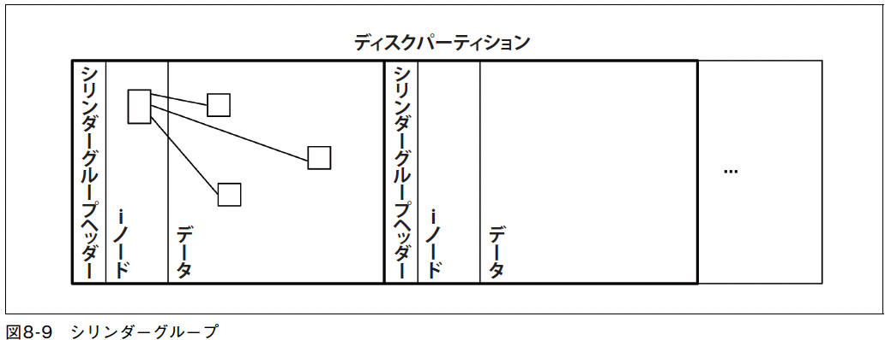
    - 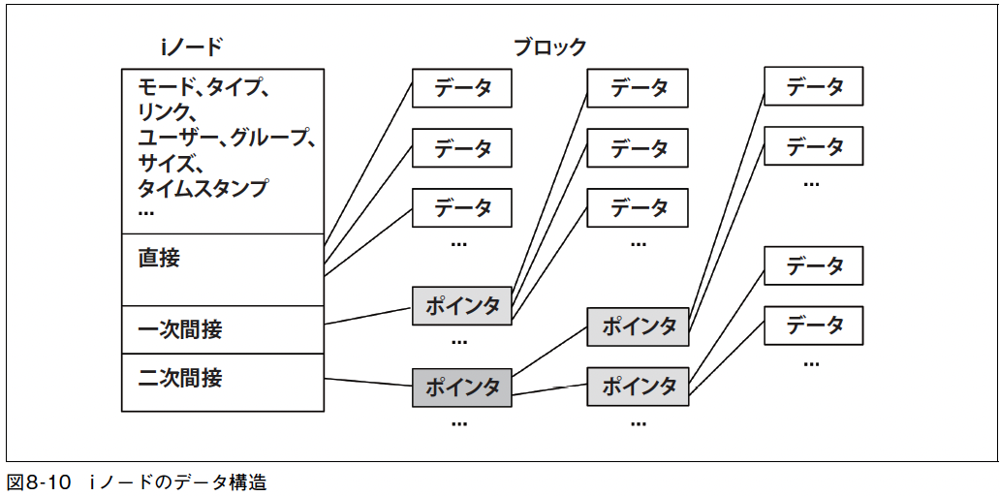
      - iノードの設計（図8-10）も、ポインタとデータブロックの階層構造を使って改善された。
    - ブロックサイズは最小で4KBに拡大
      - データブロック数が減った
      - データブロックを参照するために必要な間接ブロックの数も減った
      - 必要とされる間接ポインタブロックの数はさらに減った
      - 小さなファイルが効率よくスペースを使えるようにするために、個々のブロックは1KBのフラグメントに分割する
    - ブロックのインターリービング（block interleaving）
      - 複数のデータブロックを交互に格納
      - シーケンシャルなデータアクセスが高速化される
      - 間に挟まったブロックのおかげで、カーネルとプロセッサは、次のシーケンシャルなファイル読み出し要求を発行する時間を稼ぐことができる。
        - 👩‍💻[インターリーブ](https://ja.wikipedia.org/wiki/%E3%82%A4%E3%83%B3%E3%82%BF%E3%83%BC%E3%83%AA%E3%83%BC%E3%83%96)
          - > インターリーブでは、セクタを読んだ後の処理時間を考慮して、コンピュータが次のセクタを読む用意ができたときにちょうどそのセクタ上にヘッドが来るように配置する。従って、処理速度とインターリーブされたセクタの配置が一致していればデータ転送を高速化できるが、一致していないと著しく性能を低下させることがある。
#### 8.4.5.2 ext3
  - ext: Linux 拡張ファイルシステム。1992年にLinuxとそのVFSのための最初のファイルシステムとしてオリジナルのUnixファイルシステムを基礎として開発された。
    - ext2（1993年）: FFSの複数のタイムスタンプとシリンダーグループを組み込んだ。
    - ext3（1999年）: ファイルシステム拡張とジャーナリングを組み込んだ。
    - 👩‍💻 ext1 も開発はされたが問題が多くあったため実際の運用ではほとんど使われていないらしい
  - パフォーマンス関連の主要機能
    - ジャーナリング
      - メタデータのみのオーダードモード（ordered mode）とメタデータとデータの両方のジャーナルモード（journal mode）がある。
      - fsck（File System ChecK）の実行が不要になるので、システムクラッシュ後のブートのパフォーマンスが上がる。
      - メタデータをまとめて書き込めるので、書き込みワークロードの一部のパフォーマンスも上がる。
    - ジャーナルデバイス
      - 外部のジャーナルデバイスを使えるので、ジャーナルのワークロードが読み出しのワークロードと競合し合わない。
    - Orlovブロックアロケータ
      - [Orlov block allocator](https://en.wikipedia.org/wiki/Orlov_block_allocator): ディスク操作を高速化するために、 特定のファイルが特定のファイルシステム上のどこに存在するかを (ブロック単位で) 定義するアルゴリズムです。
      - トップレベルディレクトリをシリンダーグループ全体に分散させる。
      - サブディレクトリとそのコンテンツが近くに並びやすくなり、ランダムI/Oが減る。
    - ディレクトリインデックス
      - hashedB-tree（HTree）追加
#### 8.4.5.3 ext4
- 2008年にリリースされた。
- 追加機能
  - エクステント（extent）: 連続的な配置を増やすことによって、シーケンシャルI/OのI/Oサイズを大きくする。
  - プレアロケーション: fallocate(2) システムコールにより、連続的になりそうなスペースをあらかじめ確保できるようにする。
  - 遅延アロケーション: ディスクにフラッシュされるまでブロックのアロケーションを先延ばしにして、まとまった書き込みを実現し（マルチブロックアロケータを使う）、フラグメンテーションを削減する。
  - 高速fsck: アロケートされていないブロックとiノードエントリにマークを付け、fsck の処理時間を短縮する。
  - 一部の機能の状態は、ファイルシステムの/sys で見られる。
```
mizue@apple:/sys/fs/ext4/features$ grep . *
batched_discard:supported
casefold:supported
encrypted_casefold:supported
encryption:supported
fast_commit:supported
lazy_itable_init:supported
meta_bg_resize:supported
metadata_csum_seed:supported
test_dummy_encryption_v2:supported
verity:supported
```

#### 8.4.5.4 XFS
- 1993年にSilicon Graphics が同社のIRIX OSのために作った。
  - IRIX が使っていたEFSファイルシステム（FFS をベースとしている）のスケーラビリティの低さを解消することを目的としたもの。
  - 👩‍💻 XFSは特に大規模な環境やハードウェアに適している。
- 現在では、ほとんどのLinux ディストリビューションがXFSをサポートしている。
- パフォーマンス関連の主要な機能
  - アロケーショングループ
    - 👩‍💻 ディスクスペースの割り当てと管理を効率的に行うための仕組み
    - パーティションは、サイズが同じで並列にアクセスできるアロケーショングループ（AG）に分けられる。
  - エクステント
  - ジャーナリング
  - ジャーナルデバイス
  - ストライプアロケーション
    - 👩‍💻 データをストライプと呼ばれる連続したブロックに分割して複数のディスクに分散するアロケーション方式。高速なデータアクセスと並列処理を実現するために使用されるストレージ技術。
    - ストライピングされたRAID、LVMデバイスにファイルシステムが作られる場合、ハードウェアに合わせてデータのアロケーションを最適化するために、データやジャーナルのストライプユニット数を指定できる。
  - 遅延アロケーション
  - オンラインデフラグメンテーション
    - 👩‍💻 ファイルシステムを停止またはオフラインにすることなく、アクセス可能な状態でデータの再配置を行うことができる。
    - XFSは、フラグメンテーションを防ぐためにエクステントと遅延アロケーションを使っているが、ある種のワークロードと条件のもとでは、ファイルシステムがフラグメンテーションを起こす。
#### 8.4.5.5 ZFS
- 2005年にSun Microsystems で開発
  - Zettabyte File System
  - ほとんどの開発はOpenZFSプロジェクトで行われており、同プロジェクトは2019 年にLinux をメインのOSとしてサポートすると発表している。
    - 👩‍💻 2020年12月02日 [ZFS on Linuxから新生した「OpenZFS 2.0」リリース、pL2ARCやZstandard圧縮などを搭載](https://gigazine.net/news/20201202-openzfs-2-0/) 
- パフォーマンス関連の主要な機能
  - プール化されたストレージ（pooled storage）
    - 👩‍💻 ディスクを単一のストレージプールとして管理
    - すべてのデバイスを並列に使って最大限のスループットとIOPSを得られる。
    - 0、1、10、Z（RAID-5を基礎とする）、Z2（ダブルパリティ）、Z3（トリプルパリティ）という異なるRAIDタイプを使える。
  - COW(Copy-on-Write)
  - ロギング（logging）
    - 👩‍💻 書き込み操作をトランザクショングループと呼ばれるまとまりにまとめて処理する。適切なロギング設定を選択することで、データの保護とパフォーマンスのバランスを取ることができる。
    - トランザクショングループ（Transaction Group: TXG）をバッチでフラッシュするため、ディスク上のフォーマットは常に一定に保たれる。
  - ARC（Adaptive Replacement Cache、適応型置換キャッシュ）
  - インテリジェントプリフェッチ（intelligent prefetch）
    - ZFSは、メタデータ、zノード（ファイルのコンテンツ）、vdev（仮想デバイス）のために、適宜異なるタイプのプリフェッチを使い分ける。
  - マルチプリフェッチストリーム（multiple prefetch stream）
    - 個々のプリフェッチストリームを追跡し、新しいストリームがそこに合流できるようにしている。
  - スナップショット（snapshot）
    - COWアーキテクチャで、スナップショットはほとんど瞬間的に作成できる。
  - ZIO(Zettabyte I/O)パイプライン（ZIO pipeline）
    - 👩‍💻 データの読み書き処理を効率的に行うために使用される仕組み、高度なデータ整合性や耐障害性を提供するための仕組みの一つ
    - デバイスI/O は、ステージのパイプラインによって処理される。
    - 各ステージがスレッドプールによって処理されるため、パフォーマンスが上がる。
  - 圧縮（compression）
    - 複数のアルゴリズムがサポートされている。
    - 👩‍💻 ディスクスペースの効率的な利用
  - SLOG（Separate intent LOG）
    - 同期的な書き込みが別のデバイスに書き込まれるようにして、プールディスクのワークロードと競合を起こさないようにしている。
    - 👩‍💻 SSDなどの高速なデバイスをSLOGとして使用することができる。高い書き込み性能を確保。
  - L2ARC（Level 2 ARC）
    - 👩‍💻 ZFSファイルシステム内で使用される、キャッシュメモリの一部であり、主に読み込みアクセスの性能向上を目指すための仕組み
      - L2ARCはキャッシュヒット率が低いデータや、アーカイブデータなどのアクセスがまれなデータをキャッシュするのに適している。
      - 「8.2.3 2次キャッシュ」参照
    - メインメモリのあとの第2レベルのキャッシュ。
    - ARCのデータを重複して持つことができるので、メインメモリをフラッシュするような摂動が起きても、システムはデータを高速に復元できる。
  - データの重複排除（data deduplication）
    - 👩‍💻 同一または類似のデータブロックが複数の場所に存在する場合に、そのデータブロックを1つのコピーとして格納し、ストレージスペースを節約する仕組。
    - デバイスI/Oの削減
    - ハッシュテーブルがメインメモリに収まり切らなくなると、デバイスI/Oがかなり激しく増えるおそれがある
- ZFSのパフォーマンスが下がる問題
  - 電源が落ちたときに書き込みが確実に完了するように、ストレージデバイスにキャッシュフラッシュコマンドを発行する。
  - キャッシュフラッシュを待たなければならないため、レイテンシが持ち込まれる。
#### 8.4.5.6 Btrfs
- Btrfs（B-tree file system）は、コピーオンライトでB木を基礎としている。
- パフォーマンス関連の主要な機能
  - プール化されたストレージ
    - ストレージデバイスは1個のボリュームにまとめられ、そこからファイルシステムが作られる。
    - そのため、すべてのデバイスを並列に使って最大限のスループットとIOPSを得られる。
    - 0、1、10 という異なるRAIDタイプを使える。
    - 👩‍💻 2017年から5, 6 も使える
  - COW
  - オンライン平準化（online balancing）
    - 👩‍💻 データとメタデータの配置を最適化するプロセス
    - ワークロードを平準化するために、ストレージデバイス間でオブジェクトを移動できる。
  - エクステント
  - スナップショット
  - 圧縮
    - zlib とLZOをサポートする。
  - ジャーナリング
    - 同期的なCOWワークロードをジャーナリングするために、サブボリュームごとにログツリーを作れる。
- 👩‍💻 [Btrfsを13年使ったのでその経験の話](https://chienomi.org/articles/linux/202203-btrfs.html)
### 8.4.6 ボリュームとプール
- 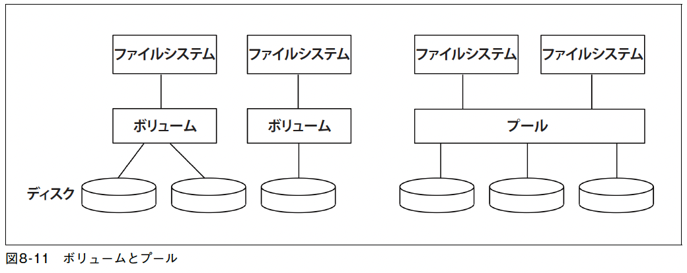
- ボリューム（volume）
  - 複数のディスクをひとつの仮想ディスクのように見せるもの。
  - すべてのディスクの上にボリュームを作ると、ワークロードが分離され、競合によってパフォーマンスが損なわれる問題を減らせる。
  - LVM（Logical Volume Manager）- ボリューム管理ソフトウェア
- プール化ストレージ（pooled storage）
  - ストレージプールに複数のディスクを組み込み、そこから複数のファイルシステムを作れるというもの。
  - ボリュームよりも柔軟性が高い
  - ZFSやBtrfs などの新しいファイルシステムで使われており、LVMでも実現できる。
- どちらを使うか？パフォーマンス上、考慮すべき点
  - 可観測性
    - 仮想デバイスの使用率は紛らわしい。物理デバイスを別々にチェックしよう。
  - CPUのオーバーヘッド
    - 特にRAIDのパリティ計算実行時
  - 再構築
    - 再同期化（resilvering）とも呼ばれる。
    - RAIDグループに空ディスクを追加したときなど。
    - この処理はI/Oリソースを消費し、数時間、あるいは数日かかるため、パフォーマンスに大きな影響を及ぼす。

## 8.5 メソドロジ
- 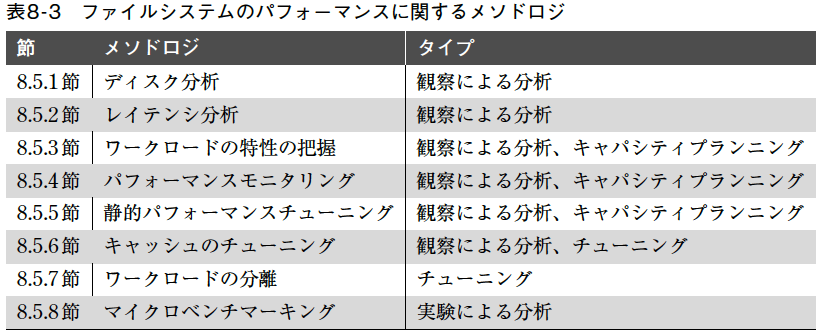

### 8.5.1 ディスク分析
- ファイルシステムが単純で、キャッシュが小さかったときには、ディスク分析だけで上手くいった。
- 今ではこのアプローチはある種の問題をまるまる見落としてしまう。
### 8.5.2 レイテンシ分析
- ファイルシステムオペレーションのレイテンシ
  - オペレーションのレイテンシ= 時刻（オペレーション完了）− 時刻（オペレーション要求）
  - ターゲット（レイヤ）
    - アプリケーション
      - ファイルシステムレイテンシがもっとも正確に計測できる。
      - テクニックがアプリケーションごとに異なる
    - システムコールインターフェース
      - 一般にOSのツールや静的トレーシングで計測できる
      - 非ストレージファイルシステム（統計、ソケット）を含むすべてのファイルシステムタイプをキャッチしてしまうため、フィルタリングしなければ紛らわしくなることがある。
    - VFS
      - ファイルシステムオペレーションごとにひとつずつしかない（たとえば、vfs_write()）
    - ファイルシステムのトップ
      - 対象のファイルシステムタイプしかトレースされない
  - どのレイヤを選ぶかは、使えるツールによって決まる場合がある
  - チェックする情報
    - アプリケーションのドキュメント
    - OSツール
    - 動的インストルメンテーション
      - システムが動的インストルメンテーションの機能を持つなら、何もリスタートせずにカスタムトレーシングプログラムであらゆるレイヤを調査できる。
#### 8.5.2.1 トランザクションのコスト
- ファイルシステムレイテンシは、アプリケーションのトランザクション中にファイルシステム待ちに使った時間の合計という形でも示せる。
  - ファイルシステム内にいた時間の割合（%）= 100 × ファイルシステム待ちのブロックによるレイテンシの合計/アプリケーションのトランザクション実行時間
  - この計算でファイルシステムオペレーションのコストを定量化、数値化できる。
  - 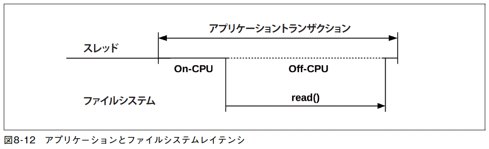
    - トランザクションは、ファイルシステムからの読み出しを1 度だけ発行 -> off-CPU 状態に遷移
    - この場合のブロック時間の合計は、1回のファイルシステムからの読み出しにかかった時間
      - このファイルシステムレイテンシを取り除けばパフォーマンスが上がることがわかる
    - 逆に、ファイルシステムのレイテンシが小さい場合は、他に原因があることが推測できる
  - アプリケーションがノンブロッキングI/Oを発行している場合、ブロック時間＝ファイルシステムからの読み出しにかかった時間ではないことに注意。
### 8.5.3 ワークロードの特性の把握
- 負荷の特性をつかむことで、削減できる不要な仕事を見つけてパフォーマンスを上げることができる。
- ファイルシステムのワークロードを特徴付ける基本属性
  - オペレーションの頻度とタイプ
  - ファイルI/Oのスループット
  - ファイルI/Oのサイズ
  - 読み書きの比率
  - 同期書き込みの比率
  - ランダムなアクセスとシーケンシャルなアクセス
- これらの特性は、毎秒変化する可能性がある。
- ワークロードの特性をうまくつかむためには、平均だけではなく、最大値をチェックする。
  - 一定時間内の値の完全な分布を解析すればなおよい
#### 8.5.3.1 高度なワークロードの特性チェックリスト
- ワークロード特性の説明に加えて、以下のチェックリストを使い、ファイルシステムの問題を徹底的に解析する
  - キャッシュのヒット率、ミス率
  - キャッシュの容量、使用状況
  - そのほかのキャッシュ（ディレクトリ、i ノード、バッファ）。それらの統計。
  - 過去にファイルシステムのチューニングのためにどのようなことをしたか。
  - どのアプリケーション、どのユーザーがファイルシステムを使っているか。
  - どのファイル、ディレクトリがアクセスされているか。
    - 作成、削除されているものはどれか。
  - エラーは起きているか。
    - それは無効な要求によるものか。それともファイルシステムの問題か。
  - ファイルシステムI/Oはなぜ発行されているか（ユーザーレベルコールパスはどうなっているか）。
  - アプリケーションは、ファイルシステムI/Oをどの程度直接（同期的に）要求しているか。
  - I/O完了までの時間の分布はどうなっているか。
- アプリケーションごと、ファイルごとに答える。
- 経時的にチェック、最大値、最小値、時間帯ごとの変化を調べる。
#### 8.5.3.2 パフォーマンスの特性の把握
- 得られたパフォーマンスを解析する。
  - ファイルシステムオペレーションの平均的なレイテンシはどうなっているか。
  - レイテンシに高い方の外れ値はあるか。
  - オペレーションのレイテンシの完全な分布はどうなっているか。
  - ファイルシステムやディスクI/O に対するリソースコントロールはあるか、アクティブになっているか。
- 👩‍💻 外れ値が含まれる状態で平均値を出すと外れ値によってデータの特性が歪められてしまう。
#### 8.5.3.3 イベントトレーシング
- トレーシングツールを使って、ファイルシステムオペレーションとその詳細情報をログに記録して、あとで分析できる。
- 全てのイベントではなく、フィルタリングして使う
  - ファイルシステムオペレーションは頻度が大きいため、全てのイベントを記録するとオーバーヘッドが大きいため
  - たとえば、遅いI/Oだけをログに記録するなど
### 8.5.4 パフォーマンスモニタリング
- 現にある問題や経時的なふるまいのパターンを明らかにすることができる。
- 主要な指標
  - オペレーションの頻度
  - オペレーションのレイテンシ
- オペレーションのレイテンシは、1秒あたりの平均値をモニタリングするだけでなく、最高値や標準偏差などの値も得るようにしたい
- ヒストグラムやヒートマップを使ってレイテンシの完全な分布を調査
- オペレーションごとの統計をとる。
- リソースコントロールがあるシステムでは、制限が効いているか、効いているのはいつか、を統計に含める。
- Linuxのファイルシステムオペレーションですぐに使える統計量は通常ない。
  - NFSでは、nfsstat(8) から得られる。
### 8.5.5 静的パフォーマンスチューニング
### 8.5.6 キャッシュのチューニング
### 8.5.7 ワークロードの分離
### 8.5.8 マイクロベンチマーキング

## 8.6 可観測性ツール

### 8.6.1 mount
### 8.6.2 free
### 8.6.3 top
### 8.6.4 vmstat
### 8.6.5 sar
### 8.6.6 slabtop
### 8.6.7 strace
### 8.6.8 fatrace
### 8.6.9 LatencyTOP
### 8.6.10 opensnoop
### 8.6.11 filetop
### 8.6.12 cachestat
### 8.6.13 ext4dist（xfs、zfs、btrfs、nfs）
### 8.6.14 ext4slower（xfs、zfs、btrfs、nfs）
### 8.6.15 bpftrace
#### 8.6.15.1 1行プログラム
#### 8.6.15.2 システムコールのトレース
#### 8.6.15.3 VFSのトレーシング
#### 8.6.15.4 ファイルシステムの内部構造
### 8.6.16 その他のツール
#### 8.6.16.1 ZFS
### 8.6.17 ビジュアライゼーション

## 8.7 実験

### 8.7.1 アドホックテスト
### 8.7.2 マイクロベンチマークツール
#### 8.7.2.1 Bonnie、Bonnie++
#### 8.7.2.2 fio
#### 8.7.2.3 FileBench
### 8.7.3 キャッシュのフラッシュ

## 8.8 チューニング

### 8.8.1 アプリケーションからの呼び出し
#### 8.8.1.1 posix_fadvise( )
#### 8.8.1.2 madvise( )
### 8.8.2 ext4
#### 8.8.2.1 mountとtnue2fs
#### 8.8.2.2 /sys/fsプロパティファイル
#### 8.8.2.3 e2fsck
### 8.8.3 ZFS

## 8.9 練習問題

1. ファイルシステムの用語についての以下の問いに答えなさい。
- 論理I/Oと物理I/Oの違いは何か。
- ランダムI/OとシーケンシャルI/Oの違いは何か。
- DirectI/O とは何か。
- ノンブロッキングI/Oとは何か。
- ワーキングセットサイズとは何か。

2. コンセプトについての以下の問いに答えなさい。
- VFSの役割は何か。
- ファイルシステムレイテンシについて、特にどこでそれを計測できるかについて説明しなさい。
- プリフェッチ（先読み）の目的は何か。
- Direct I/Oの目的は何か。

3. 以下の少し難しい問いに答えなさい。
- O_SYNC ではなくfsync(2) を使うメリットを説明しなさい。
- read(2)/write(2) との比較でmmap(2)の利点、欠点を説明しなさい。
- 論理I/Oが物理I/Oになるとサイズが大きくなるのはどういうときかを説明しなさい。
- 論理I/Oが物理I/Oになるとサイズが小さくなるのはどういうときかを説明しなさい。
- ファイルシステムのCOW（コピーオンライト）がパフォーマンスを向上させる仕組みを説明しなさい。

4. あなたの環境のために次のものを作りなさい。
- ファイルシステムキャッシュをチューニングするためのチェックリスト。存在するファイルシステムキャッシュをリストアップし、現在のサイズ、使用状況、ヒット率をチェックする方法をまとめること。
- ファイルシステムを操作するワークロードの特性の把握チェックリスト。個々の詳細情報の取得方法を入れること。まずOSが提供する既存の可観測性ツールを使うようにしなさい。

5. 以下の作業をしなさい。
- アプリケーションを選び、ファイルシステムオペレーションとレイテンシを計測しなさい。次の条件を満たすこと。
  - ファイルシステムオペレーションのレイテンシの平均だけでなく、完全な分布を示すこと。
  - 個々のアプリケーションスレッドがファイルシステムオペレーションのために費やす時間の秒未満の部分を明らかにすること。
- マイクロベンチマークツールを使って、ファイルシステムキャッシュのサイズを実験的に調べなさい。使ったツールを選んだ理由を説明すること。また、ワーキングセットがキャッシングできなくなったときのパフォーマンスの劣化を示しなさい（何らかの指標を使って）。


6. （オプション、高度）ファイルシステムに対する同期書き込みと非同期書き込みを計測する可観測性ツールを開発しなさい。頻度とレイテンシを表示し、発行したプロセスID を突き止められるようにすること。また、ワークロードの特性の把握に適したものにすること。

7. （オプション、高度）間接的で大きくされたファイルシステムI/O、つまりアプリケーションが直接発行していないのに追加されたバイトとI/Oの統計を表示するツールを開発しなさい。ツールは、追加されたI/Oをタイプ別に分類し、理由を説明できなければならない。

## 8.10 参考文献
