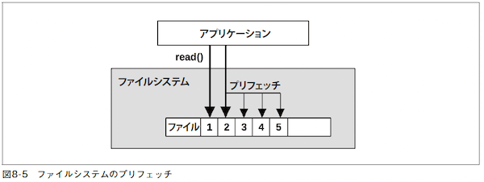

# 第8章 ファイルシステム

- アプリケーションにとっては、ディスク、ストレージデバイスのパフォーマンスよりもファイルシステムのパフォーマンスの方が重要な意味がある。
  - アプリケーションがやり取りし、処理終了を待つのはファイルシステムだから。
  - ファイルシステムは、アプリケーションがディスク（またはリモートストレージデバイス）レベルのレイテンシに支配されないように、キャッシング、バッファリング、非同期I/Oを駆使することができる。
- しかし、システムパフォーマンスの分析、モニタリングツールは、伝統的にファイルシステムパフォーマンスは盲点になっていた。
## 8.1 用語

- ファイルシステム（file system）: データをファイルとディレクトリに組織したもので、データアクセスのためのファイルベースインターフェイスとアクセス制御のためのファイルパーミッションを備えている。
- ファイルシステムキャッシュ（file system cache）:　ファイルシステム内のコンテンツをキャッシングするために使われるメインメモリ（通常DRAM）内の領域。
- オペレーション（operation、操作）: read(2)、write(2)、open(2)、close(2)、stat(2)、mkdir(2) など
- I/O（input/output、入出力）: 本書では、直接読み書きする（I/O を実行する）オペレーションだけをI/O と呼ぶ。（open(2) とclose(2) は、I/O には含まれない）
- 論理I/O（logical I/O）: アプリケーションがファイルシステムに対して発行するI/O要求のこと。
- 物理I/O（physical I/O）: ファイルシステムがディスクに直接発行する（またはRaw I/O による）I/O要求のこと。
- ブロックサイズ（レコードサイズ（record size））: ディスク上のファイルシステムデータグループのサイズ。
- スループット（throughput）: アプリケーションとファイルシステムの間でのデータ転送速度。
- i ノード（inode）: インデックスノード（index node）という意味。メタデータを格納するデータ構造。
- VFS（Virtual File System）: 異なるファイルシステムタイプを抽象化してサポートするためのカーネルインターフェイス。
- （仮想）ボリューム（volume）: ストレージのインスタンスのこと
- ボリュームマネージャ（volume manager）: 物理ストレージデバイスを柔軟に管理するためのソフトウェア


## 8.2 モデル

### 8.2.1 ファイルシステムインターフェイス

- 
- 図8-1 に示してあるのは、ジェネリックなオブジェクトオペレーション。
- ファイルシステムをブラックボックスとして扱い、オブジェクトオペレーションのレイテンシに焦点を絞るというアプローチがある。

### 8.2.2 ファイルシステムキャッシュ

- 
- 図8-2 は、メインメモリ内のジェネリックなファイルシステムキャッシュが読み出しオペレーションを処理しているところを示している。
- キャッシュヒットした場合はキャッシュから、キャッシュミスした場合はディスクからデータを返す。
- キャッシュミスしたディスクデータはキャッシュに格納される（キャッシュのウォームアップ）。
- ファイルシステムキャッシュは、あとで書き込む（フラッシュする: flush）ために書き込みデータをバッファリングすることもある。

### 8.2.3 2次キャッシュ

- 
  - 元々、著者が2007年に[ZFS](https://e-words.jp/w/ZFS.html#:~:text=ZFS%E3%81%A8%E3%81%AF%E3%80%81%E4%B8%BB%E3%81%AB,%E3%81%AB%E7%A7%BB%E6%A4%8D%E3%81%95%E3%82%8C%E3%81%A6%E3%81%84%E3%82%8B%E3%80%82)のために開発したもの
- 2次キャッシュ（second-level cache、L2 cache）は、どのようなメモリタイプでもよい。
- 👩‍💻[Solaris ZFS集中講座（3）](https://atmarkit.itmedia.co.jp/ait/articles/0905/28/news108.html)
  > L2ARC（Level 2 Adaptive Replacement Cache）は、ARCのRead用拡張2次キャッシュであり、SSDを適用することでRead速度の向上を促します。

## 8.3 コンセプト
### 8.3.1 ファイルシステムレイテンシ
- ファイルシステムのパフォーマンスでもっとも重要な指標。
- 論理ファイルシステム要求を発行してから完了するまでの時間として計測される。
  - ファイルシステム、ディスクI/O サブシステムで過ごした時間とディスクデバイス（物理I/O）の待ち時間が含まれる。
- アプリケーションのパフォーマンスに直接、比例的に影響を与える。
- しかし、アプリケーションがノンブロッキングI/Oを使っているときや、I/Oが非同期スレッドから発行されているときには、影響を直接受けない。
- OSが提供しているディスクデバイスレベルの統計量だけを観測していると誤解を招く場合がある。
  - レイテンシの高いディスクI/Oのバーストがあっても、実際はアプリケーションと非同期に実行されているなど。

### 8.3.2 キャッシング
- ファイルシステムは、パフォーマンスを上げるために、一般にメインメモリ（RAM）をキャッシュとして使うので論理I/Oレイテンシは大幅に下がる。
- キャッシュが増えて空きメモリが減った場合、アプリケーションがメモリを必要とすると、カーネルはすぐにファイルシステムキャッシュのメモリを開放してアプリケーションに渡す。
- ファイルシステムとブロックデバイスサブシステムは、一般に表8-1 に示すような複数のタイプのキャッシュを使い分ける。
- 
  - 個々のキャッシュタイプについては、「8.4 アーキテクチャ」で説明する。

### 8.3.3 ランダムI/OとシーケンシャルI/O
- シーケンシャル（sequential: 逐次）: 次のI/O のオフセットは、前のI/Oの末尾。
- ランダム（random: 直接）: オフセットは不規則に変化する。
- 
  - 図8-4 はこれらのアクセスパターンを図示したもの。
- フラグメンテーション（fragmentation、断片化）
  - ファイルはディスクのさまざまな位置に散在
  - ランダムな物理I/Oを発生させる
  - 回転ディスクの場合はプリフェッチや先読みを使ってパフォーマンスを上げることができる

### 8.3.4 プリフェッチ
- 
  - 仕組み：前回のファイルオフセットポインタと現在の位置を比較し、シーケンシャルなら、ファイルシステムは追加の読み出し（プリフェッチ）を発行する。
  - 図の場合、アプリケーションがオフセット1を読み出したあとでオフセット2を読み出すと、次の3つのオフセットのプリフェッチが実行される。
- 有効なパターン
  - 大量のファイルデータをシーケンシャルに読み出す場合の以下の問題点に有効
    - 一度に全て読み出すとキャッシュに収まらない
    - 一度しか読み出さないのでキャッシュに保持される可能性が低い
- プリフェッチ検出がうまく動作しない場合
  - アプリケーションで必要とされていない不要なI/O発生
  - キャッシュが汚れ、ディスク、I/Oトランスポートリソースが無駄に使われる
- ファイルシステムは必要に応じてプリフェッチをチューニングできるようになっている。

### 8.3.5 先読み
- readahead(2)(先読み（read-ahead）)
  - Linuxのシステムコール
    - 順次アクセスされたファイルをプリフェッチし、HDDよりもRAMから読み込まれるようする。
  - このシステムコールを使い、アプリケーションは明示的にファイルシステムキャッシュをウォームアップできる。

### 8.3.6 ライトバックキャッシング
- メインメモリへの転送が終わったら書き込みを完了扱いにし、あとで非同期に（asynchronously）ディスクに書き戻す。
  - フラッシュ（flushing）：書き戻す処理のこと
  - ダーティデータ：まだ書き込まれていないデータ
- 信頼性
  - 電源障害により、ダーティデータが失われる可能性やディスクに不完全に書き込まれる場合がある。
  - ファイルシステムメタデータが壊れた場合は、ロードできないなどの障害を引き起こし、ビジネスに影響が出る場合がある。

### 8.3.7 同期書き込み
- ファイルシステムメタデータの必要な変更を含む永続ストレージへの完全な書き込み完了で、書き込み処理完了となる。
  - ディスクデバイスのI/Oレイテンシの影響を直接被る。
- 非同期書き込みによるデータ破壊のリスクが許容できない一部のアプリケーションで使われている。
  - データベースのログライターなど

#### 8.3.7.1 個別の同期書き込み
- ファイルをオープンするときにフラグを指定する
  - [Ubuntu open(2) 同期 I/O](https://manpages.ubuntu.com/manpages/impish/ja/man2/open.2.html)
    - O_SYNC: ファイル完全性完了
    - O_DSYNC: データ完全性完了
    - O_RSYNC: Read I/O時に書き込みが完了することを保証

#### 8.3.7.2 以前の書き込みの同期コミット
- fsync(2): コード内のチェックポイントまでの非同期書き込みを同期的にコミットすることができる。
  - 書き込みをグループにまとめることができ、パフォーマンスを上げることができる。
  - [Ubuntu fsync(2)](https://manpages.ubuntu.com/manpages/impish/ja/man2/fsync.2.html)

### 8.3.8 Raw I/OとDirect I/O
- Raw I/O
  - ファイルシステムを素通りしてディスクオフセットに直接発行される。
  - ファイルシステムより上手くキャッシュ管理できるアプリケーションで使われる。
    - データベースシステムなど
    - ソフトウェアが複雑になる、管理が難しくなる、などの欠点がある。
- Direct I/O
  - ファイルシステムを使いつつ、ファイルシステムキャッシュをバイパスできるようにする。
  - キャッシング、バッファリング、プリフェッチを無効にする。
  - LinuxでO_DIRECTフラグを指定してopen(2)を呼び出すことで可能になる。
    - [Ubuntu open(2)](https://manpages.ubuntu.com/manpages/impish/ja/man2/open.2.html)
  - アライメントされたバッファ領域に対してブロックサイズの倍数でアクセスする必要がある。
    - 👩‍💻 ChatGPTにサンプルプログラムを書いてもらった。
```c
#define _GNU_SOURCE

#include <stdio.h>
#include <stdlib.h>
#include <fcntl.h>
#include <unistd.h>

int main() {
    const char* filename = "direct_io_example.txt";
    const int block_size = 4096;  // ブロックサイズ (バイト単位)
    const int num_blocks = 5;     // 書き込むブロック数

    // ファイルをO_DIRECTフラグで開く
    int fd = open(filename, O_CREAT | O_WRONLY | O_DIRECT, 0644);
    if (fd == -1) {
        perror("Failed to open file");
        return 1;
    }

    // ブロックサイズにアラインメントするためのアドレスを用意する
    void* write_buffer;
    if (posix_memalign(&write_buffer, block_size, block_size) != 0) {
        perror("Memory allocation error");
        close(fd);
        return 1;
    }

    // 書き込むデータを用意する
    for (int i = 0; i < block_size; ++i) {
        ((char*)write_buffer)[i] = 'A' + (i % 26);  // アルファベットを書き込む
    }

    // データを書き込む
    for (int i = 0; i < num_blocks; ++i) {
        ssize_t bytes_written = write(fd, write_buffer, block_size);
        if (bytes_written != block_size) {
            perror("Write error");
            close(fd);
            free(write_buffer);
            return 1;
        }
    }

    // ファイルを閉じる
    close(fd);
    free(write_buffer);

    // 書き込んだデータを読み込む
    fd = open(filename, O_RDONLY | O_DIRECT);
    if (fd == -1) {
        perror("Failed to open file for reading");
        return 1;
    }

    // バッファをアラインメントするためのアドレスを用意する
    void* read_buffer;
    if (posix_memalign(&read_buffer, block_size, block_size) != 0) {
        perror("Memory allocation error");
        close(fd);
        return 1;
    }

    // データを読み込む
    for (int i = 0; i < num_blocks; ++i) {
        ssize_t bytes_read = read(fd, read_buffer, block_size);
        if (bytes_read != block_size) {
            perror("Read error");
            close(fd);
            free(read_buffer);
            return 1;
        }

        // 読み込んだデータを処理（ここでは標準出力に出力）
        printf("Block %d: %.*s\n", i, block_size, (char*)read_buffer);
    }

    // ファイルを閉じる
    close(fd);
    free(read_buffer);

    return 0;
}

```
### 8.3.9 ノンブロッキングI/O
- スレッド作成のパフォーマンス、リソース面でのオーバーヘッドを避けるために、ノンブロッキングI/O が望ましい場合がある。
  - 参照）「5.2.6 ノンブロッキングI/O」
- open(2) システムコールでO_NONBLOCKまたはO_NDELAYフラグを指定すると実行できる。

### 8.3.10 メモリマップトファイル
- ファイルをプロセスのアドレス空間にマッピング
- 読み書きするときのシステムコール実行やコンテキストスイッチのオーバーヘッドを避けられる。
- マッピングは[madvise(2)](https://docs.oracle.com/cd/E19957-01/820-1930/auto7/index.html) でチューニングできる。
  - > カーネルに対してアドバイスを与える。カーネルはこの情報を使用して、指定された範囲に関連付けられた資源の操作と管理の手順を最適化する。
- ファイルシステムのパフォーマンス問題がディスクデバイスのI/Oレイテンシが高いことだとすると、mmap(2) でシステムコールの小さなオーバーヘッドを取り除いたところで、ほとんど無意味だ。
- マルチプロセッサシステムでマッピングを使うと、個々のCPU MMUの同期を取るためにオーバーヘッドがかかることが欠点。

👩‍💻 ChatGPTにメモリマップトファイルのサンプルプログラムを書いてもらった。
```c
#include <stdio.h>
#include <stdlib.h>
#include <string.h>
#include <sys/mman.h>
#include <sys/stat.h>
#include <fcntl.h>
#include <unistd.h>

int main() {
    const char* file_path = "sample_mmap_file.bin";
    size_t file_size = 1024;

    // ファイルをオープンしてファイルサイズを設定
    int fd = open(file_path, O_RDWR | O_CREAT, (mode_t)0600);
    if (fd == -1) {
        perror("open");
        return 1;
    }
    if (lseek(fd, file_size - 1, SEEK_SET) == -1) {
        close(fd);
        perror("lseek");
        return 1;
    }
    if (write(fd, "", 1) == -1) {
        close(fd);
        perror("write");
        return 1;
    }

    // メモリマップトファイルを作成
    void* mmapped_data = mmap(NULL, file_size, PROT_READ | PROT_WRITE, MAP_SHARED, fd, 0);
    if (mmapped_data == MAP_FAILED) {
        close(fd);
        perror("mmap");
        return 1;
    }

    // データを書き込む
    const char* data_to_write = "Hello, Memory Mapped Files!";
    size_t data_size = strlen(data_to_write);
    memcpy(mmapped_data, data_to_write, data_size);

    // メモリマップトファイルをアンマップ
    if (munmap(mmapped_data, file_size) == -1) {
        perror("munmap");
        return 1;
    }

    // ファイルをクローズ
    close(fd);

    // ファイルを削除
    if (remove(file_path) == -1) {
        perror("remove");
        return 1;
    }

    return 0;
}

```
### 8.3.11 メタデータ
- メタデータ（metadata）: ファイルやディレクトリについての情報
#### 8.3.11.1 論理メタデータ
- コンシューマ（アプリケーション）がファイルシステムに読み書きする情報
- 読み書き方法
  - 明示的な読み書き
    - ファイル統計の読み出し（stat(2)）
    - ファイルの作成、削除（creat(2)、unlink(2)）
    - ディレクトリの作成、削除（mkdir(2)、rmdir(2)）
    - ファイルのプロパティの設定（chown(2)、chmod(2)）
  - 暗黙の読み書き
    - ファイルシステムによるファイルの最終アクセス時刻タイムスタンプの更新
    - ディレクトリの最終更新時刻タイムスタンプの更新
    - 使用済みブロックのビットマップの更新、未使用スペース統計の表示
- 実際にファイルを読むより論理メタデータを参照することが多い
  - 例えば、ウェブサーバーのように、stat(2) を呼び出してキャッシング以降にファイルが変更されていないことを確認するなど。
#### 8.3.11.2 物理メタデータ
- すべてのファイルシステム情報を記録するために必要なディスク上のレイアウトについての情報
- メタデータのタイプは、ファイルシステムによって変わる。
  - 例
    - スーパーブロック
    - i ノード
    - データポインタブロック（プライマリ、セカンダリ…）
    - フリーリスト  など
### 8.3.12 論理I/Oと物理I/O
### 8.3.13 オペレーションは平等ではない
### 8.3.14 特殊ファイルシステム

### 8.3.15 最終アクセス時刻

### 8.3.16 容量

## 8.4 アーキテクチャ
### 8.4.1 ファイルシステムI/Oスタック
### 8.4.2 VFS
### 8.4.3 ファイルシステムキャッシュ
### 8.4.4 ファイルシステムのパフォーマンスに関わるその他の機能と属性
#### 8.4.4.1 ブロックとエクステント
#### 8.4.4.2 ジャーナリング
#### 8.4.4.3 コピーオンライト
#### 8.4.4.4 スクラビング
#### 8.4.4.5 その他の機能

### 8.4.5 ファイルシステムタイプ
#### 8.4.5.1 FFS
#### 8.4.5.2 ext3
#### 8.4.5.3 ext4
#### 8.4.5.4 XFS
#### 8.4.5.5 ZFS
#### 8.4.5.6 Btrfs

### 8.4.6 ボリュームとプール

## 8.5 メソドロジ

### 8.5.1 ディスク分析
### 8.5.2 レイテンシ分析
#### 8.5.2.1 トランザクションのコスト
### 8.5.3 ワークロードの特性の把握
#### 8.5.3.1 高度なワークロードの特性チェックリスト
#### 8.5.3.2 パフォーマンスの特性の把握
#### 8.5.3.3 イベントトレーシング
### 8.5.4 パフォーマンスモニタリング
### 8.5.5 静的パフォーマンスチューニング
### 8.5.6 キャッシュのチューニング
### 8.5.7 ワークロードの分離
### 8.5.8 マイクロベンチマーキング

## 8.6 可観測性ツール

### 8.6.1 mount
### 8.6.2 free
### 8.6.3 top
### 8.6.4 vmstat
### 8.6.5 sar
### 8.6.6 slabtop
### 8.6.7 strace
### 8.6.8 fatrace
### 8.6.9 LatencyTOP
### 8.6.10 opensnoop
### 8.6.11 filetop
### 8.6.12 cachestat
### 8.6.13 ext4dist（xfs、zfs、btrfs、nfs）
### 8.6.14 ext4slower（xfs、zfs、btrfs、nfs）
### 8.6.15 bpftrace
#### 8.6.15.1 1行プログラム
#### 8.6.15.2 システムコールのトレース
#### 8.6.15.3 VFSのトレーシング
#### 8.6.15.4 ファイルシステムの内部構造
### 8.6.16 その他のツール
#### 8.6.16.1 ZFS
### 8.6.17 ビジュアライゼーション

## 8.7 実験

### 8.7.1 アドホックテスト
### 8.7.2 マイクロベンチマークツール
#### 8.7.2.1 Bonnie、Bonnie++
#### 8.7.2.2 fio
#### 8.7.2.3 FileBench
### 8.7.3 キャッシュのフラッシュ

## 8.8 チューニング

### 8.8.1 アプリケーションからの呼び出し
#### 8.8.1.1 posix_fadvise( )
#### 8.8.1.2 madvise( )
### 8.8.2 ext4
#### 8.8.2.1 mountとtnue2fs
#### 8.8.2.2 /sys/fsプロパティファイル
#### 8.8.2.3 e2fsck
### 8.8.3 ZFS

## 8.9 練習問題

1. ファイルシステムの用語についての以下の問いに答えなさい。
- 論理I/Oと物理I/Oの違いは何か。
- ランダムI/OとシーケンシャルI/Oの違いは何か。
- DirectI/O とは何か。
- ノンブロッキングI/Oとは何か。
- ワーキングセットサイズとは何か。

2. コンセプトについての以下の問いに答えなさい。
- VFSの役割は何か。
- ファイルシステムレイテンシについて、特にどこでそれを計測できるかについて説明しなさい。
- プリフェッチ（先読み）の目的は何か。
- Direct I/Oの目的は何か。

3. 以下の少し難しい問いに答えなさい。
- O_SYNC ではなくfsync(2) を使うメリットを説明しなさい。
- read(2)/write(2) との比較でmmap(2)の利点、欠点を説明しなさい。
- 論理I/Oが物理I/Oになるとサイズが大きくなるのはどういうときかを説明しなさい。
- 論理I/Oが物理I/Oになるとサイズが小さくなるのはどういうときかを説明しなさい。
- ファイルシステムのCOW（コピーオンライト）がパフォーマンスを向上させる仕組みを説明しなさい。

4. あなたの環境のために次のものを作りなさい。
- ファイルシステムキャッシュをチューニングするためのチェックリスト。存在するファイルシステムキャッシュをリストアップし、現在のサイズ、使用状況、ヒット率をチェックする方法をまとめること。
- ファイルシステムを操作するワークロードの特性の把握チェックリスト。個々の詳細情報の取得方法を入れること。まずOSが提供する既存の可観測性ツールを使うようにしなさい。

5. 以下の作業をしなさい。
- アプリケーションを選び、ファイルシステムオペレーションとレイテンシを計測しなさい。次の条件を満たすこと。
  - ファイルシステムオペレーションのレイテンシの平均だけでなく、完全な分布を示すこと。
  - 個々のアプリケーションスレッドがファイルシステムオペレーションのために費やす時間の秒未満の部分を明らかにすること。
- マイクロベンチマークツールを使って、ファイルシステムキャッシュのサイズを実験的に調べなさい。使ったツールを選んだ理由を説明すること。また、ワーキングセットがキャッシングできなくなったときのパフォーマンスの劣化を示しなさい（何らかの指標を使って）。


6. （オプション、高度）ファイルシステムに対する同期書き込みと非同期書き込みを計測する可観測性ツールを開発しなさい。頻度とレイテンシを表示し、発行したプロセスID を突き止められるようにすること。また、ワークロードの特性の把握に適したものにすること。

7. （オプション、高度）間接的で大きくされたファイルシステムI/O、つまりアプリケーションが直接発行していないのに追加されたバイトとI/Oの統計を表示するツールを開発しなさい。ツールは、追加されたI/Oをタイプ別に分類し、理由を説明できなければならない。

## 8.10 参考文献
