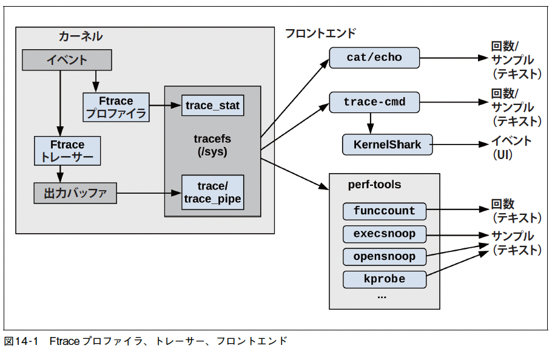
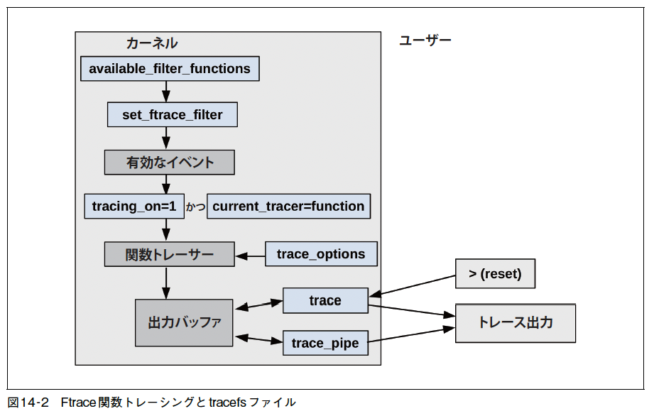
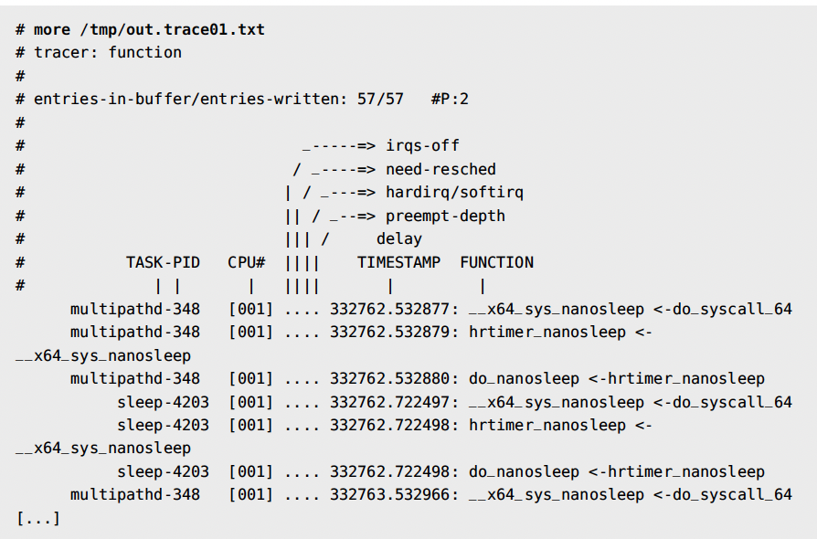
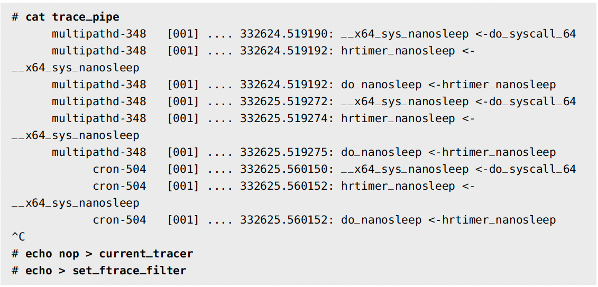
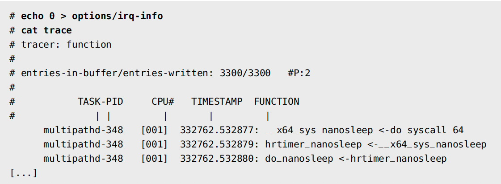
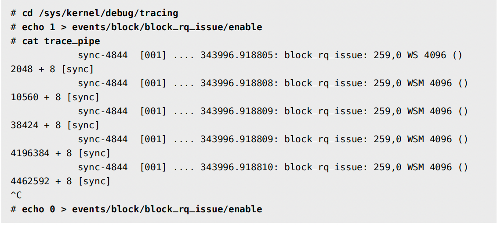
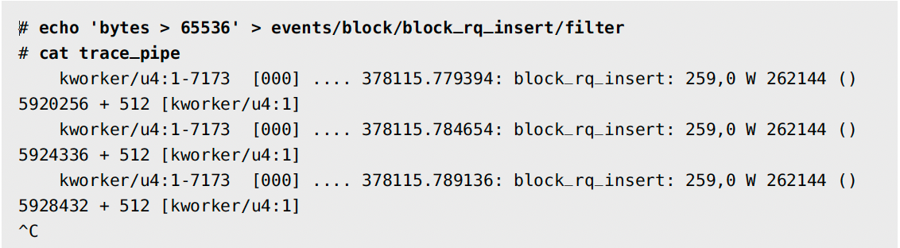

# 第14章 Ftrace

- FtraceはLinuxの公式トレーサ
- スティーブン・ロステッドが作り、Linux 2.6.27(2008年)で初めて追加された。
- Ftraceが答えられること
  - ある特定のカーネル関数がどの程度の頻度で呼び出されているか
  - どのようなコードパスでこの関数が呼び出されているか
  - このカーネル関数が呼び出す子関数は何か
  - プリエンプション無効コードパスによるレイテンシがもっと高くなったのはどこか？

- 
  
## 14.1 機能の概要
- Ftraceはプロファイラとトレーサーを持っている。
  - プロファイラは回数やヒストグラムといった集計情報を提供
  - トレーサーはイベントの詳細を提供
- この出力は、vfs_read( )がrw_verify_area( )を呼び出し、rw_verify_area( )security_file_permission( )を呼び出しているといったことを示している。
TODO:
```shell

# funcgraph vfs_read
Tracing "vfs_read"... Ctrl-C to end.
1) | vfs_read() {
1) | rw_verify_area() {
1) | security_file_permission() {
1) | apparmor_file_permission() {
1) | common_file_perm() {
1) 0.763 us | aa_file_perm();
1) 2.209 us | }
1) 3.329 us | }
1) 0.571 us | __fsnotify_parent();
1) 0.612 us | fsnotify();
1) 7.019 us | }
1) 8.416 us | }
1) | __vfs_read() {
1) | new_sync_read() {
1) | ext4_file_read_iter() {
[...]
```

- Ftraceプロファイラ
  - 関数(14.3節)
  - kprobeプロファイラ(14.6.5節)
  - uprobeプロファイラ(14.7.4節)
  - histトリガー(14.10節)
- Ftraceトレーサーとイベントトレーサー
  - function(14.4節)
  - トレースポイント(14.5節)
  - kprobe(14.6節)
  - uprobe(14.7節)
  - function_graph(14.8節)
  - wakeup
  - wakeup_rt
  - irqsoft
  - preemptoff
  - preemptirqsoft
  - blk
  - hwlat(14.9節)
  - mmiotrace
  - nop

- 👩‍💻 Ubuntuでftrace

参考) [(ftrace)trace-cmdでfunction_graphを使ってみる](https://nopipi.hatenablog.com/entry/2015/12/20/195708)
- trace-cmdのインストール
```shell
apt-get install trace-cmd
```

```shell
trace-cmd record -p function_graph -g __x64_sys_mmap -g __x64_sys_brk ls
trace-cmd report -t > trace.log
cat trace.log 
```


- 手持ちのバージョンのカーネルで使えるFtraceトレーサーのリストアップ

```shell
# cat /sys/kernel/debug/tracing/available_tracers
hwlat blk mmiotrace function_graph wakeup_dl wakeup_rt wakeup function nop
```
- Ftraceに今後追加される可能性があるプロファイラやトレーサーはドキュメントをチェックする。
  - [Linux ソースの Documentation/trace/ftrace.rst のFtrace のドキュメント](https://www.kernel.org/doc/Documentation/trace/ftrace.rst)

## 14.2 tracefs(/sys)
- Ftraceの機能を使うためのインターフェースは、tracefsファイルシステムである。例えば、次のように `/sys/kernel/tracing` にマウントされていなければならない。

```shell
mount -t tracefs tracefs /sys/kernel/tracing
```

- Ftraceはもともとdebugfsファイルシステムの一部。debugfs がマウントされている場合、Ftrace はもともとのディレクトリ構造を尊重して、tracing サブディレクトリにtracefs をマウントする。

```shell
# mount -t debugfs,tracefs
debugfs on /sys/kernel/debug type debugfs (rw,relatime)
tracefs on /sys/kernel/debug/tracing type tracefs (rw,relatime)
```
### 14.2.1 tracefsの内容
- tracingディレクトリ内の制御、出力ファイル

```shell
# ls -F /sys/kernel/debug/tracing
available_events max_graph_depth stack_trace_filter
available_filter_functions options/ synthetic_events
available_tracers per_cpu/ timestamp_mode
  :
```
- tracefsの主要ファイル

| ファイル                   | アクセス     | 説明 ｜                                                                            |
| -------------------------- | ------------ | ---------------------------------------------------------------------------------- |
| available_tracers          | 読み出し専用 | 利用できるトレーサーのリスト（表14-2 参照）                                        |
| current_tracer             | 読み書き両用 | 現在有効なトレーサー                                                               |
| function_profile_enabled   | 読み書き両用 | 関数プロファイラの有効化                                                           |
| available_filter_functions | 読み出し専用 | トレースできる関数のリスト                                                         |
| set_ftrace_filter          | 読み書き両用 | トレース関数の選択                                                                 |
| tracing_on                 | 読み書き両用 | 出力リングバッファを有効/無効化するスイッチ                                        |
| trace                      | 読み書き両用 | トレーサーの出力（リングバッファ）                                                 |
| trace_pipe                 | 読み出し専用 | トレーサーの出力。trace とは異なり、トレースを消費し、入力を待つたにブロックする。 |
| trace_options              | 読み書き両用 | トレースバッファ出力をカスタマイズするためのオプション                             |
| trace_stat（ディレクトリ） | 読み書き両用 | 関数プロファイラの出力                                                             |
| kprobe_events              | 読み書き両用 | 有効なkprobe の構成                                                                |
| uprobe_events              | 読み書き両用 | 有効なuprobe の構成                                                                |
| events（ディレクトリ）     | 読み書き両用 | イベントトレーサー制御ファイル: トレースポイント、kprobe、uprobe                   |
| instances（ディレクトリ）  | 読み書き両用 | 並行ユーザーのFtarce インスタンス                                                  |

- Ftraceトレーサが今使われているかどうか。
```shell
# cat /sys/kernel/debug/tracing/current_tracer
nop
```
  - nopが表示された場合、今使われているトレーサーはない。以下のようにしてトレーサーを有効にする。
    - blk トレーサーを有効にする場合
```shell
# echo blk > /sys/kernel/debug/tracing/current_tracer
```

## 14.3 Ftraceの関数プロファイラ
- 関数プロファイラは、カーネル関数呼び出しの統計量を提供する。
  - どのカーネル関数が使われ、どれがもっとも遅いかを知るために役立つ。
  - 効率的で比較的オーバーヘッドが低いため、カーネルコードの実行の状況を理解するための出発点として使いやすい。
  - 使うためにカーネルオプションCONFIG_FUNCTION_PROFILER=yが必要
- 関数プロファイラは、コンパイラがすべてのカーネル関数の先頭にプロファイリング呼び出しを挿入する。
  - これらの呼び出しは、使われないときには高速なnop 命令に置き換えられる。
- 約10 秒間に渡って名前の先頭が“tcp” のすべてのカーネル呼び出しを数える関数プロファイラを実行する場合。
```shell
# echo 'tcp*' > set_ftrace_filter
# echo 1 > function_profile_enabled
# sleep 10
# echo 0 > function_profile_enabled
# echo > set_ftrace_filter
```
  - これで、プロファイリングの結果がtrace_stat ディレクトリの“function” ファイルに格納される。

```shell
# head trace_stat/function*
==> trace_stat/function0 <==
Function                Hit     Time            Avg         s^2
--------                ---     ----            ---         ---
tcp_sendmsg             955912  2788479 us      2.917 us    3734541 us
tcp_sendmsg_locked      955912  2248025 us      2.351 us    2600545 us
tcp_push                955912  852421.5 us     0.891 us    1057342 us
tcp_write_xmit          926777  674611.1 us     0.727 us    1386620 us
tcp_send_mss            955912  504021.1 us     0.527 us    95650.41 us
tcp_current_mss         964399  317931.5 us     0.329 us    136101.4 us
tcp_poll                966848  216701.2 us     0.224 us    201483.9 us
tcp_release_cb          956155  102312.4 us     0.107 us    188001.9 us

==> trace_stat/function1 <==
Function                Hit     Time            Avg         s^2
--------                ---     ----            ---         ---
tcp_sendmsg             317935  936055.4 us     2.944 us    13488147 us
tcp_sendmsg_locked      317935  770290.2 us     2.422 us    8886817 us
tcp_write_xmit          348064  423766.6 us     1.217 us    226639782 us
tcp_push                317935  310040.7 us     0.975 us    4150989 us
tcp_tasklet_func        38109   189797.2 us     4.980 us    2239985 us
tcp_tsq_handler         38109   180516.6 us     4.736 us    2239552 us
tcp_tsq_write.part.0    29977   173955.7 us     5.802 us    1037352 us
tcp_send_mss            317935  165881.9 us     0.521 us    352309.0 us
```
- オーバーヘッドを減らすために関数フィルタ
  - set_ftrace_filter

## 14.4 Ftraceの関数トレーサー
- 関数トレーサーは関数プロファイリングインストルメンテーションを使ってイベント圧制時のカーネル関数の呼び出しの詳細を示す。
- 関数プロファイリングよりオーバーヘッドが高い。
  - 比較的呼び出し回数が少ない関数に適している。
    - 関数プロファイラで呼び出し発生頻度がわかる。
- 図14-2 関数トレーシングに関する主要なtracefsファイル
  - 
  - 最終的なトレース出力はtaceとtrace_pipeのどちらかのファイルから読み出せる。
  - 出力バッファに向かう逆向きの矢印は出力バッファをクリアする。

### 14.4.1 traceの使い方
- 名前の末尾が"sleep"のすべてのカーネル関数をトレースし、最終的に/tmp/out.trace01.txtファイルにイベントを保存する場合。

```shell
# cd /sys/kernel/debug/tracing
# echo 1 > tracing_on # ← 不要かもしれない
# echo '*sleep' > set_ftrace_filter
# echo function > current_tracer
# sleep 10　　# ← 10秒間トレースするのでダミーのsleep(1)コマンド
# cat trace > /tmp/out.trace01.txt
# echo nop > current_tracer # ← トレーサーを無効化
# echo > set_ftrace_filter
```
- 

- 'FUNCTION' フィールドは現在の関数とその関数を呼び出した親関数。
  - 1行目：_ _x64_sys_nanosleep( ) 関数で、do_syscall_64( ) から呼び出されている

- 改行を書き込めばtraceの内容をクリアできる。
```shell
# > trace
```
- current_tracerをnopの状態に戻してもクリアされる。
- トレースバッファは trace_pipeを使ったときにもクリアされる。

### 14.4.2 trace_pipeの使い方
- このファイルを読み出すと、エンドレスのイベントストリームが返される。
- trace_pipeはイベントを消費するため、読み出したイベントはトレースバッファから消える。
- trace_pipeを使って"sleep"イベントをライブでみる。
```shell
# echo '*sleep' > set_ftrace_filter
# echo function > current_tracer
```
- 
  - multipathd、cronプロセスが何度もsleep を呼び出していることがわかる。
- 頻度の高いイベントは、traceファイルにイベントをキャプチャして後で分析できるようにした方が良い。

### 14.4.3 オプション
- Ftraceのトレース出力をカスタマイズするためのオプションは、trace_optionsかoptionsディレクトリで設置できる。
  - フラグの欄を無効にする場合
  - 
  - 元に戻す場合
```shell
# echo 1 > options/irq-info
```
- そのほかは、optionsディレクトリのファイルリストを取ればわかる。
  - すべてLinuxソースのFtraceドキュメントで説明されている。
  - [options](https://www.kernel.org/doc/html/latest/admin-guide/kernel-parameters.html)

## 14.5 トレースポイント
- トレースポイントはカーネルの静的インストルメンテーション。
- カーネルソースに配置されたトレーシング関数に過ぎない。
- tracefsで見ることができ、Ftraceと出力/制御ファイルを共有している。
- block:block_rq_issue トレースポイントを有効にしてイベントをライブ出力する。
  - 
- トレースポイントはevents以下のディレクトリ構造内に制御ファイルを持っている。
- ここのトレースシステムごとにディレクトリがあり、その中に個々のイベントのためのサブディレクトリがある。
```shell
# ls events/block/block_rq_issue/　　# block がトレースシステム block_rq_issueがイベント
enable filter format hist id trigger
```
- [ドキュメント](https://www.kernel.org/doc/Documentation/trace/events.rst)

### 14.5.1 フィルタ
- フィルタを使うと論理式が真になった時だけイベントを記録するようになる。
```
[フィールド] [演算子] [値]
```
- フィールド: formatファイルのフィールド
- 演算子: 数値なら ==, !=、<、<=、>、>=、&、文字列なら==、!=、~
- block:block_rq_insert トレースポイントにフィルタをセットして、bytes フィールドが64KBよりも大きいイベントだけをトレースする。
  - 

### 14.5.2 トリガー
- トリガーは、イベントが発生した時に追加のトレーシングコマンドを実行する。
  - 他のトレーシングを有効/無効にする, スタックトレースを表示する, トレーシングバッファのスナップショットをとるもの、、
- 利用できるトリガーコマンドのリストは、トリガーが設定されていないときにtriggerファイルを見るとわかる。
```shell
# cat events/block/block_rq_issue/trigger
# Available triggers:
# traceon traceoff snapshot stacktrace enable_event disable_event enable_hist
disable_hist hist
```
- エラー条件の原因となったイベントを見たい時に役立つ。
  - エラー条件の位置にトレーシングを無効にするトリガー(traceoff)を配置すると、トレースバッファにはエラー条件までのイベントだけが残る。
- if キーワードを使えば、トリガーは前節のフィルタと組み合わせられる。
```shell
# echo 'traceoff if bytes > 65536' > events/block/block_rq_insert/trigger
```
## 14.6 kprobe
- kprobeはカーネルの動的インストルメンテーション。
- トレーサが使えるkprobeイベントを発生させる。
- kprobeイベントは、tracefsの出力/制御ファイルをFtraceと共有する。
- トレースポイントより細かくカスタマイズできる。
- 関数オフセットに配置できる。
- 関数の引数や戻り値を報告できる。
### 14.6.1 イベントトレーシング
- kprobe を使ってdo_nanosleep( ) カーネル関数をインストルメンテーションする
```shell
# echo 'p:brendan do_nanosleep' >> kprobe_events
# echo 1 > events/kprobes/brendan/enable
# cat trace_pipe
    multipathd-348 [001] .... 345995.823380: brendan: (do_nanosleep+0x0/0x170)
    multipathd-348 [001] .... 345996.823473: brendan: (do_nanosleep+0x0/0x170)
    multipathd-348 [001] .... 345997.823558: brendan: (do_nanosleep+0x0/0x170)
^C
# echo 0 > events/kprobes/brendan/enable
# echo '-:brendan' >> kprobe_events
```
- 作成後のkprobeは、トレースポイントともにevents ディレクトリに現れ、トレースポイントと同じように使える。
- [ドキュメント](https://www.kernel.org/doc/Documentation/trace/kprobetrace.rst)
- 構文概要
```
p[:[GRP/]EVENT] [MOD:]SYM[+offs]|MEMADDR [FETCHARGS] : プローブの設定
r[MAXACTIVE][:[GRP/]EVENT] [MOD:]SYM[+0] [FETCHARGS] : リターンプローブの設定
-:[GRP/]EVENT : プローブのクリア
```
  - “p:brendan do_nanosleep” という文字列でdo_nanosleep( ) というカーネルシンボルに “brendan”という名前のプローブ(p:）を作る。
    - カスタム名は、kprobe の別のユーザーとの区別に役立つ。
  - “-:brendan”という文字列は、“brendan”という名前のプローブを削除する。
### 14.6.2 引数
- kprobeは関数の引数や戻り値を調べることができる。
  - hrtimer_sleeperと hrtimer_mode が引数
```
static int __sched do_nanosleep(struct hrtimer_sleeper *t, enum hrtimer_mode mode)
{
[...]
```
  - Intel x86_64 システムで最初の2 個の引数をトレースし、16 進形式（デフォルト）で表示
```shell
# echo 'p:brendan do_nanosleep hrtimer_sleeper=$arg1 hrtimer_mode=$arg2' >>kprobe_events
# echo 1 > events/kprobes/brendan/enable
# cat trace_pipe
    multipathd-348 [001] .... 349138.128610: brendan: (do_nanosleep+0x0/0x170)
hrtimer_sleeper=0xffffaa6a4030be80 hrtimer_mode=0x1
    multipathd-348 [001] .... 349139.128695: brendan: (do_nanosleep+0x0/0x170)
hrtimer_sleeper=0xffffaa6a4030be80 hrtimer_mode=0x1
    multipathd-348 [001] .... 349140.128785: brendan: (do_nanosleep+0x0/0x170)
hrtimer_sleeper=0xffffaa6a4030be80 hrtimer_mode=0x1
^C
# echo 0 > events/kprobes/brendan/enable
# echo '-:brendan' >> kprobe_events
```
### 14.6.3 戻り値
- 戻り値については、kretprobeのもとで特別な別名$retval を使えるようになっている。
```shell
# echo 'r:brendan do_nanosleep ret=$retval' >> kprobe_events
# echo 1 > events/kprobes/brendan/enable
# cat trace_pipe
    multipathd-348 [001] d... 349782.180370: brendan:
(hrtimer_nanosleep+0xce/0x1e0 <- do_nanosleep) ret=0x0
    multipathd-348 [001] d... 349783.180443: brendan:
(hrtimer_nanosleep+0xce/0x1e0 <- do_nanosleep) ret=0x0
    multipathd-348 [001] d... 349784.180530: brendan:
(hrtimer_nanosleep+0xce/0x1e0 <- do_nanosleep) ret=0x0
^C
# echo 0 > events/kprobes/brendan/enable
# echo '-:brendan' >> kprobe_events
```
    - do_nanosleep()の戻り値 ret=0x0 値は "0"(成功)
### 14.6.4 フイルタとトリガー

```shell
# cat events/kprobes/brendan/format
name: brendan
ID: 2024
format:
    field:unsigned short common_type; offset:0; size:2; signed:0;
    field:unsigned char common_flags; offset:2; size:1; signed:0;
    field:unsigned char common_preempt_count; offset:3; size:1; signed:0;
    field:int common_pid; offset:4; size:4; signed:1;

    field:unsigned long __probe_ip; offset:8;   size:8; signed:0;
    field:u64 hrtimer_sleeper;      offset:16;  size:8; signed:0;
    field:u64 hrtimer_mode;         offset:24;  size:8; signed:0;
print fmt: "(%lx) hrtimer_sleeper=0x%Lx hrtimer_mode=0x%Lx", REC->__probe_ip, REC-
>hrtimer_sleeper, REC->hrtimer_mode
```
  - hrtimer_sleeper とhrtimer_mode は brendanさんがつけたカスタムの変数名
- hrtimer_modeが1 ではないときに限りdo_nanosleep( ) 呼び出しをトレースする。
```shell
# echo 'hrtimer_mode != 1' > events/kprobes/brendan/filter
```
### 14.6.5 kprobeプロファイラ
- kprobe が有効になっているときには、Ftrace はkprobe イベントの発生回数を数える。
- 数えた回数は、kprobe_profile ファイルに書き込まれる。
```shell
# cat /sys/kernel/debug/tracing/kprobe_profile
    p_blk_account_io_start_bcc_19454        1808    0
    p_blk_mq_start_request_bcc_19454        677     0
    p_blk_account_io_completion_bcc_19454   521     11
    p_kbd_event_1_bcc_1119                  632     0
```
  - プローブ名（定義はkprobe_eventsファイルを見ればわかる）、ヒット数、ミスヒット数（プローブはヒットしたがエラーが発生して記録されておらず、失われている）。
  - 一部の関数呼び出しが頻繁すぎる場合、関数プロファイラを無効にしてkprobeプロファイラを使う。
  
## 14.7 uprobe
- upropeはユーザレベルの動的インストルメンテーション。
- トレーサーが使えるupropeイベントを発生させる。
- tracefsの出力/制御ファイルをFtraceと共有する。
### 14.7.1 イベントトレーシング
- upropeの制御ファイルはuprope_events
- [ドキュメント](https://www.kernel.org/doc/Documentation/trace/uprobetracer.rst)
- 構文
```
p[:[GRP/]EVENT] PATH:OFFSET [FETCHARGS] : uprobe の設定
r[:[GRP/]EVENT] PATH:OFFSET [FETCHARGS] : リターンプローブの設定（uretprobe）
-:[GRP/]EVENT : uprobe、uretprobe イベントのクリア
```
- カーネルはユーザー空間のソフトウェアのシンボルを持っていないので、ユーザー空間のツールでオフセットを明らかにしてカーネルに与える。
- uprobe を使ってbash(1) シェルのreadline( ) 関数をインストルメンテーションする
```shell
# readelf -s /bin/bash | grep -w readline # ← シンボルオフセットを調べる
    882: 00000000000b61e0 153 FUNC GLOBAL DEFAULT 14 readline
# echo 'p:brendan /bin/bash:0xb61e0' >> uprobe_events
# echo 1 > events/uprobes/brendan/enable
# cat trace_pipe
        bash-3970 [000] d... 347549.225818: brendan: (0x55d0857b71e0)
        bash-4802 [000] d... 347552.666943: brendan: (0x560bcc1821e0)
        bash-4802 [000] d... 347552.799480: brendan: (0x560bcc1821e0)
^C
# echo 0 > events/uprobes/brendan/enable
# echo '-:brendan' >> uprobe_events
```
  - 👩‍💻readelf: ELF(Executable and Linkable Formatの略でコンパイラが生成するオブジェクトファイルや実行ファイルで利用されているファイルフォーマット)ファイルについての情報を表示するコマンド
    - ターゲットバイナリがアドレス空間配置ランダム化（ASLR）付きの位置独立実行形式（PIE）でコンパイルされている場合はうまくいかない場合がある
    - シンボルマッピングをしてくれる高水準のトレーサー（たとえば、BCCやbpftrace）を使う方が良い。
  - 注意: 誤って命令の途中の位置を指すシンボルオフセットを使うと、ターゲットプロセスを壊してしまう。
### 14.7.2 引数と戻り値
- kprobe と同じように。uprobe 作成時に指定すれば調べられる。
- [構文](https://www.kernel.org/doc/Documentation/trace/uprobetracer.rst)
### 14.7.3 フィルタとトリガー
- kprobe と同様に、events/uprobes/... ディレクトリでフィルタとトリガーを使える。
### 14.7.4 uprobeプロファイラ
- uprobe が有効になっているときには、Ftrace はuprobe イベントの発生回数を数える。数えた回数はuprobe_profile ファイルに書き込まれる。
```shell
# cat /sys/kernel/debug/tracing/uprobe_profile
/bin/bash brendan   11
```
## 14.8 Ftraceの関数グラフトレーサー
- 関数グラフ（function_graph）トレーサーは、関数のコールグラフを表示して、コードの流れを明らかにする。
### 14.8.1 コールグラフのトレーシング
- do_nanosleep( ) 関数に対して関数グラフトレーサーを使ってdo_nanosleep( ) の子関数を表示している。
```shell
# echo do_nanosleep > set_graph_function
# echo function_graph > current_tracer
# cat trace_pipe
    1)  2.731 us    | get_xsave_addr();
    1)              | do_nanosleep() {
    1)              |   hrtimer_start_range_ns() {
    1)              |       lock_hrtimer_base.isra.0() {
    1)  0.297 us    |           _raw_spin_lock_irqsave();
    1)  0.843 us    |       }
    1)  0.276 us    |       ktime_get();
    1)  0.340 us    |       get_nohz_timer_target();
    1)  0.474 us    |       enqueue_hrtimer();
    1)  0.339 us    |       _raw_spin_unlock_irqrestore();
    1)  4.438 us    |   }
    1)              |   schedule() {
    1)              |       rcu_note_context_switch() {
[...]
    5) $ 1000383 us | } /* do_nanosleep */
^C
# echo nop > current_tracer
# echo > set_graph_function
```
  - do_nanosleep( ) がhrtimer_start_range_ns( ) を呼び出し, hrtimer_start_range_ns( ) がlock_hrtimer_base.isra.0( ) を呼び出している。
  - 左側の欄はCPU（この出力ではほとんどがCPU 1）と関数内で費やした時間を示している。
    - $: 1 秒よりも長い
    - @: 100m秒よりも長い
    - *: 10m秒よりも長い
    - #: 1m秒よりも長い
    - !: 100μ秒よりも長い
    - +: 10μ秒よりも長い
  - オーバーヘッドがかかるので、関数フィルターを使ってトレースを減らす、
```shell
# echo do_nanosleep > set_ftrace_filter
# cat trace_pipe
[...]
7) $ 1000130 us | } /* do_nanosleep */
^C
```
### 14.8.1 オプション
- オプションを指定すれば出力内容を変えられる。
```shell
# ls options/funcgraph-*
options/funcgraph-abstime options/funcgraph-irqs options/funcgraph-proc
options/funcgraph-cpu options/funcgraph-overhead options/funcgraph-tail
options/funcgraph-duration options/funcgraph-overrun
```

## 14.9 Ftraceのハードウェアレイテンシ(hwlat)トレーサー

## 14.10 Ftrace histトリガー
### 14.10.1 単一キー
### 14.10.2 フィールド
### 14.10.3 修飾子
### 14.10.4 PIDフィルタ
### 14.10.5 複数キー
### 14.10.6 スタックトレースキー
### 14.10.7 合成イベント

## 14.11 trace-cmd
### 14.11.1 サブコマンドの概要
### 14.11.2 trace-cmdの1行
### 14.11.3 trace-cmdとperf(1)
### 14.11.4 trace-cmdによる関数グラフトレーシング
### 14.11.5 KernelShark
### 14.11.6 trace-cmdのドキュメント

## 14.12 perf ftrace

## 14.13 perf-tools

### 14.13.1　対象領域
### 14.13.2 単一目的ツール
### 14.13.3 多目的ツール
### 14.13.4 perf-toolsの1行
### 14.13.5 例
### 14.13.6 perf-toolsとBCC/BPF
### 14.13.7 ドキュメント

## 14.14 Ftraceのドキュメント

## 14.15 参考文献
